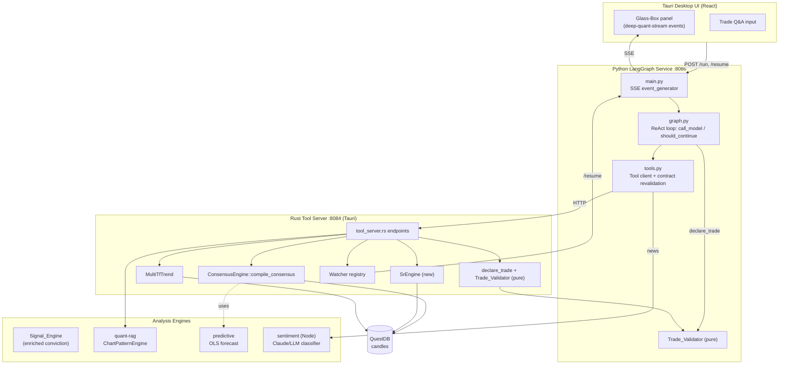
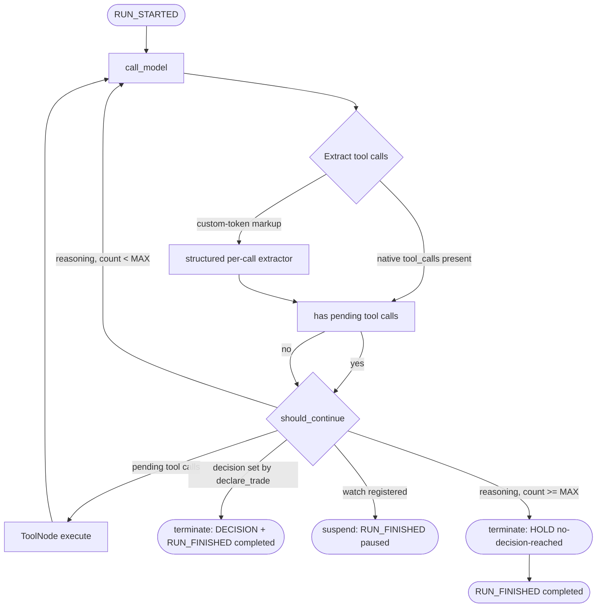

# Design Document

## Overview

This design hardens the deep-quant analysis core so the system reliably finds, validates, and defends high-probability NSE trades. It addresses the structural weaknesses identified in the requirements: fragile tool-call extraction, non-deterministic ReAct loop termination, unvalidated tool results, naive conviction scoring, a duplicated support/resistance computation, under-integrated sentiment/RAG/predictive engines, the absence of programmatic trade validation, and an unmeasured end-to-end pipeline.

The work spans four runtimes that already exist in the codebase:

| Concern | Runtime | Location |
| --- | --- | --- |
| Reasoning brain (ReAct loop, SSE stream, tool client) | Python / LangGraph | `agents/deep-quant-loop/` (`graph.py`, `main.py`, `tools.py`) |
| Tool Server (`:8084`), Consensus Engine, SR, multi-TF, watcher, declare_trade | Rust / Tauri | `frontend/src-tauri/src/quant/tool_server.rs`, `frontend/src-tauri/src/quant/mod.rs` |
| Conviction scoring | Rust | `agents/technical/src/signal_engine.rs` |
| Chart-pattern / RAG engine | Rust | `agents/quant-rag/` (`patterns.rs`, `engine.rs`, `llm.rs`) |
| Predictive forecast | Rust | `agents/predictive/` (`math.rs`, `engine.rs`) |
| News sentiment | Node.js | `agents/sentiment/` (`analyzer.js`, `fetcher.js`, `claude.js`) |

The guiding principle is **honest abstention over fabrication**: every layer either returns real, validated data or an explicit unavailable/insufficient marker, and the agent declares HOLD rather than invent a setup. A second principle is **single authoritative source**: indicators, support/resistance, and trend bias are computed once on the Rust Tool Server from the same candle source, eliminating the Python-side recomputation that currently drifts from the Consensus Engine.

### Design Approach Summary

The design is deliberately additive and refactoring-oriented rather than a rewrite:

1. **Tool-call extraction** (`graph.py`) keeps the native LangChain `tool_calls` path as primary, and replaces the brittle regex fallback with a structured, per-call extractor that records parse failures instead of dropping calls.
2. **Loop termination** (`graph.py`) is driven by a structured `decision` field in `AgentState` set by `declare_trade`, plus a bounded consecutive-reasoning counter — never by keyword matching on prose.
3. **Tool-result contracts** are enforced at the Rust Tool Server boundary (the producer) and re-validated in the Python tool client (the consumer) before results reach the model.
4. **Trade validation** is a new pure `Trade_Validator` module invoked inside `declare_trade` on both the Python and Rust sides; failures route back into the loop.
5. **Enriched conviction scoring** replaces the two-input bucket logic in `signal_engine.rs` with a weighted multi-indicator confluence model.
6. **SR consolidation** moves pivot/S-R computation out of Python into a new `/tools/get_support_resistance` endpoint backed by a shared Rust `SrEngine`.
7. **Sentiment / RAG / predictive** are wired into the decision loop through tool results, with graceful-degradation markers.
8. **Glass-box stream** gains the missing event classes (`TOOL_CALL_RESULT`, `REASONING`, `VERIFICATION_STEP`, `DECISION`) and strict ordering guarantees.
9. **Evaluation harness** is a new offline replay component that measures directional accuracy and trade quality deterministically.

## Architecture

### System Context



### Key Architectural Decisions

**AD-1: The Rust Tool Server is the single source of truth for market data.**
Today `get_support_resistance` and `get_news_context` are computed entirely inside the Python `tools.py`, while indicators and trend come from the Rust Consensus Engine. This split lets SR levels and indicator levels diverge (different candle windows, different rounding). The design adds `/tools/get_support_resistance` and `/tools/get_news_context` to `tool_server.rs` so all eight tools resolve against the same QuestDB candle loader (`load_candles_from_db`). Python tool functions become thin HTTP clients that re-validate the contract.

**AD-2: Termination is a state transition, not a string match.**
The current `should_continue` inspects message content for `"conviction_score"` and counts consecutive `AIMessage`s. The design introduces an explicit `decision` field in `AgentState`, populated only when `declare_trade` succeeds Trade_Validator checks. Routing reads that field. This removes the class of bugs where the model's "think out loud" prose mentioning a JSON plan caused premature exit.

**AD-3: Contracts are validated on both sides of the wire.**
The Rust server guarantees the `Tool_Result_Contract` on emit (producer-side), and the Python tool client validates the same contract on receipt (consumer-side). Either side detecting a violation produces a structured error result rather than passing malformed data to the model. This double-check is cheap (schema validation) and protects against version skew between the two runtimes.

**AD-4: Determinism is a first-class requirement.**
Conviction scoring (R8.5), SR levels (R9.4), and evaluation metrics (R15.5) must be deterministic for identical inputs. All three are implemented as pure functions over their inputs with no wall-clock, RNG, or ambient state. The LLM call itself remains non-deterministic, so the Evaluation_Harness measures the deterministic computational layer (validator pass-rate, RR distribution, directional accuracy of the predictive/scoring layer) rather than replaying the LLM.

**AD-5: Graceful degradation is modeled as explicit "unavailable" markers.**
Rather than fabricating values or aborting, every engine returns a typed unavailable marker (`null` indicator fields via `finite_opt`, `sentiment_summary: "Unavailable"`, empty pattern list, projection `unavailable: true`). The agent treats these as missing inputs and continues, declaring HOLD only when *directional* data is missing.

### ReAct Loop Control Flow



The routing precedence enforced in `should_continue` (R2.4): **pending tool calls or a finalized decision are always processed before the max-consecutive-reasoning rule is applied.**

## Components and Interfaces

### 1. Tool-Call Extraction (`graph.py`)

Replaces `parse_deepseek_custom_tool_calls` and the inline cleanup in `call_model` with a single `extract_tool_calls(response) -> ToolCallExtraction` function.

```python
@dataclass
class ExtractedCall:
    name: str
    args: dict | None          # None when args failed to parse
    raw_args: str              # original args fragment, for diagnostics
    status: Literal["ok", "parse_failure", "invalid_tool"]
    id: str

@dataclass
class ToolCallExtraction:
    calls: list[ExtractedCall]      # every call discovered, in source order
    used_text_extraction: bool      # False when native tool_calls were present
```

Behavior:
- If `response.tool_calls` is non-empty (native structured), each is wrapped as an `ExtractedCall(status="ok")` with **no** text extraction applied (R1.1). `used_text_extraction = False`.
- Otherwise, scan `response.content` for custom-token markup. For each discovered `(tool_name, args_fragment)`:
  - If `tool_name` is not in the registered tool set → `status="invalid_tool"` (R1.4).
  - Else attempt `json.loads(args_fragment)`; on failure (after zero-width-space cleanup) → `status="parse_failure"` (R1.3).
  - Else → `status="ok"` (R1.2).
- Every discovered call is preserved in order; none are dropped (R1.5).

The ToolNode is fed only `status="ok"` calls. `parse_failure` and `invalid_tool` calls are turned into synthetic `ToolMessage`s describing the failure so the model sees the feedback and the loop continues (R1.3, R1.4).

### 2. ReAct Loop & Termination (`graph.py`)

`AgentState` gains explicit decision/bookkeeping fields:

```python
class AgentState(TypedDict):
    messages: Annotated[Sequence[BaseMessage], add_messages]
    mode: Optional[str]            # "FIND" | "VERIFY"
    symbol: Optional[str]
    manual_trade: Optional[dict]
    timeframe: Optional[str]
    decision: Optional[dict]       # set ONLY by a validated declare_trade
    reasoning_turns: int           # consecutive reasoning-only turns
    market_data_seen: bool         # at least one market-data tool returned data
```

`should_continue(state)` precedence (R2.1–R2.7):
1. If the last message has pending `ok` tool calls → route to `tools` (R2.1, R2.4).
2. Else if `state["decision"]` is set → terminate (R2.2).
3. Else if a `watch_price_condition` interrupt is active → suspend (R2.6).
4. Else increment `reasoning_turns`; if `< MAX_REASONING_TURNS` → loop (R2.3).
5. Else → inject a `HOLD` decision with reason `no-decision-reached` and terminate (R2.5).

`MAX_REASONING_TURNS` is a module constant (default 3). Completion is read from `state["decision"]`, never from keyword matching (R2.7).

First-turn data acquisition (R3) is enforced by `market_data_seen`: `declare_trade` is rejected (and the loop continues) if no market-data tool has returned data in the run.

### 3. Tool Client & Contract Revalidation (`tools.py`)

Each `@tool` function becomes a thin HTTP client to `:8084` plus a `validate_contract(tool_name, payload)` step. `get_support_resistance` and `get_news_context` stop computing locally and call the new Rust endpoints.

```python
def validate_contract(tool_name: str, payload: Any) -> Any:
    """Returns payload unchanged if valid; otherwise returns a structured
    error dict {"error": ..., "contract_violation": <field/reason>}.
    Never raises — contract failures are data, not exceptions."""
```

### 4. Tool Server (`tool_server.rs`)

New and modified endpoints:

| Endpoint | Status | Contract summary |
| --- | --- | --- |
| `POST /tools/get_candles` | existing | ascending `timestamp_ms` candles, each with O/H/L/C/V (R4.4) |
| `POST /tools/get_consensus` | existing | all documented indicator fields as numeric or null (R4.2, R4.3) |
| `POST /tools/get_multi_tf_trend` | existing | bias per 1H/4H/1D; Neutral when MAs uncomputable (R13.1, R13.2) |
| `POST /tools/get_chart_patterns` | existing | patterns with `pattern_type`, `sentiment`, `confidence∈[0,1]`, `description` (R11.1, R11.2) |
| `POST /tools/watch_condition` | existing | register watcher, suspend; remove on trigger (R14) |
| `POST /tools/declare_trade` | **modified** | run Trade_Validator; commit only on pass (R6, R7) |
| `POST /tools/get_support_resistance` | **new** | pivot, S1–S3, R1–R3 ordered; intraday OR + daily macro (R9) |
| `POST /tools/get_news_context` | **new** | proxy to Sentiment_Service; unavailable marker on failure (R10) |
| `POST /tools/get_prediction` | **new** | forward projection direction + value; unavailable marker (R12) |

All endpoints share a `timeframe` validator returning a descriptive error for unsupported values and logging the failure (R4.5).

### 5. Trade_Validator (pure module — Rust and Python mirror)

```rust
pub struct ExecutionLevels { pub entry: f64, pub stop_loss: f64, pub take_profit: f64 }

pub enum ValidatorOutcome {
    Pass { risk_reward: f64 },
    Fail { reason: ValidatorReason },
}

pub enum ValidatorReason {
    MissingLevels,        // R6.1
    RiskRewardTooLow,     // R6.2  (< 1:2)
    StopTooTight,         // R6.3  (< 1.5 * ATR)
    DirectionInconsistent // R6.4 / R6.5
}

pub fn validate_trade(
    action: Action,            // Buy | Sell | Hold
    levels: Option<ExecutionLevels>,
    atr_14: Option<f64>,
) -> ValidatorOutcome
```

Rules (BUY/SELL only; HOLD bypasses level checks):
- Missing any of entry/SL/TP → `MissingLevels` (R6.1).
- `risk = |entry − stop_loss|`, `reward = |take_profit − entry|`; `risk_reward = reward / risk`. If `< 2.0` → `RiskRewardTooLow` (R6.2).
- If `atr_14` available and `|entry − stop_loss| < 1.5 * atr_14` → `StopTooTight` (R6.3).
- BUY: require `stop_loss < entry < take_profit` (R6.4). SELL: require `take_profit < entry < stop_loss` (R6.5). Else `DirectionInconsistent`.

On any `Fail`, `declare_trade` does **not** commit; the failure reason is returned to the agent which continues the loop to revise (R6.6). On `Pass`, the Rust server commits and emits the final-analysis decision event (R6.7).

### 6. Signal_Engine — Enriched Conviction Scoring (`signal_engine.rs`)

Replaces the RSI+VWAP bucket logic with a weighted confluence model over four indicator families drawn from the Consensus_Report. Each family votes a signed contribution in `[-1, +1]`; contributions are weighted and mapped to `[0, 100]`.

```rust
pub struct ConvictionInputs {
    pub rsi_14: Option<f64>,
    pub macd_histogram: Option<f64>,   // momentum
    pub ema_9: Option<f64>,
    pub ema_21: Option<f64>,
    pub sma_50: Option<f64>,           // trend
    pub current_price: Option<f64>,
    pub atr_14: Option<f64>,
    pub bb_upper: Option<f64>,
    pub bb_lower: Option<f64>,         // volatility position
    pub obv_slope: Option<f64>,
    pub cmf: Option<f64>,              // volume flow
    pub vwap: Option<f64>,
}

pub struct ConvictionResult {
    pub score: i32,                    // 0..=100
    pub missing_indicators: Vec<String>,
}
```

Algorithm:
- Each family computes a directional vote only from its available inputs; unavailable inputs are recorded in `missing_indicators` and the family's weight is renormalized over present families (R8.4).
- Aggregate = weighted sum of family votes ∈ `[-1, +1]`; `score = round((aggregate + 1) / 2 * 100)`, clamped to `[0, 100]` (R8.2).
- Agreement amplification: when all present families vote the same sign, an alignment factor pushes the score further from 50 than any mixed-sign combination (R8.3).
- Pure function of `ConvictionInputs`: identical inputs → identical score (R8.5).

### 7. SR_Engine (`mod.rs` / `tool_server.rs`)

```rust
pub struct SrLevels {
    pub pivot: f64,
    pub s1: f64, pub s2: f64, pub s3: f64,
    pub r1: f64, pub r2: f64, pub r3: f64,
    pub recent_high: f64, pub recent_low: f64,
    pub opening_range_high: Option<f64>,   // intraday only (R9.3)
    pub opening_range_low: Option<f64>,
    pub daily_pivot: Option<f64>,          // intraday only (R9.3)
    pub ordering_exception: Option<String>,// R9.2 flag
}

pub fn compute_sr(candles: &[Candle], timeframe: &str) -> SrLevels
```

Computed from the same `load_candles_from_db` source as other indicators (R9.1). Classic pivot formulas yield `S3 ≤ S2 ≤ S1 ≤ pivot ≤ R1 ≤ R2 ≤ R3` under normal data; when data forces a violation, the engine returns the computed levels and sets `ordering_exception` (R9.2). Pure function → identical levels for identical inputs (R9.4).

### 8. Sentiment Integration (`get_news_context` → Sentiment_Service)

The new `/tools/get_news_context` proxies to the Node sentiment service, returning recent headlines plus a directional sentiment label (R10.1, R10.2). If the service is unreachable, it returns `{"sentiment_summary": "Unavailable", "error": ...}` with no fabricated classification (R10.3). The agent treats `Unavailable` as a missing input and does not block on it (R10.4).

### 9. RAG Pattern Integration (`get_chart_patterns` → ChartPatternEngine)

Already returns patterns with `pattern_type`, `sentiment`, `confidence`, `description`. The design pins `confidence ∈ [0.0, 1.0]` at the contract boundary (R11.2) and adds a system-prompt rule plus defensibility-record wiring so any pattern with `confidence > 0.6` is named in `setup_validation` (R11.3, R7.3). Empty pattern list → agent proceeds (R11.4).

### 10. Predictive Integration (`get_prediction` → Predictive_Engine)

The predictive OLS model (`predictive/src/math.rs`) and the in-consensus `vwepr/ols` projection both produce a forward value. The new `/tools/get_prediction` returns `{projected_direction: "Up"|"Down"|"Flat", projected_value: f64, confidence: f64}` (R12.1, R12.2). When the agent's directional bias conflicts with `projected_direction`, the conflict is stated in `setup_validation` (R12.3). Unavailable → proceed with a noted-unavailable marker (R12.4).

### 11. Glass-Box Stream (`main.py` `event_generator`)

The SSE generator is extended to emit the full event vocabulary in strict order.

| Event | Trigger | Payload |
| --- | --- | --- |
| `RUN_STARTED` | run begins | `{thread_id}` (first event, R17.1) |
| `REASONING` | AIMessage content without tool calls | `{content}` — reasoning only, markup stripped (R16.1, R16.8) |
| `TOOL_CALL_START` | tool call issued | `{tool, args}` (R16.2) |
| `TOOL_CALL_RESULT` | tool returns | `{tool, result|summary}` (R16.3) |
| `TOOL_CALL_END` | tool completes | `{tool, status, error_reason?}` (R16.4, R16.5) |
| `VERIFICATION_STEP` | self-verification check | `{check, outcome}` (R16.6) |
| `DECISION` | finalized decision | `{action, conviction_score, rationale}` (R16.7) |
| `RUN_FINISHED` | run completes/pauses | `{status: "completed"|"paused"}` (R17.2, R17.6) |
| `ERROR` | LLM stream failure | `{error}`; no DECISION emitted (R17.5) |

Ordering invariants: `RUN_STARTED` first (R17.1); `TOOL_CALL_START` before its `TOOL_CALL_RESULT`/`TOOL_CALL_END` (R17.3); events delivered in step order (R17.4); `RUN_FINISHED` last (R17.2). Every payload is a valid JSON object (R17.7). The reasoning/markup separation (R16.8) extends the existing "skip TEXT_MESSAGE when tool_calls present" logic into an explicit splitter that emits `REASONING` only for natural-language fragments.

### 12. Trade Q&A Mode (`graph.py` / `main.py`)

A `Trade_QA_Mode` request reuses the same thread_id and the MemorySaver checkpointer so the `Session_Analysis_Context` (multi-TF bias, SR levels, indicators, patterns, sentiment, Declared_Trade + defensibility record) is available (R18.1, R18.5). Answers about a specific level cite the recorded entry/SL/TP/RR/volatility basis (R18.2). With no Declared_Trade, the agent answers from context and states none has been declared (R18.3). Missing data → call the relevant tool or state unavailable; never fabricate (R18.4). Q&A never mutates the committed trade (R18.6) and uses the same stream conventions (R18.7).

### 13. Evaluation_Harness (new offline component)

A standalone replay tool (Python, alongside `agents/deep-quant-loop/`) that feeds historical candle series through the deterministic analysis layer (SR_Engine, Signal_Engine, Predictive_Engine, Trade_Validator) without invoking the live LLM.

```python
@dataclass
class EvalReport:
    directional_accuracy: float       # predicted vs realized (R15.1)
    rr_met_proportion: float          # share of trades with RR >= 1:2 (R15.2)
    validator_pass_proportion: float  # share passing all validator checks (R15.3)
    sample_count: int
```

It emits a summary report (R15.4) and re-runs each dataset twice; if metrics differ across identical runs it aborts with a non-determinism failure (R15.5).

## Data Models

### Tool_Result_Contract (consensus report)

```json
{
  "symbol": "RELIANCE",
  "trend_score": 42,
  "momentum_state": "BULLISH",
  "volatility_state": "EXPANDING",
  "volume_flow_state": "INFLOW",
  "current_price": 2450.5,
  "rsi_14": 38.2, "stoch_k": 21.0,
  "ema_9": 2448.1, "ema_21": 2440.0, "sma_50": 2400.0, "sma_200": 2310.0,
  "macd_line": 3.1, "macd_signal": 2.0, "macd_histogram": 1.1,
  "bb_upper": 2470.0, "bb_mid": 2445.0, "bb_lower": 2420.0,
  "atr_14": 18.5, "vwap": 2442.0, "obv": 1200000.0, "cmf": 0.12,
  "parabolic_sar": 2415.0
}
```
Any non-finite indicator is serialized as `null` (the existing `finite_opt` helper), never a fabricated number (R4.2, R4.3).

### Declared_Trade + Defensibility Record

```json
{
  "action": "BUY",
  "conviction_score": 74,
  "setup_validation": "Multi-TF bias 1H/4H bullish, 1D neutral. Entry at S1 (2440) with SL below S2 (2418, 1.9x ATR). Inverse H&S (conf 0.71) confirms. RR 1:2.4. Predictive projects Up (agrees).",
  "execution_plan": "BUY entry 2440, SL 2418, TP 2492",
  "levels": { "entry": 2440.0, "stop_loss": 2418.0, "take_profit": 2492.0 },
  "risk_reward": 2.36,
  "validator_outcome": "Pass"
}
```
Fields required by R7: multi-TF bias, key S/R levels, volatility basis for the stop, RR value (R7.1, R7.2), and named high-confidence pattern (R7.3).

### Multi-TF Trend Response

```json
{ "symbol": "RELIANCE", "trend_1h": "Bullish", "trend_4h": "Bullish", "trend_1d": "Neutral", "indicators": { "ema_9_1h": 2448.1, "...": 0.0 } }
```
A horizon whose MAs are uncomputable returns `"Neutral"` while other horizons still report their computed bias (R13.2).

### Stream_Event envelope

```json
{ "event": "TOOL_CALL_RESULT", "data": { "tool": "get_consensus_report", "result": { "trend_score": 42 } } }
```
`data` is always a valid JSON object (R17.7).

## Correctness Properties

*A property is a characteristic or behavior that should hold true across all valid executions of a system — essentially, a formal statement about what the system should do. Properties serve as the bridge between human-readable specifications and machine-verifiable correctness guarantees.*

The deep-quant core contains substantial pure logic — tool-call extraction, loop routing, trade validation, conviction scoring, support/resistance computation, the watcher trigger predicate, the sufficiency classifier, the evaluation metrics, and the stream event ordering — all of which are amenable to property-based testing. The properties below are derived from the prework analysis, after consolidating redundant criteria.

### Property 1: Native tool calls bypass text extraction

*For any* model response carrying at least one native structured tool call, the extractor returns exactly those calls with status `ok` and reports `used_text_extraction == False` (no text-based extraction is applied).

**Validates: Requirements 1.1**

### Property 2: Custom-token tool calls round-trip through extraction

*For any* set of valid `(tool_name, args)` pairs rendered as in-content custom-token markup, the extractor recovers each tool name and a parsed-JSON args object equal to the original.

**Validates: Requirements 1.2**

### Property 3: Malformed tool-call args become parse-failures without dropping or terminating

*For any* tool call whose args fragment is not valid JSON, the extractor records it with status `parse_failure`, excludes it from the executable set, and the loop-continue signal is preserved (the run is not terminated).

**Validates: Requirements 1.3**

### Property 4: Unregistered tool names are flagged invalid

*For any* extracted tool name not in the registered Analysis_Tool set, the extractor records that call with status `invalid_tool`.

**Validates: Requirements 1.4**

### Property 5: Extraction preserves every call in order

*For any* model response containing N tool calls, the extraction result contains exactly N entries in their original source order, with none dropped.

**Validates: Requirements 1.5**

### Property 6: Pending tool calls route to execution

*For any* loop state whose last message has one or more `ok` pending tool calls, `should_continue` routes to tool execution.

**Validates: Requirements 2.1**

### Property 7: A finalized decision terminates the run

*For any* loop state with `decision` set and no pending tool calls, `should_continue` terminates the run.

**Validates: Requirements 2.2**

### Property 8: Bounded reasoning is allowed before forcing termination

*For any* loop state with no pending tool calls and no decision where `reasoning_turns < MAX_REASONING_TURNS`, `should_continue` routes back to continued reasoning.

**Validates: Requirements 2.3**

### Property 9: Pending work takes precedence over the reasoning cap

*For any* loop state with `reasoning_turns >= MAX_REASONING_TURNS` that also has pending `ok` tool calls or a set `decision`, routing processes the tool calls or the decision and never takes the forced-HOLD path.

**Validates: Requirements 2.4**

### Property 10: Exhausted reasoning yields a HOLD with no-decision-reached

*For any* loop state with `reasoning_turns >= MAX_REASONING_TURNS`, no pending tool calls, and no decision, routing terminates with an injected HOLD decision whose stated reason is `no-decision-reached`.

**Validates: Requirements 2.5**

### Property 11: A registered price watch suspends rather than terminates

*For any* loop state with an active `watch_price_condition` interrupt, routing suspends the run in a resumable (paused) state rather than terminating it.

**Validates: Requirements 2.6**

### Property 12: Termination ignores decision-like keywords in prose

*For any* reasoning content that contains decision-like keywords (such as `conviction_score`) while `decision` is unset and `reasoning_turns < MAX_REASONING_TURNS`, routing does not terminate the run.

**Validates: Requirements 2.7**

### Property 13: No decision before market data is seen

*For any* run (FIND or VERIFY), a finalized decision or verdict can be produced only when `market_data_seen` is true; while no market-data Analysis_Tool has returned data, any finalize attempt is blocked and the loop continues.

**Validates: Requirements 3.1, 3.2, 3.3**

### Property 14: Consensus report fields are present and numeric-or-null

*For any* candle dataset, the compiled Consensus_Report contains every documented indicator field, and each such field is either a finite number or `null` — never NaN or infinity.

**Validates: Requirements 4.2, 4.3**

### Property 15: Candles are returned in ascending order with full OHLCV

*For any* `get_candles` result, the candles are in non-decreasing `timestamp_ms` order and each candle contains `timestamp_ms`, `open`, `high`, `low`, `close`, and `volume`.

**Validates: Requirements 4.4**

### Property 16: Unsupported timeframes are rejected with a descriptive error

*For any* timeframe string outside the supported set, the timeframe validator returns an error that names the offending timeframe; for any supported timeframe it returns ok.

**Validates: Requirements 4.5**

### Property 17: Tool errors are recorded without aborting the run

*For any* Analysis_Tool error result injected into the loop, the failure is recorded and the run continues (no termination is forced by the error alone).

**Validates: Requirements 5.1**

### Property 18: Data-sufficiency classification follows the three-branch rule

*For any* `(available_count, required_count, tolerance)`, the sufficiency classifier returns: `error` when `available_count < required_count - tolerance`; `proceed-with-warning` when `required_count - tolerance <= available_count < required_count`; and `ok` when `available_count >= required_count`.

**Validates: Requirements 5.2**

### Property 19: Missing directional data forces a HOLD with a stated limitation

*For any* finalize attempt where required directional inputs are absent, the produced decision is HOLD carrying a data-limitation reason.

**Validates: Requirements 5.3**

### Property 20: Missing-level trades are rejected

*For any* BUY or SELL declaration missing an entry, stop-loss, or take-profit price, the Trade_Validator returns `Fail(MissingLevels)`.

**Validates: Requirements 6.1**

### Property 21: Risk-reward below 1:2 is rejected at the boundary

*For any* BUY or SELL trade with complete, direction-consistent levels, the Trade_Validator returns `Fail(RiskRewardTooLow)` if and only if `|take_profit − entry| / |entry − stop_loss| < 2.0` (boundary exactly at 2.0 passes).

**Validates: Requirements 6.2**

### Property 22: Stops tighter than 1.5×ATR are rejected at the boundary

*For any* BUY or SELL trade with complete levels and an available ATR, the Trade_Validator returns `Fail(StopTooTight)` if and only if `|entry − stop_loss| < 1.5 × atr_14` (boundary exactly at 1.5×ATR passes).

**Validates: Requirements 6.3**

### Property 23: Direction consistency is enforced per side

*For any* trade, the Trade_Validator's direction check passes if and only if: for BUY, `stop_loss < entry < take_profit`; for SELL, `take_profit < entry < stop_loss`.

**Validates: Requirements 6.4, 6.5**

### Property 24: Commit happens exactly when validation passes

*For any* declaration, the decision is committed (and the final-analysis event emitted) if and only if the Trade_Validator returns `Pass`; on any `Fail` the decision is not committed and the loop continues to revise.

**Validates: Requirements 6.6, 6.7**

### Property 25: Committed trades carry a complete defensibility record

*For any* committed Declared_Trade, the recorded defensibility evidence includes the multi-timeframe trend bias, the key support/resistance levels used, the volatility basis for the stop-loss, and the Risk_Reward_Ratio value equal to `|take_profit − entry| / |entry − stop_loss|`.

**Validates: Requirements 7.1, 7.2**

### Property 26: High-confidence patterns are named in the thesis

*For any* set of detected patterns informing a decision, every pattern with confidence above 0.6 that is used appears by name in the trade's `setup_validation`.

**Validates: Requirements 7.3, 11.3**

### Property 27: VERIFY mode reports an outcome for every validator check

*For any* user-proposed trade evaluated in VERIFY_Mode, the verification output states a pass/fail outcome for each Trade_Validator check.

**Validates: Requirements 7.4**

### Property 28: Conviction score depends on all four indicator families

*For any* conviction input, flipping the directional signal of any one indicator family (momentum, trend, volatility, volume) while holding the others fixed can change the score — the score is a genuine function of all four families, not of RSI/VWAP alone.

**Validates: Requirements 8.1**

### Property 29: Conviction score stays within [0, 100]

*For any* conviction input — including inputs with missing indicators — the produced score satisfies `0 <= score <= 100`.

**Validates: Requirements 8.2**

### Property 30: Aligned indicators produce more extreme scores than conflicting ones

*For any* conviction input where all present families vote the same direction, `|score − 50|` is at least as large as that of any variant of the same magnitudes with conflicting directions.

**Validates: Requirements 8.3**

### Property 31: Missing indicators are tolerated and reported

*For any* subset of available indicators, the score is computed from the available ones (and remains within `[0, 100]`), and `missing_indicators` equals exactly the set of absent indicators.

**Validates: Requirements 8.4**

### Property 32: Conviction scoring is deterministic

*For any* conviction input, two evaluations produce an identical score.

**Validates: Requirements 8.5**

### Property 33: SR levels are derived by formula from the candle source

*For any* candle dataset, `compute_sr` returns `pivot`, `s1`, `s2`, `s3`, `r1`, `r2`, `r3` equal to the documented pivot formula applied to the recent high, low, and close of those candles.

**Validates: Requirements 9.1**

### Property 34: SR levels are ordered or the exception is flagged

*For any* candle dataset, either `s3 <= s2 <= s1 <= pivot <= r1 <= r2 <= r3` holds, or `ordering_exception` is set.

**Validates: Requirements 9.2**

### Property 35: Intraday SR adds opening range and daily macro levels

*For any* intraday timeframe with sufficient candles, `compute_sr` returns `opening_range_high`, `opening_range_low`, and `daily_pivot` as present values; for the daily timeframe these are absent.

**Validates: Requirements 9.3**

### Property 36: SR computation is deterministic

*For any* candle dataset and timeframe, repeated `compute_sr` calls return identical levels.

**Validates: Requirements 9.4**

### Property 37: News result maps service classification to headlines + directional label

*For any* Sentiment_Service classification payload, the `get_news_context` result includes the recent headlines and a sentiment classification carrying a directional label.

**Validates: Requirements 10.2**

### Property 38: Unavailable sentiment does not block a decision

*For any* loop state in which sentiment is `Unavailable` but directional data is present, a decision can still be produced (sentiment absence alone never blocks).

**Validates: Requirements 10.4**

### Property 39: RAG patterns carry the required fields

*For any* candle dataset, every pattern returned by the RAG/chart-pattern engine includes `pattern_type`, `sentiment`, `confidence`, and a `description`.

**Validates: Requirements 11.1**

### Property 40: Pattern confidence stays within [0.0, 1.0]

*For any* candle dataset, every returned pattern's `confidence` satisfies `0.0 <= confidence <= 1.0`.

**Validates: Requirements 11.2**

### Property 41: Predictive projection carries direction and value

*For any* candle window large enough to fit the model, the predictive projection returns a `projected_direction` in `{Up, Down, Flat}` and a numeric `projected_value`.

**Validates: Requirements 12.2**

### Property 42: A projection conflicting with bias is stated

*For any* `(directional_bias, projected_direction)` pair whose directions oppose, the trade's `setup_validation` contains a statement of the conflict.

**Validates: Requirements 12.3**

### Property 43: Multi-TF response includes all three horizon biases

*For any* candle inputs, `get_multi_tf_trend` returns a directional bias label for each of the 1H, 4H, and 1D horizons.

**Validates: Requirements 13.1**

### Property 44: Uncomputable horizons return Neutral while others compute

*For any* combination of per-horizon candle availability, every horizon whose required moving averages are uncomputable (insufficient or non-finite) returns `Neutral`, while every horizon with computable averages returns the directional bias implied by its EMA comparison.

**Validates: Requirements 13.2**

### Property 45: A trade opposing the 1D trend states the macro conflict

*For any* `(trade_direction, trend_1d)` pair whose directions oppose, the `setup_validation` states a macro-trend conflict before committing.

**Validates: Requirements 13.3**

### Property 46: Valid watch parameters register a watcher and suspend the run

*For any* valid `(symbol, timeframe, price_level, direction, volume_multiplier)`, registration adds the watcher to the active registry keyed by `thread_id` and the run is suspended in a resumable state.

**Validates: Requirements 14.1**

### Property 47: The watcher trigger predicate is correct

*For any* registered watcher and live candle, the watcher fires if and only if the candle's close satisfies the price condition for its direction (`close >= level` for above/up, `close <= level` for below/down) **and** the candle volume is at least `average_volume × volume_multiplier`.

**Validates: Requirements 14.2**

### Property 48: A fired watcher is removed from the registry

*For any* watcher whose condition is satisfied, after firing the watcher is no longer present in the active registry.

**Validates: Requirements 14.4**

### Property 49: Directional-accuracy metric is well-formed

*For any* replayed historical candle series, the Evaluation_Harness produces a `directional_accuracy` value in `[0, 1]`.

**Validates: Requirements 15.1**

### Property 50: Trade-quality proportions equal the true proportions

*For any* set of generated trades, `rr_met_proportion` equals the fraction of trades whose Risk_Reward_Ratio is at least 1:2, and `validator_pass_proportion` equals the fraction passing all Trade_Validator checks; both lie in `[0, 1]`.

**Validates: Requirements 15.2, 15.3**

### Property 51: A completed evaluation emits a full summary report

*For any* completed Evaluation_Harness run, the emitted summary report contains the directional-accuracy metric and both trade-quality metrics.

**Validates: Requirements 15.4**

### Property 52: Evaluation metrics are deterministic across identical runs

*For any* historical dataset and configuration, two Evaluation_Harness runs over the measured deterministic layer produce identical metrics; any divergence triggers an abort with a non-determinism failure.

**Validates: Requirements 15.5**

### Property 53: Reasoning-only messages emit a REASONING event

*For any* AIMessage with non-empty content and no tool calls, the Glass_Box_Stream emits a `REASONING` event containing that natural-language content.

**Validates: Requirements 16.1**

### Property 54: Tool calls emit START with name and args

*For any* issued Analysis_Tool call, the stream emits a `TOOL_CALL_START` event carrying the tool name and the supplied arguments.

**Validates: Requirements 16.2**

### Property 55: Tool results emit RESULT with name and result/summary

*For any* Analysis_Tool that returns, the stream emits a `TOOL_CALL_RESULT` event carrying the tool name and the returned result or a structured summary.

**Validates: Requirements 16.3**

### Property 56: Tool completion emits END with a terminal status

*For any* Analysis_Tool call that completes, the stream emits a `TOOL_CALL_END` event naming the tool with a terminal status of `success` or `failure`, and when the result is an error the status is `failure` with an `error_reason`.

**Validates: Requirements 16.4, 16.5**

### Property 57: Verification steps emit VERIFICATION_STEP with check and outcome

*For any* self-verification check evaluated, the stream emits a `VERIFICATION_STEP` event naming the check and stating its outcome.

**Validates: Requirements 16.6**

### Property 58: Finalized decisions emit DECISION with action, conviction, rationale

*For any* finalized decision, the stream emits a `DECISION` event containing the action, the conviction score, and the rationale.

**Validates: Requirements 16.7**

### Property 59: Reasoning events contain no raw tool-call markup

*For any* model message combining natural-language reasoning with tool-call markup, the emitted `REASONING` event content contains none of the tool-call markup tokens.

**Validates: Requirements 16.8**

### Property 60: RUN_STARTED is the first event

*For any* run, `RUN_STARTED` is emitted before any Reasoning_Trace, tool, verification, or decision event for that run.

**Validates: Requirements 17.1**

### Property 61: RUN_FINISHED is the final event with a status

*For any* run that completes or pauses, `RUN_FINISHED` is the final emitted event and states whether the run is `completed` or `paused`; a run suspended by `watch_price_condition` ends with `paused`.

**Validates: Requirements 17.2, 17.6**

### Property 62: A tool call's START precedes its RESULT and END

*For any* Analysis_Tool invocation, the position of its `TOOL_CALL_START` event precedes that of its `TOOL_CALL_RESULT`, which precedes or coincides with its `TOOL_CALL_END`.

**Validates: Requirements 17.3, 17.4**

### Property 63: A failed LLM stream emits ERROR and no DECISION

*For any* run in which the language-model stream fails, the stream emits an `ERROR` event describing the failure and emits no `DECISION` event for that run.

**Validates: Requirements 17.5**

### Property 64: Every stream event payload is a valid JSON object

*For any* emitted Stream_Event, its `data` payload parses into a JSON object.

**Validates: Requirements 17.7**

### Property 65: Q&A preserves the session analysis context

*For any* Trade_QA_Mode turn over a thread with an existing Session_Analysis_Context, the context after answering retains all analysis evidence present before the turn (no loss of prior analysis).

**Validates: Requirements 18.5**

### Property 66: Q&A never mutates the committed trade

*For any* Trade_QA_Mode turn, the committed Declared_Trade is identical before and after the answer.

**Validates: Requirements 18.6**

### Property 67: Q&A answers follow the run-transparency stream conventions

*For any* Trade_QA_Mode answer, the emitted events conform to the same envelope and ordering conventions defined for run transparency (RUN_STARTED first, RUN_FINISHED last, JSON-object payloads).

**Validates: Requirements 18.7**

## Error Handling

The system's error strategy is **honest abstention with explicit markers** — no layer fabricates data to hide a failure.

### Tool-call extraction (Python)
- Unparseable args → synthetic `ToolMessage` describing the parse failure, fed back to the model; the loop continues (R1.3).
- Unknown tool name → synthetic `ToolMessage` describing the invalid tool; the loop continues (R1.4).
- These are treated as data, never exceptions.

### Tool client / contract validation (Python)
- HTTP failure to `:8084` → structured `{"error": ...}` result; the agent records the failure and continues with remaining tools (R5.1).
- Contract violation on receipt → `{"error": ..., "contract_violation": <reason>}`; the malformed result never reaches the model.

### Tool Server (Rust)
- Non-finite indicator intermediates → serialized as `null` via the existing `finite_opt` helper (R4.3); never NaN/Inf.
- Unsupported timeframe → descriptive error naming the timeframe + a logged validation failure (R4.5).
- Insufficient candle data → data-insufficiency error, except within the configured minimal-shortfall tolerance where it proceeds and attaches a data-shortfall warning (R5.2).
- QuestDB pool unavailable → `500` with a structured error body (existing behavior, retained).

### Trade validation
- Any `Fail` outcome → the decision is not committed; the failure reason is surfaced to the agent which revises rather than commits (R6.6).

### External engines (graceful degradation)
- Sentiment_Service unreachable → `sentiment_summary: "Unavailable"` (R10.3); treated as a missing, non-blocking input (R10.4).
- RAG returns no patterns → agent proceeds with remaining inputs (R11.4).
- Predictive unavailable → projection marked unavailable; agent proceeds (R12.4).
- Multi-TF horizon MAs uncomputable → `Neutral` for that horizon only (R13.2).

### Watcher
- Registration failure after the configured retries → agent declares HOLD and outputs no trade (R14.3).
- On trigger, the watcher is removed from the registry before the resume handoff (R14.4).

### LLM stream
- Stream failure mid-run → `ERROR` event surfaced, **no** `DECISION`/trade plan emitted (R5.5, R17.5). No rule-based fallback (preserves the current "never fabricate a plan" guarantee in `main.py`).

### Evaluation harness
- Detected non-determinism across identical runs → abort with a non-determinism failure report (R15.5).

## Testing Strategy

The deep-quant core is rich in pure logic, so the strategy is a **dual approach**: property-based tests for universal invariants and example/integration tests for specific scenarios and external wiring.

### Property-Based Testing

PBT applies to the extractor, loop router, Trade_Validator, Signal_Engine, SR_Engine, watcher predicate, sufficiency classifier, evaluation metrics, and stream-event ordering — all pure or purifiable functions with large input spaces.

Libraries per runtime:
- **Python** (`graph.py`, `tools.py`, harness, stream): [Hypothesis](https://hypothesis.readthedocs.io/).
- **Rust** (`signal_engine.rs`, `tool_server.rs` SR/multi-TF/watcher/validator): [proptest](https://docs.rs/proptest/).

Requirements for property tests:
- Each correctness property is implemented by a **single** property-based test.
- Minimum **100 iterations** per property test (Hypothesis `max_examples=100`, proptest `cases = 100` or higher).
- Each test is tagged with a comment referencing its design property in the format:
  **`Feature: deep-quant-analysis-hardening, Property {number}: {property_text}`**
- Generators must include boundary inputs: empty/degenerate candle sets (forcing non-finite indicators), RR exactly at 2.0, stop exactly at 1.5×ATR, the sufficiency tolerance boundaries, intraday vs daily timeframes, and unicode/zero-width characters in tool-call markup.
- Do **not** hand-implement a PBT framework; use the libraries above.

Property → component mapping:

| Properties | Component | Runtime |
| --- | --- | --- |
| 1–5 | Tool-call extractor | Python/Hypothesis |
| 6–13, 17, 19, 38 | Loop router & gating | Python/Hypothesis |
| 14, 43–44 | Consensus / Multi-TF contract | Rust/proptest |
| 15, 16, 18 | Candle contract & sufficiency | Rust/proptest |
| 20–25, 27 | Trade_Validator & defensibility | Rust + Python mirror |
| 26, 39–40, 42, 45 | Pattern/predictive/trend integration in thesis | Python/Hypothesis |
| 28–32 | Signal_Engine conviction | Rust/proptest |
| 33–36 | SR_Engine | Rust/proptest |
| 37 | News mapping | Python/Hypothesis |
| 41 | Predictive projection | Rust/proptest |
| 46–48 | Watcher predicate & registry | Rust/proptest |
| 49–52 | Evaluation harness | Python/Hypothesis |
| 53–67 | Glass-box stream events & ordering | Python/Hypothesis |

### Unit / Example Tests

Focused example tests cover specific behaviors and edge cases that are not universal properties (from prework classified EXAMPLE/EDGE_CASE):
- LLM stream-failure path emits `ERROR` and no `DECISION` (R5.5/R17.5).
- Sentiment unavailable returns the `Unavailable` marker without fabrication (R10.3).
- Empty pattern list still reaches a decision (R11.4).
- Predictive unavailable still reaches a decision with a noted marker (R12.4).
- Watcher registration failure after retries → HOLD, no trade (R14.3).
- Provenance check: a fixed scenario's defensibility record cites only values present in tool results (R5.4).
- Trade Q&A behaviors that depend on LLM grounding: answering from context, stating "no trade declared", and citing recorded level rationale (R18.1–R18.4). These are example tests because correctness of free-form LLM answers is not deterministically assertable; the tests verify the **context is loaded and attached** and that guardrail branches (tool-call vs unavailable statement) are exercised.

### Integration Tests

For external-service wiring (not suitable for PBT), use 1–3 representative examples with mocks/stubs:
- `get_news_context` ↔ Sentiment_Service: mocked service returns a classification that the tool surfaces (R10.1).
- `get_prediction` ↔ Predictive_Engine: mocked projection endpoint is fetched during directional analysis (R12.1).
- Tool Server endpoints against a seeded QuestDB fixture: each endpoint returns a contract-valid payload end-to-end (R4.1 umbrella).
- Watcher end-to-end: register → broadcast a triggering candle → `/resume` handoff fires once and the watcher is removed.

### Test Data and Determinism

- Conviction scoring, SR computation, and the evaluation harness's measured layer are pure; tests assert determinism directly (Properties 32, 36, 52).
- Candle generators produce realistic OHLCV with `low <= open,close <= high` and non-negative volume, plus degenerate cases (flat prices, single candle, zero volume) to exercise non-finite guards.
- The LLM is never invoked in automated tests; the model layer is mocked so the deterministic pipeline is what is measured.
