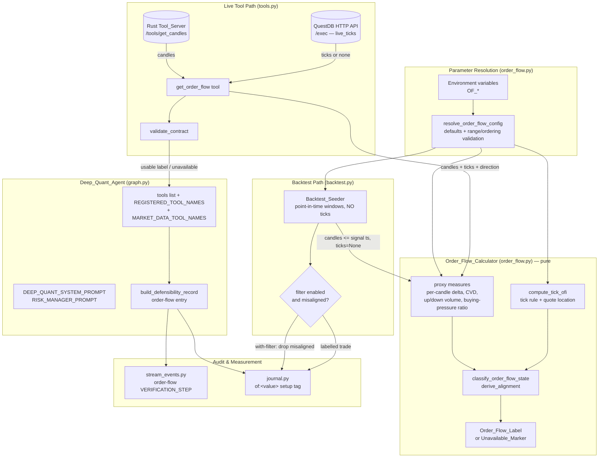

# Design Document

## Overview

The Order Flow Context feature gives the Deep Quant agent ("Alpha-Quant") the one read it currently lacks: *who is actually pressing the trade* — buyers or sellers. The agent reasons from candle-derived indicators and now also from regime and relative strength, but it is still blind to order flow: whether upticks are trading on volume, whether cumulative delta confirms a move, whether net buying or selling pressure backs the proposed direction. A veteran trader reads the tape; this feature implements that read within the honest limits of the data the system actually has.

The data reality drives a **two-layer** design. The system's intraday tick stream (`live_ticks` in QuestDB) carries, per tick, the last price, the day's cumulative volume, and the best bid / best ask — so a true tick-rule Order Flow Imbalance (OFI) is a **live, intraday-only** signal. There is no tick-level bid/ask history in the multi-year candle archive, so OFI cannot be backtested. To preserve the project's "prove the lift with a backtest" rigor (used by `regime-detection-gate` and `relative-strength-context`), the feature delivers two complementary layers:

1. **Candle-derived order-flow proxies** — a pure-math layer computed from OHLCV candles only (a per-candle delta proxy from close-location × volume, a cumulative-volume-delta proxy, up/down volume, and a buying-pressure ratio). Because it needs only candles, it is deterministic, property-testable, and **fully backtestable** on the historical archive with the same with-filter / without-filter comparison the preceding features use.
2. **Live tick-based Order Flow Imbalance (Tick_OFI)** — a true tick-rule OFI (signed traded volume by uptick/downtick, refined Lee-Ready-style by quote location when best bid/ask is present), read from `live_ticks` via the QuestDB HTTP API and computed in Python (mirroring the existing Rust `compute_order_flow_imbalance`). It is the real intraday edge but is honestly marked **unavailable** when the tick stream is absent (market closed, no rows, too few ticks), never fabricating a neutral value.

Both layers feed a single `Order_Flow_Label` — an Order_Flow_State (`buying`/`selling`/`balanced`) plus an Alignment (`aligned`/`misaligned`/`neutral`) of a proposed trade direction with the flow, the named Order_Flow_Proxy_Measures, the Tick_OFI (or its unavailable indication), and a flag recording whether live tick data contributed. The label is exposed to the agent as a new `get_order_flow` Analysis_Tool and wired through exactly the same layers as the preceding two features: graph registration, system prompts, the defensibility record, a stream verification step, a Trade_Journal fingerprint dimension, and the Backtest_Seeder comparison (proxy layer only). All parameters are environment-variable-driven with documented defaults.

Concretely, the design adds:

1. A pure-Python `Order_Flow_Calculator` (new module `order_flow.py`) that maps an OHLCV candle sequence, an optional tick sequence, a resolved configuration, and an optional proposed trade direction to a structured `Order_Flow_Label`, or to an honest `Unavailable_Marker`. No network, no clock, no hidden state.
2. A new `get_order_flow` Analysis_Tool in `tools.py` that fetches the symbol candles from the authoritative Rust Tool_Server (proxy layer) and attempts to read recent ticks for the symbol from the `live_ticks` Live_Ticks_Source via the QuestDB HTTP API (Tick_OFI layer), classifies them with the calculator, and returns a contract-validated result. `validate_contract` gains a `get_order_flow` branch.
3. Graph wiring in `graph.py`: the tool is bound to the model, registered in `REGISTERED_TOOL_NAMES` and `MARKET_DATA_TOOL_NAMES`, and the defensibility record gains an order-flow entry.
4. Prompt integration: `DEEP_QUANT_SYSTEM_PROMPT` and `RISK_MANAGER_PROMPT` instruct the agent to read the tape, check Alignment before a directional trade, and bias toward lower conviction / wait / HOLD when `misaligned`.
5. An order-flow `VERIFICATION_STEP` emitted by `stream_events.py`, ordered before the `DECISION`.
6. A new `of:<value>` dimension on the Trade_Journal Setup_Fingerprint (`journal.py`).
7. Backtest integration: `backtest.py` classifies each generated signal with the **same** `Order_Flow_Calculator` proxy functions (proxy layer only — no tick history) and supports a with-filter / without-filter comparison so the journal can prove, with numbers, whether requiring order-flow alignment improves expectancy.
8. Environment-variable-driven, validated parameters resolved identically on both the tool path and the backtest path.

This feature deliberately reuses the architecture established by `regime-detection-gate` and `relative-strength-context` (pure-Python deterministic calculator + configurable parameters + tool + contract + graph/prompt/defensibility/stream/journal/backtest integration) so the three compose cleanly: the **regime says *when* to trade, relative strength says *what* to trade, and order flow says *who is pressing it right now*.**

The design's central constraint is **scope discipline** (Requirement 14): order flow is a filter / context aid. It produces only a label or an unavailable marker; it never emits BUY/SELL/HOLD, never overrides a committed decision, never blocks a trade the agent chooses to take, and never fabricates a neutral Tick_OFI when live ticks are absent.

### Key Design Decisions

- **AD-1: Computation lives in pure Python; I/O lives in the tool.** The `Order_Flow_Calculator` takes its candle sequence **and its tick sequence** as plain in-memory inputs, so it is unit- and property-testable in isolation with no infrastructure (Requirements 1, 2, 4). The `get_order_flow` tool is the only place that performs I/O: it fetches candles from the same `/tools/get_candles` Rust endpoint every other tool uses, and reads ticks from the `live_ticks` QuestDB HTTP API. The calculator never touches the network or a clock (R1.1).
- **AD-2: A single source of truth for the order-flow math.** Both the live tool path (`get_order_flow`) and the `Backtest_Seeder` call the **same** `Order_Flow_Calculator` proxy functions (Requirements 12.1, 12.7). The backtest never reimplements the math; it only feeds candle windows point-in-time (no look-ahead) and supplies **no** ticks (tick history is unavailable in the candle archive, R12.2), so the seeded label is proxy-only.
- **AD-3: Two layers, one label, tick-first priority.** When a usable Tick_OFI is present it drives the Order_Flow_State (Requirement 3.2); otherwise the candle-derived proxies do. The label always carries a `live_tick_contributed` boolean so every consumer knows which layer spoke (Requirement 3.5). A label with only the proxy layer is still a usable label — not unavailable (Requirement 6.6).
- **AD-4: Contract failures are data, not exceptions.** Mirroring the existing `validate_contract` philosophy, a malformed order-flow result becomes a structured `{"error", "contract_violation"}` dict, and an unavailable result is an honest pass-through marker. Nothing in the order-flow path raises into the agent loop (Requirements 5.9, 6.5).
- **AD-5: Unavailable means "missing optional input," never "fabricate."** When order flow cannot be computed (insufficient candles, all-null proxies with no tick layer, candle-retrieval failure), the result omits Order_Flow_State / Alignment entirely rather than defaulting them, and every downstream consumer (defensibility record, verification step, journal tag, backtest filter) treats absence as a benign, non-blocking gap (Requirements 4.1, 4.6, 6.3, 9.3, 10.5, 12.6). A missing tick stream specifically degrades only the Tick_OFI to unavailable — never the whole label when the proxy layer is computable (Requirement 6.1, 6.6, 14.6).
- **AD-6: Parameters are resolved once, deterministically, with documented defaults.** A single `resolve_order_flow_config()` reads each parameter from its own environment variable, falls back to a documented default on unset/unparseable/out-of-range values, and enforces the `selling_threshold < buying_threshold` ordering — applied identically on both paths (Requirement 13).
- **AD-7: The order-flow tag is low-cardinality by construction.** The journal's order-flow dimension draws from a fixed enumeration of at most 8 values (including `unknown`) so the order-flow-extended `setup_key` stays groupable and individual setups can accumulate enough scored trades to clear the low-sample threshold (Requirement 11.3).
- **AD-8: The Tick_OFI math mirrors the authoritative Rust implementation.** The Python `compute_tick_ofi` reproduces `compute_order_flow_imbalance` (`frontend/src-tauri/src/commands/deep_quant.rs`): per-tick traded size is the positive delta of the day's cumulative `volume` between consecutive ticks; each delta is signed by the tick rule (uptick = buy, downtick = sell, zero-tick inherits the previous sign), refined by quote location relative to the bid/ask mid when a usable best bid/ask is present; the net signed volume is normalized by total signed volume and clamped to `[-1.0, 1.0]`; insufficient ticks or zero total signed volume yield unavailable rather than a fabricated `0.0`.

## Architecture

The order-flow feature threads a single new computation (`Order_Flow_Calculator`) through the agent's existing layers. The calculator is the only place the order-flow math exists; everything else consumes its output.



### Request flow (live FIND-mode analysis)

1. The agent, following `DEEP_QUANT_SYSTEM_PROMPT`, calls `get_order_flow(symbol, timeframe)` (optionally with a `proposed_direction`) during analysis.
2. The tool validates its arguments, resolves parameters via `resolve_order_flow_config()`, fetches the symbol candles from the Rust Tool_Server, and attempts to read recent ticks for the symbol from the `live_ticks` QuestDB HTTP API.
3. The tool calls `classify_order_flow(candles, ticks, config, proposed_direction=...)`, receiving either an `Order_Flow_Label` or an `Unavailable_Marker`. A missing/untrustworthy tick stream yields a usable proxy-only label with `live_tick_contributed=false`; a missing/insufficient candle layer yields an `Unavailable_Marker`.
4. The tool re-validates the result with `validate_contract("get_order_flow", result)` and returns it to the ReAct loop.
5. A usable label sets `market_data_seen`; an error/unavailable result does not.
6. When the agent commits a decision, `build_defensibility_record` reads the most recent `get_order_flow` result from message history and writes an order-flow entry.
7. `stream_events.py` emits an order-flow `VERIFICATION_STEP` (ordered before `DECISION`) derived from that entry.
8. `journal.derive_setup_tags` appends an `of:<value>` tag at a fixed position so per-order-flow stats are measurable.

### Backtest flow (comparison mode, proxy layer only)

1. The seeder walks history; for each generated signal it classifies order flow using only candles **at or before** the signal's candle timestamp (no look-ahead) via the same `classify_order_flow`, passing **no ticks** (tick history is unavailable in the candle archive) and the signal's direction as the proposed direction. The seeded label is therefore proxy-only with `live_tick_contributed=false`.
2. In the with-filter run, a signal whose Alignment is `misaligned` for its direction is excluded; an `Unavailable_Marker` signal is **retained** (never excluded on the basis of order flow).
3. The without-filter run keeps all signals. Both runs use identical candle history and identical setup rules.
4. Each seeded trade is labelled with its proxy-derived Order_Flow_State and Alignment; the seeder reports win-rate and expectancy per run, reporting `not-applicable` when a run produced zero closed trades.

## Components and Interfaces

### 1. `order_flow.py` (new module) — the Order_Flow_Calculator

A new pure-Python module in `agents/deep-quant-loop/`. No imports of `httpx`, no file/clock access. It exposes the calculator, the configuration resolver, the proxy measure functions, and the Tick_OFI function. It mirrors the structure of `regime.py` and `rs.py` exactly.

#### Configuration resolution

```python
# Default parameters (documented; applied on unset / unparseable / out-of-range).
DEFAULT_OF_LOOKBACK = 20             # bars over which CVD / up-down volume / pressure are measured
DEFAULT_OF_MIN_CANDLES = 20          # minimum valid candles required to classify the proxy layer
DEFAULT_OF_BUY_PRESSURE_THRESHOLD = 0.58   # buying-pressure ratio >= this => buying (proxy layer)
DEFAULT_OF_SELL_PRESSURE_THRESHOLD = 0.42  # buying-pressure ratio <= this => selling (proxy layer)
DEFAULT_OF_OFI_BUY_THRESHOLD = 0.20  # Tick_OFI >= this => buying (tick layer)
DEFAULT_OF_OFI_SELL_THRESHOLD = -0.20  # Tick_OFI <= this => selling (tick layer)
DEFAULT_OF_MIN_TICKS = 10            # minimum ticks for a trustworthy Tick_OFI (matches Rust >= 10)

@dataclass(frozen=True)
class OrderFlowConfig:
    lookback: int
    min_candles: int
    buy_pressure_threshold: float
    sell_pressure_threshold: float
    ofi_buy_threshold: float
    ofi_sell_threshold: float
    min_ticks: int

    @property
    def largest_lookback(self) -> int:
        """Max valid candles any single proxy measure requires (drives the gate)."""
        return max(self.lookback, self.min_candles)

def resolve_order_flow_config() -> OrderFlowConfig:
    """Resolve every parameter from its own env var with documented defaults.

    Per-parameter rules (R13):
      * unset / empty            -> documented default
      * unparseable as its type  -> documented default (never raises)
      * parses but out of range  -> documented default (never raises)
      * sell_pressure_threshold >= buy_pressure_threshold -> BOTH revert to defaults
    Called on the tool path and the backtest path so resolved values are
    identical for identical env (R13.6). NEVER raises.
    """
```

Environment variables (each independently parsed):

| Parameter | Env var | Type | Valid range | Default |
|---|---|---|---|---|
| Proxy lookback period | `OF_LOOKBACK` | int | ≥ 2 | 20 |
| Minimum candle count | `OF_MIN_CANDLES` | int | ≥ 2 | 20 |
| Buying-pressure threshold | `OF_BUY_PRESSURE_THRESHOLD` | float | 0.0–1.0 | 0.58 |
| Selling-pressure threshold | `OF_SELL_PRESSURE_THRESHOLD` | float | 0.0–1.0 | 0.42 |
| Tick_OFI buying threshold | `OF_OFI_BUY_THRESHOLD` | float | -1.0–1.0 | 0.20 |
| Tick_OFI selling threshold | `OF_OFI_SELL_THRESHOLD` | float | -1.0–1.0 | -0.20 |
| Minimum trustworthy tick count | `OF_MIN_TICKS` | int | ≥ 2 | 10 |

The `selling_threshold < buying_threshold` ordering is enforced for the buying/selling pressure thresholds: if the resolved selling threshold is not strictly less than the resolved buying threshold, **both** revert to their documented defaults (Requirement 13.5). (The Tick_OFI buy/sell thresholds are documented with `sell < buy` defaults; the same ordering guard is applied to them.)

#### Proxy measure functions (pure, candle-only)

```python
def compute_close_location_value(candle) -> Optional[float]:
    """Close-location value ((close - low) - (high - close)) / (high - low) in
    [-1.0, 1.0]; None when high == low (R1.2). Pure."""

def compute_candle_delta_proxy(candle) -> Optional[float]:
    """Per-candle delta proxy = close-location value * volume (R1.2). None when
    the close-location value is None (high == low)."""

def compute_cvd_proxy(candles, lookback) -> Optional[float]:
    """Cumulative-volume-delta proxy = running sum of the per-candle delta proxy
    over the last `lookback` valid candles (R1.3). Candles whose delta proxy is
    None contribute 0. None when no valid candle is available."""

def compute_up_down_volume(candles, lookback) -> tuple[float, float]:
    """Up-volume (sum of volume on candles closing above open) and down-volume
    (sum of volume on candles closing below open) over the last `lookback` valid
    candles (R1.4). Candles closing exactly at open contribute to neither."""

def compute_buying_pressure_ratio(candles, lookback) -> Optional[float]:
    """Buying-pressure ratio = up_volume / (up_volume + down_volume) in
    [0.0, 1.0], clamped (R1.5, R4.4). None when total directional volume is zero
    (R1.5, R4.5)."""
```

Each measure function ignores candles with non-finite/non-numeric OHLCV fields (Requirement 4.2), clamps bounded measures into range (Requirement 4.4), and returns `None` when its denominator is zero (Requirements 1.5, 4.5).

#### Tick_OFI function (pure, mirrors the Rust implementation)

```python
def compute_tick_ofi(ticks, config) -> Optional[float]:
    """Tick-rule Order Flow Imbalance over a tick sequence (AD-8, R2).

    Each tick is (last_price, cumulative volume, best_bid, best_ask). Per-tick
    traded size is the POSITIVE delta of cumulative volume between consecutive
    ticks (negative deltas — session resets — are skipped). Each delta is signed
    by the tick rule (uptick=+1 buy, downtick=-1 sell, zero-tick inherits the
    previous sign), then refined by quote location when a usable best bid/ask is
    present: trade above the bid/ask mid => +1, below => -1, at mid => tick sign
    (Lee-Ready style, R2.2). OFI = net signed volume / total signed volume,
    clamped to [-1.0, 1.0] (R2.4).

    Returns None (unavailable) when ticks is empty, has fewer than
    `config.min_ticks` usable ticks, or yields zero total signed volume (R2.3) —
    NEVER a fabricated neutral 0.0 (R14.6). Pure and deterministic; never mutates
    the tick sequence (R2.5); never returns a non-finite value (R2.4)."""
```

Ticks with non-finite/non-numeric fields are excluded from the computation (Requirement 4.2).

#### Classification functions (pure, total)

```python
def classify_order_flow_state(tick_ofi, buying_pressure_ratio, config) -> str:
    """Return exactly one of 'buying' | 'selling' | 'balanced' (R3.1).
    Tick-first priority (R3.2): when `tick_ofi` is a usable finite value, compare
    it against the configured Tick_OFI buy/sell thresholds; otherwise compare the
    candle-derived `buying_pressure_ratio` against the configured pressure
    thresholds. A None on the deciding signal => 'balanced'."""

def derive_alignment(order_flow_state, proposed_direction) -> str:
    """Return exactly one of 'aligned' | 'misaligned' | 'neutral' (R3.3, R3.4).
    Total function: every (order_flow_state, proposed_direction) combination —
    including a None/absent proposed_direction -> 'neutral' — maps to exactly one
    Alignment value."""

def classify_order_flow(candles, ticks, config, proposed_direction=None,
                        symbol=None, timeframe=None) -> dict:
    """Top-level entry point. Returns either an Order_Flow_Label dict or an
    Unavailable_Marker dict. Pure and deterministic (R1.6, R2.5); never mutates
    inputs (R1.7); never raises (R4); emits ONLY a label or marker (R14.1)."""
```

`classify_order_flow` computes the proxy measures from valid candles, computes the Tick_OFI from the (possibly empty/None) tick sequence, sets `live_tick_contributed` true only when a usable Tick_OFI was produced, classifies the Order_Flow_State (tick-first), and derives the Alignment. It returns an `Unavailable_Marker` when the valid candle count is fewer than the configured minimum (Requirement 4.1) or when every candle-derived proxy is null **and** the Tick_OFI is unavailable (Requirement 4.6). The Order_Flow_State / Alignment / proxy-measure / Tick_OFI mapping tables are specified in the Data Models section so they are total and unambiguous.

### 2. `tools.py` — the `get_order_flow` tool and contract

```python
ORDER_FLOW_STATES = {"buying", "selling", "balanced"}
# ALIGNMENT_VALUES = {"aligned", "misaligned", "neutral"}  # already defined (relative-strength)
_OF_MEASURE_FIELDS = (
    "candle_delta", "cvd_proxy", "up_volume", "down_volume", "buying_pressure_ratio",
)

# QuestDB HTTP query API for the Live_Ticks_Source (same endpoint backtest.py uses).
QUESTDB_HTTP_URL = os.getenv("QUESTDB_HTTP_URL", "http://127.0.0.1:9000")
# How many recent ticks to read for the Tick_OFI (matches the Rust LIMIT 200).
OF_TICK_FETCH_LIMIT = int(os.getenv("OF_TICK_FETCH_LIMIT", "200"))

@tool
def get_order_flow(symbol: str, timeframe: str, proposed_direction: str = "") -> dict:
    """Read the tape: classify net order-flow pressure (buying/selling/balanced)
    and the alignment of a proposed trade direction with that flow, from candle-
    derived proxies and (when the live tick stream is available) a true tick-based
    Order Flow Imbalance. Returns order_flow_state, alignment, the named proxy
    measures, the Tick_OFI (or an unavailable indication), and the
    live-tick-contributed flag, or an Unavailable_Marker. Never raises (R5, R6)."""
    # 1. Validate args: empty/whitespace symbol or unsupported timeframe -> error (R5.3).
    # 2. Resolve config via order_flow.resolve_order_flow_config().
    # 3. Fetch symbol candles from RUST_SERVER_URL/tools/get_candles. On retrieval
    #    failure/timeout/error payload -> Unavailable_Marker citing the cause (R6.2).
    # 4. Attempt to read recent ticks from live_ticks via the QuestDB HTTP API
    #    (_read_live_ticks). On any failure / no rows -> ticks = [] (Tick_OFI will
    #    be unavailable; proxy layer still classified, R6.1).
    # 5. result = order_flow.classify_order_flow(candles, ticks, config,
    #               proposed_direction=proposed_direction or None, ...)
    # 6. return validate_contract("get_order_flow", result)
```

A `_read_live_ticks(symbol, limit)` helper performs the Live_Ticks_Source read against the QuestDB HTTP `/exec` endpoint (the same API `backtest.py` already uses for `historical_*`):

```python
def _read_live_ticks(symbol, limit):
    """Read up to `limit` recent ticks for `symbol` from the live_ticks table via
    the QuestDB HTTP query API, oldest-first. Returns a list of tick dicts
    {last_price, volume, best_bid, best_ask}. Returns [] on any failure
    (unreachable, no rows, malformed) — the caller treats [] as 'tick layer
    unavailable' (R6.1). Never raises into the tool body."""
    # SELECT last_traded_price, volume, best_bid, best_ask FROM live_ticks
    #   WHERE symbol='...' ORDER BY timestamp DESC LIMIT {limit}    (then reversed)
```

A `_order_flow_unavailable(symbol, timeframe, reason)` helper mirrors `_regime_unavailable` / `_relative_strength_unavailable`: it carries context plus `{"unavailable": true, "reason": ...}` and **omits** `order_flow_state` / `alignment` (AD-5, Requirements 6.3, 14.6).

`validate_contract` gains a `get_order_flow` branch:

- An `Unavailable_Marker` (`{"unavailable": true, ...}`) is already recognized by the existing `_has_honest_marker` and passes through unchanged (Requirement 5.8).
- A conforming label: `order_flow_state ∈ {buying,selling,balanced}`, `alignment ∈ {aligned,misaligned,neutral}`, each `_OF_MEASURE_FIELDS` measure present (under a `measures` object) and finite-number-or-null, `tick_ofi` a finite number or `null`, and `live_tick_contributed` a boolean. Returned unchanged (Requirement 5.6).
- Otherwise → `_contract_error("...offending field...")` (Requirement 5.7).
- Wrapped in the existing `try/except` so validation never raises (Requirement 5.9).

### 3. `graph.py` — graph wiring and defensibility

- Add `get_order_flow` to the `tools` list, `REGISTERED_TOOL_NAMES`, and `MARKET_DATA_TOOL_NAMES` (Requirements 7.1–7.3). Because it joins `MARKET_DATA_TOOL_NAMES`, the existing `market_data_seen` logic automatically treats a usable result as data and an error/unavailable result as not-data (Requirements 7.4–7.5) with no further change — the existing `_tool_result_is_error` / unavailable predicates already classify the `{"unavailable": true}` marker correctly.
- `build_defensibility_record` gains an order-flow entry built by a new `_order_flow_entry(results)` helper, modelled on `_relative_strength_entry`:

```python
def _order_flow_entry(results) -> dict:
    """Build the defensibility order-flow entry from the most recent
    get_order_flow result already present in message history (R9.1-R9.3).
    Returns {'available': False, ...} when absent / unavailable / not a usable
    label (R9.3); otherwise copies order_flow_state, alignment, the named
    measures, tick_ofi, and live_tick_contributed VERBATIM (R9.2 — no inference)."""
```

The record's order-flow entry, plus a flag set when `alignment == "misaligned"` and `action ∈ {BUY, SELL}`, supplies the explicit "trade is taken against the prevailing order flow" statement (Requirement 9.4). The entry is a pure read of tool output and never touches the committed decision's action or execution levels (Requirements 14.4, 14.5).

### 4. `stream_events.py` — order-flow verification step

A new check is appended in `_derive_find_mode_steps` (and surfaced in VERIFY mode via the same record entry), modelled on `_relative_strength_step`:

```python
def _order_flow_step(record) -> dict:
    """Map the defensibility order-flow entry to a VERIFICATION_STEP (R10).
      aligned      -> 'pass'                              (R10.2)
      misaligned   -> 'fail'                              (R10.3)
      neutral      -> 'informational'                     (R10.4)
      unavailable  -> 'not-evaluable' (with an 'unavailable' indication, R10.5)
    Stable check id 'order-flow' (R10.1). Never fabricates an alignment (R10.5)."""
```

`decision_events` already emits all `VERIFICATION_STEP`s before the `DECISION`, so ordering (Requirement 10.6) holds for free. Exactly one order-flow step is appended in both FIND and VERIFY mode (Requirement 10.1).

### 5. `journal.py` — order-flow setup-fingerprint dimension

`derive_setup_tags` appends exactly one order-flow tag at a **fixed position** (after the existing `rs:` tag) so `setup_key_from_tags` stays deterministic:

```python
OF_TAG_VALUES = {
    "buying-aligned", "buying-misaligned",
    "selling-aligned", "selling-misaligned",
    "balanced-neutral", "aligned", "misaligned",
    "unknown",
}  # <= 8 values total, including 'unknown' (R11.3)

def _order_flow_tag(decision) -> str:
    """Read order flow from decision['defensibility']['order_flow']; map
    (Order_Flow_State x Alignment) to one of the fixed OF_TAG_VALUES.
    Missing/empty/unavailable/unrecognized -> 'of:unknown' (R11.2)."""
```

The order-flow tag collapses the (Order_Flow_State × Alignment) space into a small fixed set so per-order-flow `setup_key` groups stay low-cardinality (Requirement 11.3): the directional pairings (`buying-aligned`, `buying-misaligned`, `selling-aligned`, `selling-misaligned`), the `balanced-neutral` pairing, and the bare `aligned`/`misaligned` for the residual combinations; anything missing/unavailable/unrecognized → `unknown`. The existing `_aggregate` already computes win-rate (fraction of scored trades that are wins) and expectancy (mean R-multiple) per `setup_key`, and the existing `LOW_SAMPLE_THRESHOLD` flagging already satisfies Requirements 11.4–11.5 once the tag is in place.

### 6. `backtest.py` — with-filter / without-filter comparison (proxy layer)

- `BacktestConfig` gains `of_filter_enabled: bool` and reuses `order_flow.resolve_order_flow_config()` (Requirements 12.7, 13.6).
- `generate_and_score` classifies each signal's order flow using only `candles[: i + 1]` (the window at/before the signal bar) via `order_flow.classify_order_flow`, passing **`ticks=None`** (tick history is unavailable in the candle archive — proxy-only, Requirement 12.2) and the signal's direction as `proposed_direction` (Requirement 12.1, no look-ahead).
- An `_order_flow_defensibility_entry(of_result)` helper (mirroring `_relative_strength_defensibility_entry`) writes the seeded trade's `decision['defensibility']['order_flow']` so `journal._order_flow_tag` labels it (Requirement 12.4).
- With-filter run: drop a signal when `alignment == "misaligned"` for its direction via a `_signal_is_of_misaligned(decision)` predicate; **retain** a signal whose order-flow result is an `Unavailable_Marker` (Requirements 12.3, 12.6). The drop advances the cooldown exactly as a taken signal would, so the with-filter run walks the identical history/rules as the without-filter run and its seeded set is a strict subset.
- A `compare_order_flow(...)` entry point (mirroring `compare_relative_strength`) runs both filtered and unfiltered over identical history/rules and reports each run's win-rate (`wins / closed`) and expectancy (mean realized R), returning `"n/a"` when a run has zero closed trades (Requirements 12.5).

### Frontend (consumption only)

No new Tauri/React work is mandated by the requirements. The order-flow `VERIFICATION_STEP` and the order-flow fields in the `DECISION`/defensibility payload flow through the existing SSE stream that the deep-quant panel / `AgentTerminal` already render, so the order-flow check and label appear in the existing verification/plan views automatically.

## Data Models

### OrderFlowConfig

The resolved, validated parameter set (see `resolve_order_flow_config`). Frozen dataclass; identical for identical env on both paths.

### Order_Flow_Label (successful classification)

```json
{
  "order_flow_state": "buying | selling | balanced",
  "alignment": "aligned | misaligned | neutral",
  "measures": {
    "candle_delta": 1820.5,
    "cvd_proxy": 14230.0,
    "up_volume": 98000.0,
    "down_volume": 64000.0,
    "buying_pressure_ratio": 0.605
  },
  "tick_ofi": 0.34,
  "live_tick_contributed": true,
  "symbol": "RELIANCE",
  "timeframe": "15m",
  "candles_used": 120,
  "ticks_used": 187
}
```

Each `measures` value is a finite number or `null` (Requirements 4.3, 4.5). The bounded `buying_pressure_ratio` is clamped into `[0.0, 1.0]` (Requirement 4.4). `tick_ofi` is a finite number in `[-1.0, 1.0]` when live ticks contributed, otherwise `null`; `live_tick_contributed` records which layer spoke (Requirements 3.5, 6.6). When only the proxy layer was usable, `tick_ofi` is `null` and `live_tick_contributed` is `false` (the label is still usable — not an Unavailable_Marker, Requirement 6.6).

### Unavailable_Marker

```json
{
  "symbol": "RELIANCE",
  "timeframe": "1m",
  "unavailable": true,
  "reason": "insufficient data: 12 valid candles received, 20 required"
}
```

`order_flow_state` / `alignment` are **omitted** (not defaulted) when unavailable (Requirements 4.1, 4.6, 6.3, 14.6). The `reason` cites the cause and, for the insufficient-data case, includes the count of valid candles received and the count required (Requirements 4.1). A candle-retrieval-failure marker names the retrieval cause (Requirement 6.2).

### Contract-violation result (from `validate_contract`)

```json
{
  "error": "Tool result failed contract validation: order_flow_state 'flat' not in {buying, selling, balanced}",
  "contract_violation": "order_flow_state 'flat' not in {buying, selling, balanced}"
}
```

### Per-candle delta proxy and close-location value

For a candle with high `H`, low `L`, close `C`, volume `V`:

- Close-location value `CLV = ((C - L) - (H - C)) / (H - L)`, in `[-1.0, 1.0]`; `null` when `H == L` (Requirement 1.2).
- Per-candle delta proxy `= CLV * V`; `null` when `CLV` is `null` (Requirement 1.2).

### Order_Flow_State classification (total mapping)

The deciding signal is the Tick_OFI when a usable (finite) Tick_OFI is present (tick-first priority, Requirement 3.2); otherwise the candle-derived `buying_pressure_ratio`. Thresholds satisfy `sell < buy` (enforced at resolution).

When a usable Tick_OFI is present:

| Condition | Order_Flow_State |
|---|---|
| `tick_ofi >= ofi_buy_threshold` | `buying` |
| `tick_ofi <= ofi_sell_threshold` | `selling` |
| otherwise (between thresholds) | `balanced` |

Otherwise (proxy layer):

| Condition | Order_Flow_State |
|---|---|
| `buying_pressure_ratio >= buy_pressure_threshold` | `buying` |
| `buying_pressure_ratio <= sell_pressure_threshold` | `selling` |
| otherwise (between thresholds, or `buying_pressure_ratio` is `null`) | `balanced` |

### Alignment derivation (total mapping over Order_Flow_State × proposed_direction)

Alignment expresses whether the proposed trade direction agrees with the prevailing pressure. When no proposed trade direction is provided (or HOLD), Alignment is `neutral` (Requirement 3.4).

For a **BUY** proposed direction:

| Order_Flow_State | Alignment |
|---|---|
| `buying` | `aligned` |
| `selling` | `misaligned` |
| `balanced` | `neutral` |

For a **SELL** proposed direction:

| Order_Flow_State | Alignment |
|---|---|
| `selling` | `aligned` |
| `buying` | `misaligned` |
| `balanced` | `neutral` |

For **no proposed direction** (or HOLD): `neutral` for every Order_Flow_State.

Every combination of the two inputs maps to exactly one Alignment value, so `derive_alignment` is total (Requirement 3.3).

### Journal order-flow tag (fixed enumeration)

The journal collapses (Order_Flow_State, Alignment) into the fixed `of:<value>` set: the directional pairings (`buying-aligned`, `buying-misaligned`, `selling-aligned`, `selling-misaligned`), the `balanced-neutral` pairing, and the bare `aligned`/`misaligned` for the residual combinations; anything missing/unavailable/unrecognized → `unknown`. At most 8 distinct values including `unknown` (Requirement 11.3).

## Correctness Properties

*A property is a characteristic or behavior that should hold true across all valid executions of a system — essentially, a formal statement about what the system should do. Properties serve as the bridge between human-readable specifications and machine-verifiable correctness guarantees.*

The prework analysis classified each acceptance criterion and consolidated the redundant ones (the purity/determinism criteria, the measure-presence/clamping criteria, the zero-denominator criteria, the contract identity criteria, the degradation criteria, the verification-step outcome criteria, the tag criteria, and the per-parameter fallback criteria were each merged). Purely structural/prompt-text criteria (tool registration, prompt wording, the data-source restriction, the backtest's reuse of the calculator) are covered by example-based unit tests in the Testing Strategy rather than properties.

### Property 1: Classification is deterministic

*For any* candle sequence, tick sequence, configuration, and optional proposed direction, invoking `classify_order_flow` two or more times returns results (Order_Flow_Label or Unavailable_Marker, including the Order_Flow_State, Alignment, every proxy measure, the Tick_OFI, and the live-tick-contributed flag) that are element-wise identical across all invocations.

**Validates: Requirements 1.6, 2.5**

### Property 2: Calculator functions are pure (no input mutation)

*For any* candle sequence, tick sequence, and configuration, every `Order_Flow_Calculator` function (the proxy measure functions, `compute_tick_ofi`, the classification functions, and `classify_order_flow`) leaves the provided candle sequence, tick sequence, and configuration deep-equal to their pre-call snapshots, producing no observable change to any input and performing no network call.

**Validates: Requirements 1.1, 1.7, 2.5**

### Property 3: Proxy measures are present, finite-or-null, and correct

*For any* candle sequence with at least the configured minimum of valid candles, the resulting Order_Flow_Label includes each named Order_Flow_Proxy_Measure (`candle_delta`, `cvd_proxy`, `up_volume`, `down_volume`, `buying_pressure_ratio`), each is a finite number or `null`, the per-candle delta proxy equals the close-location value (which is `null` when `high == low`) times the candle volume, the CVD proxy equals the running sum of the per-candle delta proxies over the lookback, and the up/down volumes equal the summed volumes of candles closing above/below their open.

**Validates: Requirements 1.2, 1.3, 1.4, 4.3**

### Property 4: Bounded measures are clamped within their range

*For any* candle sequence and tick sequence, the `buying_pressure_ratio` reported in the Order_Flow_Label lies within `[0.0, 1.0]` and the reported `tick_ofi` (when present) lies within `[-1.0, 1.0]`, even when a raw computed value would fall outside that range.

**Validates: Requirements 4.4**

### Property 5: Zero-denominator measures are null, and all-null-with-no-tick yields unavailable

*For any* candle window in which a proxy measure's denominator is zero (for example zero total directional volume for the buying-pressure ratio, or a flat `high == low` candle for the close-location value), that measure is represented as `null` in the Order_Flow_Label and no exception is raised; and *for any* input in which every candle-derived proxy is `null` and the Tick_OFI is unavailable, `classify_order_flow` returns an Unavailable_Marker rather than an Order_Flow_Label.

**Validates: Requirements 1.5, 4.5, 4.6**

### Property 6: Tick_OFI is the normalized signed-volume imbalance within bounds

*For any* tick sequence with at least the configured minimum of usable ticks and nonzero total signed volume, `compute_tick_ofi` returns a finite value equal to the net signed traded volume divided by the total signed traded volume — where per-tick traded size is the positive cumulative-volume delta signed by the tick rule (uptick buy, downtick sell, zero-tick inheriting the previous sign) — clamped to and lying within `[-1.0, 1.0]`, and never returns a non-finite value.

**Validates: Requirements 2.1, 2.4**

### Property 7: Quote location refines the tick sign (Lee-Ready)

*For any* tick carrying a usable best bid and best ask (both positive with ask ≥ bid), the sign contributed by that tick is `+1` when its last price is above the bid/ask mid-price, `-1` when below the mid, and the plain tick-rule sign when exactly at the mid; for any tick lacking a usable quote, the contributed sign is the plain tick-rule sign.

**Validates: Requirements 2.2**

### Property 8: Insufficient or degenerate ticks yield an unavailable Tick_OFI, never a fabricated neutral

*For any* tick sequence that is empty, carries fewer usable ticks than the configured minimum, or yields zero total signed volume, `compute_tick_ofi` reports the Tick_OFI as unavailable (and the resulting label's `tick_ofi` is `null` with `live_tick_contributed` false) rather than returning a fabricated neutral `0.0`, and never raises.

**Validates: Requirements 2.3, 14.6**

### Property 9: Order_Flow_State is well-formed and matches the threshold mapping

*For any* Order_Flow_Label produced from sufficient candles, the Order_Flow_State is exactly one of `buying`/`selling`/`balanced` and equals the value dictated by comparing the deciding signal against the configured thresholds per the specified mapping tables (the Tick_OFI against the Tick_OFI buy/sell thresholds when a usable Tick_OFI is present, otherwise the buying-pressure ratio against the pressure thresholds).

**Validates: Requirements 3.1**

### Property 10: A usable Tick_OFI takes priority over the candle proxies

*For any* candle sequence and tick sequence that yields a usable Tick_OFI, the Order_Flow_State equals the value dictated by the Tick_OFI threshold mapping regardless of what the candle-derived buying-pressure ratio alone would dictate, and the label's `live_tick_contributed` flag is true.

**Validates: Requirements 3.2, 3.5**

### Property 11: Alignment is a total function of state and proposed direction

*For any* combination of an Order_Flow_State value and a proposed trade direction (BUY, SELL, or absent), `derive_alignment` returns exactly one Alignment value drawn from `aligned`/`misaligned`/`neutral`, so that every combination maps to exactly one Alignment.

**Validates: Requirements 3.3**

### Property 12: Absent proposed direction yields a neutral alignment with the other fields present

*For any* candle/tick sequences and configuration with no proposed trade direction provided, the result (when not unavailable) reports Alignment `neutral` while still populating the Order_Flow_State, the named proxy measures, and the live-tick-contributed flag.

**Validates: Requirements 3.4, 3.5**

### Property 13: Non-finite candles and ticks are excluded without affecting the result

*For any* valid candle and tick sequences and any interleaving of candles or ticks carrying non-finite or non-numeric fields, `classify_order_flow` returns a result equal to the result of classifying only the valid candles and ticks, and never raises an exception.

**Validates: Requirements 4.2**

### Property 14: Insufficient candles yield an Unavailable_Marker with counts

*For any* candle sequence whose count of valid candles is fewer than the configured minimum (whether short to begin with or short after excluding non-finite candles), `classify_order_flow` returns an Unavailable_Marker whose reason identifies the insufficient-data condition and includes both the count of valid candles received and the configured minimum required, leaving the inputs unmodified and never raising.

**Validates: Requirements 4.1**

### Property 15: An Unavailable_Marker never carries fabricated states

*For any* path that produces an Unavailable_Marker (insufficient candles, all-null proxies with no tick layer, candle-retrieval failure, or processing error), the marker omits the `order_flow_state` and `alignment` keys entirely rather than populating them with default, placeholder, or otherwise fabricated values.

**Validates: Requirements 4.6, 6.3, 14.6**

### Property 16: The tool rejects invalid arguments without raising

*For any* whitespace-only or empty `symbol`, or any `timeframe` not in the supported timeframe set, `get_order_flow` returns a structured error result and never raises an exception.

**Validates: Requirements 5.3**

### Property 17: A successful tool result is well-formed

*For any* candle data sufficient to classify (with candle retrieval and tick reading mocked), the `get_order_flow` result contains `order_flow_state` in its enum, `alignment` in its enum, each named proxy measure present as a finite number or `null`, `tick_ofi` as a finite number or `null`, and `live_tick_contributed` as a boolean.

**Validates: Requirements 5.5, 3.5**

### Property 18: validate_contract is the identity on conforming results and markers

*For any* generated conforming `get_order_flow` Order_Flow_Label, and *for any* Unavailable_Marker, `validate_contract("get_order_flow", result)` returns that result unchanged.

**Validates: Requirements 5.6, 5.8**

### Property 19: validate_contract rejects non-conforming results, naming the field

*For any* `get_order_flow` result mutated to violate the contract (an out-of-enum state or alignment, a missing required field, a non-numeric/non-null measure, a non-numeric/non-null `tick_ofi`, or a non-boolean `live_tick_contributed`), `validate_contract` returns a structured `{"error", "contract_violation"}` result whose violation message identifies the offending field.

**Validates: Requirements 5.7**

### Property 20: validate_contract never raises on an order-flow result

*For any* arbitrary payload (a well-formed object, a malformed object, a list, a scalar, or `None`), `validate_contract("get_order_flow", payload)` returns a dict and never raises an exception.

**Validates: Requirements 5.9**

### Property 21: The tool degrades to an Unavailable_Marker on any candle-retrieval or processing failure

*For any* simulated failure in candle retrieval (timeout, connection error, error payload) or in downstream processing, `get_order_flow` returns an Unavailable_Marker whose reason identifies the cause and never propagates an exception into the agent loop.

**Validates: Requirements 6.2, 6.5**

### Property 22: A missing tick stream degrades only the Tick_OFI, leaving a usable proxy-only label

*For any* candle data sufficient to classify combined with a live-tick read that is unreachable, returns no rows, or yields an untrustworthy (insufficient/zero-signed-volume) tick set, `get_order_flow` returns a usable Order_Flow_Label whose `tick_ofi` is `null` and whose `live_tick_contributed` flag is false — rather than an Unavailable_Marker — so the proxy layer alone still produces a usable read.

**Validates: Requirements 6.1, 6.6**

### Property 23: The market-data gate classifies order-flow results correctly and stays monotone

*For any* message history, `get_order_flow` contributes to `market_data_seen` only via a usable result (neither an error nor an Unavailable_Marker); a history whose only market-data result is an error or unavailable order-flow result yields `market_data_seen == false`; and once a usable market-data result makes the flag true, appending any further messages leaves it true.

**Validates: Requirements 7.4, 7.5**

### Property 24: The defensibility order-flow entry mirrors the tool result without fabrication

*For any* message history containing a usable `get_order_flow` result, `build_defensibility_record` produces an order-flow entry whose Order_Flow_State, Alignment, named proxy measures, Tick_OFI, and live-tick-contributed flag are exactly the values from the most recent such result, introducing no value not present in that result.

**Validates: Requirements 9.1, 9.2**

### Property 25: Absent order flow is recorded as unavailable

*For any* message history containing no usable `get_order_flow` result, the order-flow entry of the Defensibility_Record is marked unavailable and contains no Order_Flow_State, Alignment, measure, or Tick_OFI substitute values.

**Validates: Requirements 9.3**

### Property 26: A misaligned directional trade records the opposition statement

*For any* decision whose most recent order-flow Alignment is `misaligned` and whose committed action is BUY or SELL, the Defensibility_Record includes an explicit statement that the committed trade is taken against the prevailing order flow; for HOLD actions or non-`misaligned` alignments, no such statement is added.

**Validates: Requirements 9.4**

### Property 27: Exactly one order-flow verification step with the correct outcome mapping

*For any* decision, the built Verification_Steps contain exactly one order-flow step carrying the stable check identifier `order-flow`, whose outcome is `pass` when the recorded Alignment is `aligned`, `fail` when `misaligned`, `informational` when `neutral`, and `not-evaluable` (with an unavailable indication and no fabricated Alignment) when order flow is unavailable.

**Validates: Requirements 10.1, 10.2, 10.3, 10.4, 10.5**

### Property 28: The order-flow verification step precedes the DECISION event

*For any* decision, the event sequence emitted by `decision_events` places the order-flow `VERIFICATION_STEP` before the `DECISION` event of that run.

**Validates: Requirements 10.6**

### Property 29: Exactly one low-cardinality order-flow tag at a fixed position

*For any* decision, `derive_setup_tags` appends exactly one `of:<value>` tag at a fixed position in the tag sequence, where `<value>` is drawn from the fixed enumeration of at most 8 values (including `unknown`); a decision lacking a valid recorded order flow yields `of:unknown`; and identical decisions yield an identical `setup_key`.

**Validates: Requirements 11.1, 11.2, 11.3**

### Property 30: Per-order-flow aggregation reports correct win-rate and expectancy

*For any* set of recorded trades, grouping scored (win or loss) trades by the order-flow-extended `setup_key` yields, for each group, a win-rate equal to the fraction of scored trades that are wins (within `[0.0, 1.0]`) and an expectancy equal to the mean R-multiple of the group's scored trades, with any group holding fewer scored trades than the low-sample threshold flagged as a weak prior.

**Validates: Requirements 11.4, 11.5**

### Property 31: Backtest order-flow classification is look-ahead-free

*For any* candle history and any signal index, the Order_Flow_Label the Backtest_Seeder assigns to that signal is computed only from candles at or before the signal's candle timestamp, so that altering or removing any later candles does not change the assigned Order_Flow_Label.

**Validates: Requirements 12.1**

### Property 32: The enabled filter excludes misaligned signals and retains unavailable ones

*For any* set of generated signals with the order-flow filter enabled, the with-filter seeded trade set contains no signal whose Alignment is `misaligned` for its direction, and retains every signal whose order-flow result is an Unavailable_Marker (such signals are never excluded on the basis of order flow).

**Validates: Requirements 12.3, 12.6**

### Property 33: Comparison-mode runs are consistent and metrics are well-defined

*For any* candle history processed in comparison mode over identical setup rules, the with-filter seeded trade set is a subset of the without-filter set, each seeded trade is labelled with the proxy-derived Order_Flow_State and Alignment used to classify it, each run's reported win-rate equals its winning-closed-trade count divided by its closed-trade count and its expectancy equals the mean realized R-multiple per closed trade, and a run with zero closed trades reports win-rate and expectancy as not-applicable rather than dividing by zero.

**Validates: Requirements 12.4, 12.5**

### Property 34: Each parameter falls back to its documented default

*For any* environment in which an order-flow parameter variable is unset, empty, unparseable as its expected type, or parseable but outside its valid range, `resolve_order_flow_config` applies that parameter's documented default value while reading every parameter from its own variable, and never raises.

**Validates: Requirements 13.1, 13.2, 13.3, 13.4**

### Property 35: Pressure-threshold ordering is enforced

*For any* environment in which the resolved selling-pressure threshold is not strictly less than the resolved buying-pressure threshold, `resolve_order_flow_config` applies the documented default values for both pressure thresholds without raising.

**Validates: Requirements 13.5**

### Property 36: Parameter resolution is deterministic and path-independent

*For any* environment, `resolve_order_flow_config` returns equal `OrderFlowConfig` values across repeated calls and across the Order_Flow_Tool path and the Backtest_Seeder path, so identical environment values resolve to identical parameters on both paths.

**Validates: Requirements 13.6**

### Property 37: The calculator never emits a trade decision

*For any* candle/tick sequences and configuration, the `classify_order_flow` result is an Order_Flow_Label or an Unavailable_Marker and contains no BUY, SELL, or HOLD action, no conviction score, and no decision field, so classification alone — even when the Order_Flow_State confirms a direction — never commits, generates, or triggers a trade.

**Validates: Requirements 14.1, 14.3**

### Property 38: The order-flow context never modifies or blocks a committed decision

*For any* committed decision — including one whose Alignment is `misaligned` or `neutral` — assembling the defensibility order-flow entry and verification step leaves the decision's action and execution levels (entry, stop-loss, take-profit) unchanged, so the order-flow context neither overrides nor blocks a trade the agent decides to commit.

**Validates: Requirements 14.4, 14.5**

## Error Handling

The order-flow feature follows the codebase's established "errors are data, never exceptions into the loop" philosophy.

| Failure | Layer | Handling |
|---|---|---|
| Fewer valid candles than the configured minimum | `classify_order_flow` | Return `Unavailable_Marker` with reason citing received vs required counts (R4.1). No raise. |
| Candle/tick with non-finite/non-numeric fields | proxy / tick functions | Candle or tick excluded from all computations (R4.2). No raise. |
| Zero-denominator measure (flat candle, zero directional volume) | proxy function | Measure reported as `null` (R1.5, R4.5); if all proxies null and Tick_OFI unavailable, calculator returns `Unavailable_Marker` (R4.6). |
| Empty / too-few / zero-signed-volume ticks | `compute_tick_ofi` | Tick_OFI reported unavailable (`null`, `live_tick_contributed=false`); never a fabricated `0.0` (R2.3, R14.6). |
| Parameter env var unset/empty/unparseable/out-of-range | `resolve_order_flow_config` | Apply documented default for that parameter (R13.2–R13.4). No raise. |
| `sell_pressure_threshold >= buy_pressure_threshold` | `resolve_order_flow_config` | Revert BOTH pressure thresholds to defaults (R13.5). No raise. |
| Empty/whitespace symbol or unsupported timeframe | `get_order_flow` | Return structured error result (R5.3). No raise. |
| Live-ticks read unreachable / no rows / malformed | `_read_live_ticks` → `get_order_flow` | Treat as no ticks: Tick_OFI unavailable, proxy layer still classified into a usable label (R6.1, R6.6). No raise. |
| Candle retrieval timeout / connection error / error payload | `get_order_flow` | Return `Unavailable_Marker` citing the retrieval cause (R6.2). No raise. |
| Any unexpected exception during fetch/classify | `get_order_flow` | Caught; return `Unavailable_Marker` (R6.5). Never propagates into the agent loop. |
| Malformed order-flow result reaching the consumer | `validate_contract` | Return `{"error", "contract_violation"}` naming the offending field (R5.7); wrapped in try/except so validation never raises (R5.9). |
| No order-flow result in history at commit time | `build_defensibility_record` | Record entry as unavailable; no substitute values (R9.3). |
| Zero closed trades in a comparison run | `backtest` comparison | Report win-rate/expectancy as `"n/a"` rather than dividing by zero (R12.5). |
| `journal.record_decision` / tagging failure | `journal.py` | Best-effort; logged and swallowed (existing pattern) so journaling never aborts a run. |

The defining invariant: a missing or unavailable order-flow result is always a benign, non-blocking gap. It never fabricates Order_Flow_State/Alignment or a neutral Tick_OFI, never blocks a decision, and never aborts a run.

## Testing Strategy

Property-based testing **is** appropriate for the core of this feature: the `Order_Flow_Calculator` is a set of pure, deterministic functions over candle and tick data with universal properties (determinism, purity, totality, clamping invariants, tick-rule math, look-ahead-freedom, contract identity/rejection), and the journal/backtest/defensibility consumers have universal input/output properties. The thin glue layers (prompt wording, tool registration, the data-source restriction, the QuestDB tick read) are covered by example-based unit tests.

### Property-based testing

- **Library:** `hypothesis` (already vendored in the repo — note the existing `agents/deep-quant-loop/.hypothesis` cache). Do not implement property testing from scratch.
- **Iterations:** each property test runs a minimum of 100 generated examples (Hypothesis default `max_examples` ≥ 100).
- **Tagging:** each property test carries a comment of the form `# Feature: order-flow-context, Property {number}: {property_text}` referencing the design property it implements.
- **Coverage:** exactly one property-based test implements each of Properties 1–38.
- **Generators:**
  - *Candle generator:* lists of OHLCV dicts with finite floats satisfying `low <= open,close <= high` and `volume >= 0`, parameterized by length to drive both sufficient and insufficient cases. Variants interleave non-finite/non-numeric/`None` OHLCV fields (Properties 13, 14, 5) and degenerate "flat" (`high == low`, zero directional volume) windows (Property 5).
  - *Tick generator:* lists of `(last_price, cumulative_volume, best_bid, best_ask)` dicts with monotone-ish cumulative volume, parameterized to drive sufficient/insufficient counts, zero-signed-volume (flat price) windows, ticks with and without usable quotes, and session-reset (decreasing cumulative volume) sequences (Properties 6, 7, 8, 13).
  - *Config/env generator:* maps of `OF_*` env-var strings spanning valid numerics, out-of-range numerics, unparseable strings, empty strings, unset keys, and ordering-violating threshold pairs (Properties 34–36).
  - *Direction generator:* BUY / SELL / absent proposed directions across the full Order_Flow_State cross-product (Properties 11, 12).
  - *Label generator:* well-formed Order_Flow_Labels (Properties 18, 24, 27, 29) and mutated/malformed labels (Property 19).
  - *Trade-row generator:* journal trade dicts with assorted `of:` tags and win/loss/expired statuses (Property 30).
  - *Signal-history generator:* candle histories long enough to produce multiple signals, used to assert look-ahead-freedom and filter behavior (Properties 31–33). The Rust candle fetch and the QuestDB tick read are mocked so the tool-boundary properties (17, 21, 22, 23) run in-memory with no network.

### Example-based unit tests

These verify specific structural facts and prompt content that are not universal properties:

- `get_order_flow` is an `@tool`-decorated function named `get_order_flow` accepting `symbol`, `timeframe`, and an optional `proposed_direction` (R5.1, R5.2).
- `get_order_flow` appears in the bound `tools` list, in `REGISTERED_TOOL_NAMES`, and in `MARKET_DATA_TOOL_NAMES` (R7.1, R7.2, R7.3).
- The tool fetches the symbol candles from the Rust Tool_Server and attempts to read recent ticks from the `live_ticks` QuestDB HTTP API — verified with mocks (both consulted; no other data source, R5.4, R14.2).
- The Python `compute_tick_ofi` reproduces the Rust `compute_order_flow_imbalance` on a shared fixture (a representative tick sequence yields the same OFI within floating tolerance), anchoring AD-8.
- `DEEP_QUANT_SYSTEM_PROMPT` instructs calling `get_order_flow`, checking the Order_Flow_State for Alignment before a directional trade, the misaligned→(lower conviction | wait | HOLD) guidance, the setup-validation disclosure of Order_Flow_State / Alignment / live-tick-contributed, and the unavailable-and-proceed guidance (R8.1–R8.4, R8.6).
- `RISK_MANAGER_PROMPT` instructs consulting `get_order_flow`, the misaligned warning statement, and the unavailable-and-proceed guidance (R8.5, R8.6).
- `backtest.py` imports and calls `order_flow.classify_order_flow` (with `ticks=None`) rather than reimplementing the math, and the seeded label has `live_tick_contributed` false (R12.2, R12.7).
- A representative end-to-end example: a FIND-mode run with a mocked `aligned` order-flow result produces a defensibility order-flow entry, a `pass` order-flow verification step ordered before the DECISION, and an `of:buying-aligned` journal tag.

### Integration / smoke tests (1–3 examples each)

- Graph-level: an unavailable order-flow result alone does not satisfy the data gate nor force a decision (R6.4) — a small example with a single unavailable order-flow ToolMessage.
- The order-flow tool against a stubbed Rust candle endpoint and a stubbed `live_ticks` query returns a contract-valid label for a known symbol/timeframe (smoke), and against a stubbed empty tick set returns a usable proxy-only label with `live_tick_contributed` false (R6.1, R6.6).
- A comparison-mode backtest over a fixed candle fixture produces with-filter and without-filter summaries with the expected subset relationship (smoke).

### Test balance

Property tests carry the bulk of input-coverage for the calculator, contract, defensibility, journal, and backtest logic. Unit tests stay focused on concrete structural/wording facts, the Rust-parity anchor for the Tick_OFI, and a couple of representative end-to-end scenarios; they are kept few in number because the property tests already exercise wide input ranges.
