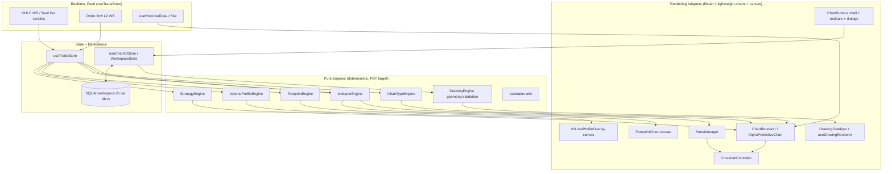

# Design Document

## Overview

The Professional Charting Suite elevates the Ai-trader terminal's charting surface to a premium-platform standard (TradingView / Bookmap / Sierra Chart class). It builds on the existing `lightweight-charts` + Tauri (Rust) + Zustand stack already present in the frontend (`AlphaPredictiveChart`, `FootprintChart`, `VolumeProfileOverlay`, `ChartToolsBar`, `useTradeStore`, `useChartUIStore`, and the SQLite-backed `db.rs` workspace store).

The core design strategy is a **separation between pure computational engines and rendering adapters**:

- **Pure engines** (chart-type transforms, indicator math, footprint aggregation, volume-profile binning, strategy evaluation, drawing geometry, validation) are deterministic, side-effect-free TypeScript modules. They take typed inputs (candles, ticks, parameters) and return typed outputs (series, signals, profiles). Because they are pure, they are the primary target for property-based testing.
- **Rendering adapters** are React components and hooks that take engine output and draw it onto `lightweight-charts` series or supersampled `<canvas>` overlays. These are validated with example/snapshot/integration tests, not PBT.

This split lets us guarantee mathematical correctness of indicators and transforms independent of the rendering layer, and lets the rendering layer stay focused on performance (the 16 ms Frame_Budget).

The suite is organized into seven trader-facing pillars mapped to the twelve requirements:

| Pillar | Requirements | Primary engine |
| --- | --- | --- |
| Chart types | 1 | `ChartTypeEngine` |
| Overlay indicators | 2 | `IndicatorEngine` |
| Oscillator panes | 3 | `IndicatorEngine` + `PaneManager` |
| Indicator management | 4 | `IndicatorManager` (UI + store) |
| Drawing tools | 5, 10 | `DrawingEngine` |
| Footprint | 6 | `FootprintEngine` |
| Volume profile | 7 | `VolumeProfileEngine` |
| Strategies | 8 | `StrategyEngine` |
| Realtime / animation | 9, 10 | `ChartRenderer` + `CrosshairController` |
| Persistence | 11 | `WorkspaceStore` (Zustand + `db.rs`) |
| Chart-surface UX | 12 | `ChartSurface` shell + dialogs |

## Architecture

### High-level component graph



### Data flow phases

1. **Ingest** — `useTradeStore` receives historical candles (`useHistoricalData`), live OHLC (`connectAlphaWebSocket`), and L2 ticks (`connectOrderFlowWebSocket`). It keeps `ohlcCandles` and `orderFlowData` buffers and exposes connection status.
2. **Normalize** — a shared selector produces a **canonical candle series**: sorted ascending by timestamp, de-duplicated by timestamp. All engines consume this canonical series so out-of-order live updates (Requirement 9.6) cannot corrupt downstream computations.
3. **Compute** — engines transform the canonical series + parameters into renderable output (`ChartCandle[]`, indicator line sets, footprint clusters, profiles, signals). Computation is memoized and incremental where the requirement demands live-append latency.
4. **Render** — adapters push engine output to `lightweight-charts` series (Standard surface) or draw to supersampled canvas overlays (footprint, volume profile, drawings). Pane synchronization keeps all sub-panes on the price pane's time range.
5. **Persist** — `WorkspaceStore` debounces and serializes workspace state (chart type, indicators, drawings, pane layout) to SQLite per symbol via the existing `save_workspace` / `load_workspace` IPC, falling back to in-memory state outside Tauri.

### Why this architecture

- **`lightweight-charts` panes**: The library (v4+) natively supports multiple panes that share one time scale, which directly satisfies pane synchronization (Requirement 3.3, 3.4) without manual time-axis bridging. The `PaneManager` wraps pane creation/removal and height redistribution.
- **Canvas overlays for footprint/volume profile**: These require per-pixel control (split bid/ask bars, imbalance highlight, profile histograms) that series primitives cannot express. The existing `FootprintChart` and `VolumeProfileOverlay` already use supersampled `<canvas>` with a `requestAnimationFrame` loop; the design generalizes their aggregation into pure engines and keeps the canvas as a thin renderer.
- **Pure engine extraction**: Today the footprint aggregation and volume-profile binning live inside the rendering components. The design extracts them into pure modules so they become testable and reusable, while the components keep only draw logic.

### Chart-type rendering strategy

`lightweight-charts` provides native series for candlestick, bar (OHLC), line, area, and baseline. The remaining "computed" chart types are produced by `ChartTypeEngine` as a transform over the canonical candle series, then rendered on an appropriate native series:

| Chart type | Strategy |
| --- | --- |
| Candlestick, Hollow candle | Candlestick series (hollow = transparent body fill for up candles) |
| OHLC bar | Bar series |
| Line, Area, Baseline | Line / Area / Baseline series on close |
| Heikin Ashi | Transform → candlestick series |
| Renko, Kagi, Point & Figure, Line Break | Transform to synthetic "bricks/columns" → candlestick or custom series with non-time x-spacing |

For brick/column types (Renko, P&F, Line Break, Kagi), the engine emits a derived series where the x-axis is a synthetic ordinal index rather than wall-clock time, because these chart types are price-driven, not time-driven. The renderer maps these to candlestick/line series with an index-based time scale.

## Components and Interfaces

### ChartTypeEngine

Pure module: `frontend/src/charting/engines/chartTypeEngine.ts`.

```typescript
export type ChartType =
  | 'candlestick' | 'hollow-candle' | 'ohlc-bar' | 'line' | 'area'
  | 'baseline' | 'heikin-ashi' | 'renko' | 'kagi' | 'point-figure' | 'line-break';

export interface ChartTypeParams {
  renkoBoxSize?: number;        // 1..999999
  pfBoxSize?: number;           // 1..999999
  pfReversal?: number;          // 1..999999
  kagiReversal?: number;        // 1..999999
  lineBreakCount?: number;      // 1..999999
}

export interface RenderableSeries {
  kind: 'candlestick' | 'bar' | 'line' | 'area' | 'baseline';
  points: ChartCandle[] | LinePoint[];
  indexBased: boolean;          // true for Renko/Kagi/P&F/LineBreak
}

// Pure transform — no rendering, no side effects.
export function buildSeries(
  candles: ChartCandle[],
  type: ChartType,
  params: ChartTypeParams
): RenderableSeries;

export function computeHeikinAshi(candles: ChartCandle[]): ChartCandle[];

export function validateChartTypeParams(
  type: ChartType,
  params: ChartTypeParams
): ValidationResult<ChartTypeParams>;
```

Heikin Ashi follows the standard recurrence: `haClose = (open+high+low+close)/4`; `haOpen = (prevHaOpen + prevHaClose)/2` (seeded from the first source candle); `haHigh = max(high, haOpen, haClose)`; `haLow = min(low, haOpen, haClose)` (Requirement 1.7).

### IndicatorEngine

Pure module: `frontend/src/charting/engines/indicatorEngine.ts`.

```typescript
export type OverlayId =
  | 'sma' | 'ema' | 'wma' | 'bollinger' | 'vwap' | 'ichimoku'
  | 'supertrend' | 'psar' | 'donchian' | 'keltner';

export type OscillatorId =
  | 'rsi' | 'macd' | 'stochastic' | 'adx' | 'atr' | 'obv' | 'cci' | 'mfi' | 'williams-r';

export type IndicatorId = OverlayId | OscillatorId;

export interface IndicatorParams { [key: string]: number; } // e.g. { period: 14, stdDev: 2 }

export interface IndicatorPlot {
  lines: { id: string; points: LinePoint[]; style: LineStyleSpec }[];
  bands?: { upper: LinePoint[]; lower: LinePoint[]; fill: string }[];
  referenceLevels?: number[]; // e.g. RSI [30,70]
  warmupBars: number;         // count of leading bars with no defined value
}

export interface IndicatorDef {
  id: IndicatorId;
  name: string;
  kind: 'overlay' | 'oscillator';
  defaults: IndicatorParams;
  paramSpec: Record<string, NumericRange>; // valid ranges per param
  minLookback(params: IndicatorParams): number;
  compute(candles: ChartCandle[], params: IndicatorParams): IndicatorPlot;
}

export const INDICATOR_REGISTRY: Record<IndicatorId, IndicatorDef>;

export function listIndicators(): IndicatorDef[];
export function searchIndicators(query: string): IndicatorDef[]; // case-insensitive name contains
```

EMA uses the standard smoothing factor `2 / (period + 1)` (Requirement 2.9). Each indicator reports a `warmupBars` count so the `CrosshairController` can show a no-value placeholder before warm-up completes (Requirement 10.3). When `minLookback(params) > candles.length`, `compute` returns an empty plot flagged as insufficient data (Requirements 2.6, 3.8).

### IndicatorManager (UI + store slice)

Manages the active-indicator list per symbol. Backed by a Zustand slice (extends `useChartUIStore`), surfaced by an overlay panel component `IndicatorManagerPanel.tsx`.

```typescript
export interface ActiveIndicator {
  instanceId: string;          // unique per active instance
  indicatorId: IndicatorId;
  params: IndicatorParams;
  style: LineStyleSpec;        // color, lineWidth, lineStyle
  visible: boolean;
  paneId: string | null;       // null = price pane (overlay)
}

interface IndicatorSlice {
  activeIndicators: Record<string /*symbol*/, ActiveIndicator[]>;
  addIndicator(symbol: string, id: IndicatorId): Result<void, AddError>;
  removeIndicator(symbol: string, instanceId: string): void;
  setIndicatorParams(symbol: string, instanceId: string, params: IndicatorParams): Result<void, ValidationError>;
  setIndicatorStyle(symbol: string, instanceId: string, style: Partial<LineStyleSpec>): void;
  toggleIndicatorVisible(symbol: string, instanceId: string): void;
}
```

Rules enforced in the slice: reject duplicate `indicatorId` for a symbol (Requirement 4.4); reject add when the list already has 50 (Requirement 4.5); initialize an empty list for an unknown symbol (Requirement 4.11).

### PaneManager

Wraps `lightweight-charts` pane APIs. Responsible for creating an `Indicator_Pane` per oscillator (stacked below price in addition order), synchronizing time range, and redistributing heights when a pane is removed.

```typescript
export interface PaneLayout { paneId: string; heightFraction: number; order: number; }

export interface PaneManager {
  ensurePane(instanceId: string): string;          // returns paneId
  removePaneIfEmpty(paneId: string): void;          // redistributes leftover height
  layout(): PaneLayout[];                            // ordered top→bottom
  redistribute(removed: string): PaneLayout[];       // pure helper, sums to 1.0
  syncVisibleRange(range: TimeRange): void;          // applies to all panes
}
```

`redistribute` is a pure helper extracted for testability: given a set of pane height fractions and a removed pane, it returns new fractions that sum to exactly 1.0 with no gap (Requirement 3.6).

### DrawingEngine

Geometry/validation are pure; rendering reuses existing `useDrawingRenderer` / `DrawingOverlays`. The store slice already exists in `useChartUIStore` (`drawings`, `addDrawing`, `updateDrawingPoints`, `magnetMode`, `drawingsLocked`, `drawingsVisible`, `clearDrawings`).

```typescript
export interface ToolSpec { tool: string; anchorCount: number | 'multi'; category: DrawingCategory; }

export const TOOL_REGISTRY: Record<string, ToolSpec>;

// Pure geometry helpers (PBT targets)
export function fibLevels(p1: number, p2: number): { ratio: number; price: number }[]; // 0,0.236,0.382,0.5,0.618,0.786,1.0
export function magnetSnap(
  pointer: Point, candle: ChartCandle, pxPerPrice: number, thresholdPx = 10
): Point;                                            // snaps to nearest OHLC within threshold, else pointer
export function isComplete(tool: string, anchors: Point[]): boolean;
export function clearUnlocked(drawings: Drawing[]): Drawing[]; // keep locked, drop unlocked
```

The `Drawing` model is extended with `locked?: boolean` and `symbol` ownership so clear/visibility/lock semantics (Requirements 5.7–5.9) and per-symbol persistence (5.11) work. Pan/zoom repositioning is handled by the existing renderer that converts stored `{time, price}` anchors to pixel coordinates every frame, guaranteeing anchors stay fixed in data space (Requirement 5.4).

### FootprintEngine

Pure module extracted from `FootprintChart.tsx` aggregation logic.

```typescript
export interface FootprintCell { price: number; bid: number; ask: number; }
export interface FootprintCandle {
  time: number;
  cells: FootprintCell[];
  delta: number;            // sum(ask) - sum(bid)
  totalVolume: number;
  poc: number;              // price level of greatest total volume; tie → closest to close
  imbalances: number[];     // price levels flagged as imbalance
  synthetic: boolean;       // true when built from synthetic distribution
}

export function buildFootprint(
  candles: ChartCandle[],
  ticks: OrderFlowTick[],
  opts: { tickSize: number; imbalanceRatio: number } // ratio 1.5..20, default 3
): FootprintCandle[];

export function cumulativeDelta(fps: FootprintCandle[]): number[]; // running sum from leftmost

export function detectImbalances(cells: FootprintCell[], ratio: number): number[];
```

Imbalance is diagonal: an ask at level `p` vs bid at the level below (`p - tickSize`); flagged when `max/min >= ratio` (Requirement 6.6). POC ties break toward the level closest to the candle close (Requirement 6.7). When no ticks exist for a candle, the engine produces a synthetic distribution flagged `synthetic = true` (Requirement 6.3).

### VolumeProfileEngine

Pure module extracted from `VolumeProfileOverlay.tsx`.

```typescript
export type ProfileRange = 'visible' | 'session' | 'fixed';

export interface VolumeProfile {
  rows: { priceLow: number; priceHigh: number; volume: number; inValueArea: boolean }[];
  poc: number | null;       // null when total volume is 0
  vah: number | null;
  val: number | null;
  totalVolume: number;
}

export function buildProfile(
  candles: ChartCandle[],
  volumes: VolumeBar[],
  opts: { rows: number; valuePercent: number } // rows 1..1000 default 24; pct 1..100 default 70
): VolumeProfile;

export function valueArea(
  rowVolumes: number[], pocIndex: number, valuePercent: number
): { loIndex: number; hiIndex: number }; // expand from POC until cumulative >= target
```

The Value_Area expansion grows outward from the POC, adding the larger adjacent row each step until cumulative volume reaches the target percentage (Requirement 7.4). Zero total volume yields `poc/vah/val = null` and an empty-profile indication (Requirement 7.9). Fixed range requires `end > start`, otherwise the prior profile is retained (Requirement 7.10).

### StrategyEngine

Pure module: `frontend/src/charting/engines/strategyEngine.ts`.

```typescript
export type SignalKind = 'entry-long' | 'exit-long' | 'entry-short' | 'exit-short';
export interface Signal { time: number; price: number; kind: SignalKind; }

export interface StrategyDef {
  id: string;                       // 'ma-cross' | 'rsi-mean-reversion' | 'breakout' | ...
  name: string;
  defaults: StrategyParams;
  paramSpec: Record<string, NumericRange>;
  requiredLookback(params: StrategyParams): number;
  evaluate(candles: ChartCandle[], params: StrategyParams): Signal[];
  summarize(signals: Signal[], candles: ChartCandle[]): { count: number; netResult: number };
}

export const STRATEGY_REGISTRY: Record<string, StrategyDef>; // >= 3 strategies
```

When `candles.length < requiredLookback`, `evaluate` returns `[]` and the caller surfaces an insufficient-data indication (Requirement 8.3). `summarize` exposes total signal count and net numeric result (Requirement 8.9).

### ChartRenderer / ChartSurface

`ChartRenderer` is the existing `AlphaPredictiveChart` generalized to consume `ChartTypeEngine` output and host indicator series + panes. `ChartSurface` is the shell that mounts the chart, the persistently-visible controls (chart-type selector, indicator-manager entry, drawing toolbar, chart-mode toggle, timeframe selector, strategy entry — Requirement 12.1), and the overlay dialogs (Requirements 12.2, 12.3).

Key behaviors:
- In-place last-candle update (Requirement 9.3) via `series.update()` rather than `setData()`.
- Symbol switch clears previous series before drawing new data (Requirement 9.4).
- Right-edge follow when already at the latest candle (Requirement 9.5).
- Repaint from the canonical (sorted, de-duplicated) dataset on out-of-order updates (Requirement 9.6).
- Wheel zoom clamped to 5..5000 visible candles (Requirement 10.6).
- DPR-aware rendering for device pixel ratios 1.0–4.0 (Requirement 12.6).

### CrosshairController

Subscribes to `lightweight-charts` crosshair move events, reads OHLC + active-indicator values at the crosshair time, formats to instrument precision, and broadcasts a synchronized vertical crosshair to every pane (Requirements 10.1–10.4, 10.8). Shows a no-value placeholder when the time is in an indicator warm-up region or outside the loaded data range.

### WorkspaceStore (persistence)

Extends `useChartUIStore` with the full workspace payload and reuses the existing `save_workspace` / `load_workspace` Tauri commands (`db.rs`). Serialization is a pure function so it can be round-trip tested.

```typescript
export interface WorkspaceState {
  version: 1;
  chartType: ChartType;
  chartTypeParams: ChartTypeParams;
  activeIndicators: ActiveIndicator[];
  drawings: Drawing[];
  paneLayout: PaneLayout[];
}

export function serializeWorkspace(s: WorkspaceState): string;       // JSON
export function deserializeWorkspace(json: string): WorkspaceState;  // throws → caller applies defaults
export const DEFAULT_WORKSPACE: WorkspaceState;                      // candlestick, no indicators, no drawings
```

Persistence is debounced; failures retain in-memory state, surface an indication, and retry on the next change (Requirements 11.4, 11.5). Outside Tauri, all state stays in memory for the session (Requirement 11.6).

## Data Models

### Canonical candle series

```typescript
// Derived selector over useTradeStore.ohlcCandles for the active symbol+timeframe.
// Invariant: sorted ascending by time, no duplicate timestamps.
export function canonicalCandles(
  raw: OhlcCandle[], symbol: string
): ChartCandle[];
```

This selector is the single source of truth feeding every engine, enforcing the ordering/de-duplication invariant the renderer relies on for out-of-order recovery (Requirement 9.6).

### Shared value types

```typescript
export interface LinePoint { time: number; value: number; }

export interface LineStyleSpec {
  color: string;
  lineWidth: number;
  lineStyle: 'solid' | 'dashed' | 'dotted';
}

export interface NumericRange {
  min: number; max: number; integer: boolean;
}

export type ValidationResult<T> =
  | { ok: true; value: T }
  | { ok: false; errorParam: string; message: string };
```

### Validation utility

```typescript
// Pure. Rejects non-numeric, out-of-range, and wrong-type values; returns the
// offending parameter name so the UI can identify it.
export function validateNumeric(
  value: unknown, range: NumericRange, paramName: string
): ValidationResult<number>;

export function validateParams(
  params: Record<string, unknown>, spec: Record<string, NumericRange>
): ValidationResult<Record<string, number>>;
```

Used by chart-type params (range 1–999,999, Requirement 1.6), indicator params (period 1–5,000, BB multiplier 0.1–10.0, Requirements 2.3, 2.5), strategy params (Requirement 8.6), tick size > 0 (Requirement 6.9), profile rows 1–1000 and percent 1–100 (Requirement 7.2, 7.4). On rejection the caller retains last valid values and rendered output.

### Persistence schema

Reuses the existing `workspaces(symbol TEXT PK, state_json TEXT)` SQLite table in `db.rs`. The `state_json` blob is the serialized `WorkspaceState`. Per-symbol keying matches the current `save_workspace(symbol, stateJson)` contract; the special `__WATCHLIST__` key remains untouched.

## Correctness Properties

*A property is a characteristic or behavior that should hold true across all valid executions of a system — essentially, a formal statement about what the system should do. Properties serve as the bridge between human-readable specifications and machine-verifiable correctness guarantees.*

The properties below target the **pure engines** (chart-type transforms, indicator math, footprint/profile aggregation, strategy evaluation, drawing geometry, validation, persistence serialization). UI rendering, timing/perf, library-driven pane synchronization, and connection-state behavior are validated by example/integration tests in the Testing Strategy, not by property-based tests. Properties were consolidated during prework reflection to remove redundancy.

### Property 1: Heikin Ashi close is the source candle average

*For any* candle series, every computed Heikin Ashi candle's close equals the arithmetic average of the corresponding source candle's open, high, low, and close, and each HA open equals the average of the previous HA open and close.

**Validates: Requirements 1.7**

### Property 2: EMA uses the standard smoothing factor

*For any* candle series and any valid period, the Exponential Moving Average satisfies the recurrence `ema[i] = price[i] * alpha + ema[i-1] * (1 - alpha)` with `alpha = 2 / (period + 1)`.

**Validates: Requirements 2.9**

### Property 3: Invalid parameters are rejected and last valid values are retained

*For any* engine parameter (chart-type, indicator, or strategy) and *for any* value that is non-numeric, of the wrong type, or outside its declared range, validation rejects the value, returns an error identifying the offending parameter, and the previously valid parameter set and its computed output are left unchanged.

**Validates: Requirements 1.6, 2.5, 8.6**

### Property 4: Insufficient data omits computation and signals insufficiency

*For any* indicator or strategy whose required lookback exceeds the number of available candles, the engine produces no plotted output / no signals and reports an insufficient-data result, without altering the input series.

**Validates: Requirements 2.6, 3.8, 8.3**

### Property 5: Indicator plots contain every defined line, band, and reference level

*For any* indicator that defines multiple lines, a filled band, or reference levels, the computed plot includes every constituent line, every band's upper/lower/fill, and every defined reference level.

**Validates: Requirements 2.8, 3.5**

### Property 6: Live append equals full recompute

*For any* engine that supports live updates (overlay indicators, oscillators, footprint, strategies) and *for any* candle series, appending a new candle and incrementally updating yields the same result as recomputing the engine over the full extended series.

**Validates: Requirements 2.7, 3.7, 6.10, 8.7**

### Property 7: Oscillator panes stack in addition order

*For any* sequence of oscillator additions, the resulting pane layout orders the indicator panes below the price pane in the exact order they were added, top to bottom.

**Validates: Requirements 3.2**

### Property 8: Pane removal redistributes height with no gap

*For any* set of pane height fractions, removing one pane and redistributing produces fractions that sum to exactly 1.0 (the full available height) with no unallocated gap.

**Validates: Requirements 3.6**

### Property 9: Indicator search returns exactly the case-insensitive name matches

*For any* search query and *for any* set of available indicators, the search result contains every indicator whose name contains the query case-insensitively and contains no indicator whose name does not.

**Validates: Requirements 4.2**

### Property 10: Active-indicator add invariants hold

*For any* sequence of add operations on a symbol's active-indicator list, the list never contains duplicate indicator ids and never exceeds 50 entries; any rejected add (duplicate or at-capacity) leaves the list unchanged.

**Validates: Requirements 4.3, 4.4, 4.5**

### Property 11: Toggling visibility preserves configuration

*For any* active indicator or drawing, toggling its visibility off and on again restores it to visible and leaves its parameters, style, and geometry unchanged.

**Validates: Requirements 4.7, 5.8**

### Property 12: Drawing creation requires exactly the tool's anchor count

*For any* drawing tool, a drawing is created if and only if the number of placed anchors meets the tool's required anchor count; placing fewer anchors (cancellation) produces no drawing.

**Validates: Requirements 5.2, 5.3**

### Property 13: Drawing anchors survive a coordinate round-trip

*For any* drawing anchor expressed in `{time, price}`, converting to pixel coordinates under any valid visible range and back to data coordinates reproduces the original time and price within a 1-pixel tolerance.

**Validates: Requirements 5.4**

### Property 14: Magnet snaps to the nearest OHLC within threshold, else to the pointer

*For any* pointer position and candle, magnet mode snaps the anchor to the nearest of the candle's open/high/low/close when that value is within the snap threshold (10 px), and otherwise places the anchor at the exact pointer coordinates.

**Validates: Requirements 5.6**

### Property 15: Locked drawings are immutable

*For any* locked drawing, any attempt to modify its geometry or delete it leaves the drawing and its geometry unchanged.

**Validates: Requirements 5.7**

### Property 16: Clear removes unlocked drawings and retains locked ones

*For any* set of drawings, clearing returns exactly the subset of drawings that are locked.

**Validates: Requirements 5.9**

### Property 17: Fibonacci retracement levels match the canonical ratios

*For any* two price anchors, the Fibonacci retracement levels equal the prices at ratios 0, 0.236, 0.382, 0.5, 0.618, 0.786, and 1.0 of the anchored price range.

**Validates: Requirements 5.10**

### Property 18: Footprint delta and cumulative delta are correct sums

*For any* footprint candle, its delta equals total ask volume minus total bid volume and its total volume equals the sum of all cell volumes; *for any* footprint series, the cumulative delta at each index equals the running sum of per-candle deltas from the leftmost candle, and the final value equals the sum of all deltas.

**Validates: Requirements 6.4, 6.5, 6.8**

### Property 19: Footprint clustering groups by tick size and conserves volume

*For any* candle and order-flow ticks with a given tick size, every cluster cell's price is a multiple of the tick size and the cell bid/ask sums equal the grouped tick volumes; regrouping the same data under a different tick size preserves the candle's total volume.

**Validates: Requirements 6.1, 6.2, 6.9**

### Property 20: Footprint falls back to a flagged synthetic distribution

*For any* candle with no order-flow ticks, the engine produces a non-empty cluster marked as synthetic.

**Validates: Requirements 6.3**

### Property 21: Imbalance flags exactly the levels meeting the configured ratio

*For any* cluster and *for any* configured ratio in 1.5–20, a price level is flagged as an imbalance if and only if the ratio of the larger to the smaller of its diagonally-opposed bid and ask volumes is greater than or equal to the configured ratio.

**Validates: Requirements 6.6**

### Property 22: Footprint POC is the greatest-volume level with close tie-break

*For any* footprint candle, the POC is the price level with the greatest total volume, and when multiple levels tie for greatest volume the POC is the level closest to the candle's close.

**Validates: Requirements 6.7**

### Property 23: Volume profile binning conserves volume and row count

*For any* candle/volume range and *for any* configured row count in 1–1000, the profile produces exactly that many rows and the sum of row volumes equals the total traded volume contributed by the candles in the range.

**Validates: Requirements 7.2, 7.6**

### Property 24: Volume profile POC and value area are correct

*For any* profile with positive total volume, the POC is the single greatest-volume row, the Value_Area is a contiguous set of rows around the POC whose cumulative volume reaches at least the configured percentage (1–100) of total volume, the in-value-area flag is set exactly for those rows, and VAH/VAL are the upper/lower price edges of that set; when total volume is zero, POC, VAH, and VAL are null.

**Validates: Requirements 7.3, 7.4, 7.7, 7.8, 7.9**

### Property 25: Invalid fixed range is rejected and the prior profile is retained

*For any* fixed-range selection whose end anchor is at or before the start anchor, the engine rejects the range and returns the previously computed profile unchanged.

**Validates: Requirements 7.10**

### Property 26: Strategy signals are well-formed and anchored to candles

*For any* strategy with sufficient lookback and *for any* candle series, every produced signal has a numeric price and a timestamp that matches the timestamp of a candle in the series.

**Validates: Requirements 8.2**

### Property 27: Strategy summary reports a consistent count and numeric net result

*For any* strategy evaluation, the reported total signal count equals the number of produced signals and the net result is a finite numeric value.

**Validates: Requirements 8.9**

### Property 28: Canonical candle series is sorted and de-duplicated

*For any* set of raw candles (including out-of-order arrivals and duplicate timestamps), the canonical series is sorted strictly ascending by timestamp with no duplicate timestamps, and producing it never raises an error.

**Validates: Requirements 9.6**

### Property 29: Live update of the latest candle changes only that candle

*For any* canonical series and *for any* live update whose timestamp equals the most recent candle, applying the update modifies only the most recent candle and leaves all preceding candles unchanged.

**Validates: Requirements 9.3**

### Property 30: Wheel zoom keeps the visible candle count within bounds

*For any* sequence of zoom operations, the resulting number of visible candles is always at least 5 and at most 5,000.

**Validates: Requirements 10.6**

### Property 31: Values are formatted to the instrument's configured precision

*For any* numeric OHLC or indicator value and *for any* configured decimal precision, the crosshair readout string is the value rounded and formatted to exactly that number of decimal places.

**Validates: Requirements 10.1, 10.2**

### Property 32: Out-of-range or warm-up positions yield a no-value placeholder

*For any* crosshair time that is outside the loaded candle range, or that falls within an indicator's warm-up region where no value is defined, the readout is a no-value placeholder rather than a numeric value from an adjacent candle.

**Validates: Requirements 10.3, 10.8**

### Property 33: Workspace serialization round-trips

*For any* workspace state (chart type and params, active indicators with settings, drawings, pane layout), deserializing its serialized form reproduces an equivalent workspace state.

**Validates: Requirements 1.3, 4.9, 4.10, 5.11, 11.1, 11.2**

### Property 34: Absent persisted workspace yields defaults

*For any* symbol with no persisted workspace, loading yields the default workspace: a candlestick chart, an empty active-indicator list, and zero drawings.

**Validates: Requirements 1.4, 4.11, 11.3**

## Error Handling

Error handling follows a consistent principle: **never destroy good state on a bad input or a failed side effect.** Engines are pure and total — they return typed results rather than throwing — and the rendering/persistence layers degrade gracefully.

| Condition | Handling | Requirements |
| --- | --- | --- |
| Invalid chart-type / indicator / strategy parameter | Validation returns `{ ok: false, errorParam }`; caller keeps last valid params and rendered output, surfaces an inline error identifying the parameter | 1.6, 2.5, 8.6 |
| Insufficient candles for an indicator/strategy | Engine returns empty plot/signals + insufficient-data flag; renderer shows an "insufficient data" indication and leaves price series untouched | 2.6, 3.8, 8.3 |
| Empty candle dataset | Renderer shows loading/empty-state message instead of an empty frame | 1.8, 6.11 |
| Candle data fetch failure | Retain previously rendered chart; show a data-retrieval-failed indication | 1.9 |
| No order-flow ticks for a candle | Build a synthetic cluster flagged `synthetic = true` with a visible synthetic indication | 6.3 |
| Zero traded volume in a profile range | Render empty-profile indication; POC/VAH/VAL are null and not drawn | 7.9 |
| Invalid fixed-range anchors (end ≤ start) | Reject; retain previously computed profile; show invalid-selection indication | 7.10 |
| Out-of-order / duplicate live candle | Repaint from the canonical (sorted, de-duplicated) series; no unhandled error | 9.6 |
| Crosshair outside data / in warm-up | Show no-value placeholder | 10.3, 10.8 |
| Locked drawing modify/delete attempt | Reject; retain geometry; show locked indication | 5.7 |
| Workspace restore failure (corrupt/unparseable blob) | Apply defaults, retain current on-screen state, show restore-failed indication | 11.4 |
| Workspace persist failure | Retain in-memory state, show save-failed indication, retry on next change | 5.12, 11.5 |
| Running outside Tauri runtime | All workspace state kept in memory for the session; no error raised | 11.6 |
| Fullscreen request fails/unsupported | Retain current dimensions; show fullscreen-unavailable indication | 12.5 |

Engine purity note: `deserializeWorkspace` is the one function permitted to throw (on malformed JSON); its single caller wraps it in a try/catch that applies `DEFAULT_WORKSPACE` per Requirement 11.4.

## Testing Strategy

The suite uses a **dual testing approach**: property-based tests for the pure engines and example/integration/snapshot tests for rendering, timing, and library-driven behavior.

### Property-based testing

- **Library**: `fast-check` with the existing Vitest runner (the project already uses Vitest in the frontend; Python engines, if any are added under `agents/`, would use Hypothesis, already present in `agents/deep-quant-loop/.hypothesis`). We will not implement property testing from scratch.
- **Iterations**: each property test runs a minimum of 100 generated cases (`fc.assert(fc.property(...), { numRuns: 100 })`).
- **Tagging**: each property test is tagged with a comment in the form
  `// Feature: professional-charting-suite, Property {number}: {property_text}`
  and implements exactly one design property per test.
- **Generators**:
  - Candle series: arrays of `{time, open, high, low, close, volume}` with `low ≤ open,close ≤ high`, ascending unique times (plus a deliberately unordered/duplicated generator for Property 28).
  - Order-flow ticks: `{timestamp, price_level, bid_volume, ask_volume, delta}` bucketed within candle intervals; a no-tick generator for Property 20.
  - Parameters: in-range and out-of-range numeric generators (including NaN, negative, oversized, wrong-type) for Property 3.
  - Drawings: tool ids with matching/short anchor counts, lock flags, colors for Properties 11–17.
  - Workspace states: composed from the above for Properties 33–34.
- **Coverage**: Properties 1–34 above. Each maps to one property test.

### Example and edge-case unit tests

- Registry completeness: 11 chart types (1.1), overlay list (2.1), oscillator list (3.1), drawing categories (5.1), ≥3 strategies incl. the three named (8.1), exactly three profile ranges (7.1).
- Valid-apply paths: applying a valid Renko box size re-renders (1.5); add/remove/restyle indicators update series (4.6, 4.8); drag updates geometry (5.5); eraser deletes clicked drawing (10.7).
- Error paths: data fetch failure retains chart (1.9); persist/restore failures (5.12, 11.4, 11.5); fullscreen failure (12.5); zero-volume index proxy label (12.7).
- Connection state: disconnected indicator appears/clears (9.7, 9.8); symbol switch clears prior series (9.4); right-edge follow (9.5).

### Integration and performance tests

- Pane synchronization: indicator-pane time bounds match the price pane and follow pan/zoom (3.3, 3.4); synchronized crosshair across panes (10.4).
- Latency budgets: chart-type switch < 1000 ms (1.2); overlay add < 500 ms and redraw < 200 ms (2.2, 2.4); live OHLC reflected < 200 ms (9.2); profile recompute after 200 ms debounce within frame budget (7.5); pan/zoom within the 16 ms Frame_Budget for ≥95% of frames on a 5,000-candle dataset (9.1).
- Persistence integration: round-trip through the real `save_workspace`/`load_workspace` SQLite IPC for a representative workspace.

### Rendering / DPR

- Snapshot tests for the chart-surface shell controls presence (12.1) and settings-dialog overlay behavior (12.2, 12.3).
- DPR rendering: assert canvas backing-store dimensions scale with `devicePixelRatio` for ratios 1.0–4.0 (12.6).

### Review and Approval

The requirements document (`requirements.md`) exists for this requirements-first workflow and all twelve requirements are addressed by the design above. If any gap is identified during review, the design offers to return to requirements clarification before proceeding to tasks.
