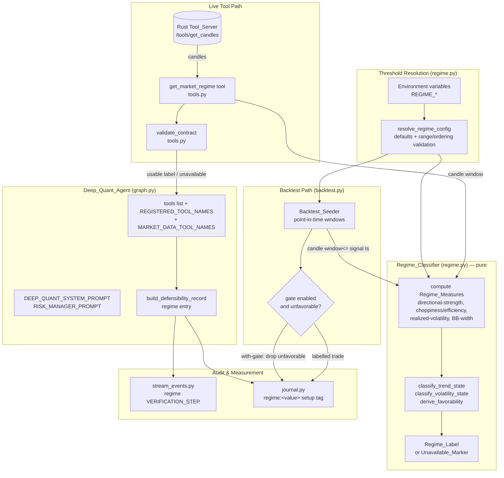

# Design Document

## Overview

The Regime Detection Gate adds a deterministic, pure-math market-regime classifier to the Deep Quant agent and wires its output through every layer the agent already uses to reason, commit, audit, and measure trades. The motivating evidence is a multi-symbol/multi-timeframe backtest in which the existing rule set carries genuine edge on the daily timeframe (≈46% win rate, +0.38R on RELIANCE 1d) but decays toward break-even on fast intraday timeframes (≈25–33% on 1m/5m). The hypothesis is that the losses concentrate in choppy, rangebound, or abnormally low/high-volatility "regimes" where trend and momentum setups fail — and that a veteran trader's core skill is knowing when **not** to trade.

This feature implements that skill as a cheap classifier that labels the current market regime from OHLCV candle data the system already retrieves, and surfaces that label as guidance — never as a hard block and never as a trade generator. Concretely, the design adds:

1. A pure-Python `Regime_Classifier` (new module `regime.py`) that maps a candle sequence plus a resolved configuration to a structured `Regime_Label` (Trend_State, Volatility_State, the underlying Regime_Measures, and a derived Favorability), or to an honest `Unavailable_Marker` when it cannot compute one. No network, no clock, no hidden state.
2. A new `get_market_regime` Analysis_Tool in `tools.py` that fetches candles from the authoritative Rust Tool_Server (exactly as `journal.py` and `backtest.py` already do), classifies them with the `Regime_Classifier`, and returns a contract-validated result. `validate_contract` is extended to cover the new contract.
3. Graph wiring in `graph.py`: the tool is bound to the model, registered in `REGISTERED_TOOL_NAMES` and `MARKET_DATA_TOOL_NAMES`, and the defensibility record gains a regime entry.
4. Prompt integration: `DEEP_QUANT_SYSTEM_PROMPT` and `RISK_MANAGER_PROMPT` instruct the agent to consult the regime and bias toward HOLD/lower conviction/wait when the regime is unfavorable for the proposed setup type.
5. A regime `VERIFICATION_STEP` emitted by `stream_events.py`, ordered before the `DECISION`.
6. A new `regime:<value>` dimension on the Trade_Journal Setup_Fingerprint (`journal.py`).
7. Backtest integration: `backtest.py` classifies each generated signal with the **same** `Regime_Classifier` functions and supports a with-gate / without-gate comparison so the journal can prove, with numbers, whether the gate improves expectancy.
8. Environment-variable-driven, validated thresholds resolved identically on both the tool path and the backtest path.

The design's central constraint is **scope discipline** (Requirement 12): the regime is a filter/calibration aid. It produces only a label or an unavailable marker; it never emits BUY/SELL/HOLD, never overrides a committed decision, and never blocks a trade the agent chooses to take.

### Key Design Decisions

- **AD-1: Classification lives in Python, candle retrieval is delegated to Rust.** The `Regime_Classifier` is pure Python so it is unit- and property-testable in isolation with no infrastructure (Requirement 1, 2). The `get_market_regime` tool retrieves candles from the same `/tools/get_candles` Rust endpoint every other tool uses, so the regime is computed from the system's authoritative price source. Requirement 3.9 ("WHERE the regime computation is delegated to the Rust_Tool_Server") is satisfied vacuously in this design — computation is **not** delegated to Rust, so the conditional re-validation it requires does not apply. The tool still re-validates its own result on receipt (consumer-side, AD-3) like every other tool.
- **AD-2: A single source of truth for the regime math.** Both the live tool path (`get_market_regime`) and the `Backtest_Seeder` call the **same** `Regime_Classifier` functions (Requirement 10.5). The backtest never reimplements the math; it only feeds different candle windows (point-in-time, no look-ahead).
- **AD-3: Contract failures are data, not exceptions.** Mirroring the existing `validate_contract` philosophy, a malformed regime result becomes a structured `{"error", "contract_violation"}` dict, and an unavailable regime is an honest pass-through marker. Nothing in the regime path raises into the agent loop (Requirements 3.8, 4.5).
- **AD-4: Unavailable means "missing optional input," never "fabricate."** When the regime cannot be computed, the tool omits Trend_State/Volatility_State/Favorability entirely rather than defaulting them, and every downstream consumer (defensibility record, verification step, journal tag, backtest gate) treats absence as a benign, non-blocking gap (Requirements 4, 7.3, 8.5, 9.2, 10.6).
- **AD-5: Thresholds are resolved once, deterministically, with documented defaults.** A single `resolve_regime_config()` reads each threshold from its own environment variable, falls back to a documented default on unset/unparseable/out-of-range values, and enforces the low<high volatility-percentile ordering — applied identically on both paths (Requirement 11).
- **AD-6: The regime tag is low-cardinality by construction.** The journal's regime dimension draws from a fixed enumeration of at most 8 values (including `unknown`) so the regime-extended `setup_key` stays groupable and individual setups can accumulate enough scored trades to clear the low-sample threshold (Requirement 9.3).

## Architecture

The regime feature threads a single new computation (`Regime_Classifier`) through the agent's existing layers. The classifier is the only place the regime math exists; everything else consumes its output.



### Request flow (live FIND-mode analysis)

1. The agent, following `DEEP_QUANT_SYSTEM_PROMPT`, calls `get_market_regime(symbol, timeframe)` during analysis.
2. The tool validates its arguments, fetches candles from the Rust Tool_Server, and resolves thresholds via `resolve_regime_config()`.
3. The tool calls `classify_regime(candles, config)`, receiving either a `Regime_Label` or an `Unavailable_Marker`.
4. The tool re-validates the result with `validate_contract("get_market_regime", result)` and returns it to the ReAct loop.
5. A usable label sets `market_data_seen`; an error/unavailable result does not.
6. When the agent commits a decision, `build_defensibility_record` reads the most recent `get_market_regime` result from message history and writes a regime entry.
7. `stream_events.py` emits a regime `VERIFICATION_STEP` (ordered before `DECISION`) derived from that entry.
8. `journal.derive_setup_tags` appends a `regime:<value>` tag at a fixed position so per-regime stats are measurable.

### Backtest flow (comparison mode)

1. The seeder walks history; for each generated signal it classifies the regime using only candles **at or before** the signal's candle timestamp (no look-ahead), via the same `classify_regime`.
2. In the with-gate run, a signal whose Favorability is `unfavorable` for its setup type is excluded; an `Unavailable_Marker` signal is **retained** (not excluded on the basis of regime).
3. The without-gate run keeps all signals. Both runs use identical candle history and identical setup rules.
4. Each seeded trade is labelled with its Regime_Label; the seeder reports win-rate and expectancy per run, reporting `not-applicable` when a run produced zero closed trades.

## Components and Interfaces

### 1. `regime.py` (new module) — the Regime_Classifier

A new pure-Python module in `agents/deep-quant-loop/`. No imports of `httpx`, no file/clock access. It exposes the classifier, the configuration resolver, and the measure functions.

#### Configuration resolution

```python
# Default thresholds (documented; applied on unset / unparseable / out-of-range).
DEFAULT_ADX_TREND_CUTOFF = 25.0          # ADX >= this => directional strength present
DEFAULT_CHOP_RANGING_CUTOFF = 61.8       # choppiness index >= this => ranging (chop)
DEFAULT_VOL_LOW_PCTL = 25.0              # ATR-percentile < this => low volatility
DEFAULT_VOL_HIGH_PCTL = 75.0             # ATR-percentile > this => high volatility
DEFAULT_MIN_CANDLES = 50                 # minimum candles to classify

# Lookback periods (also configurable; drive the "largest lookback" gate).
DEFAULT_ADX_PERIOD = 14
DEFAULT_CHOP_PERIOD = 14
DEFAULT_VOL_PERIOD = 14
DEFAULT_VOL_PCTL_WINDOW = 100            # window over which ATR percentile is ranked
DEFAULT_BB_PERIOD = 20

@dataclass(frozen=True)
class RegimeConfig:
    adx_period: int
    chop_period: int
    vol_period: int
    vol_pctl_window: int
    bb_period: int
    adx_trend_cutoff: float
    chop_ranging_cutoff: float
    vol_low_pctl: float
    vol_high_pctl: float
    min_candles: int

    @property
    def largest_lookback(self) -> int:
        """Max candles any single measure requires (drives the sufficiency gate)."""
        ...

def resolve_regime_config() -> RegimeConfig:
    """Resolve every threshold from its own env var with documented defaults.

    Per-threshold rules (R11):
      * unset / empty            -> documented default
      * unparseable as its type  -> documented default (never raises)
      * parses but out of range  -> documented default (never raises)
      * vol_low_pctl >= vol_high_pctl -> BOTH revert to their defaults
    The same function is called on the tool path and the backtest path so the
    resolved values are identical for identical env (R11.6). NEVER raises.
    """
```

Environment variables (each independently parsed):

| Threshold | Env var | Type | Valid range | Default |
|---|---|---|---|---|
| Directional-strength cutoff | `REGIME_ADX_TREND_CUTOFF` | float | 0.0–100.0 | 25.0 |
| Choppiness/efficiency cutoff | `REGIME_CHOP_RANGING_CUTOFF` | float | 0.0–100.0 (chop index range) | 61.8 |
| Low-volatility percentile | `REGIME_VOL_LOW_PCTL` | float | 0.0–100.0 | 25.0 |
| High-volatility percentile | `REGIME_VOL_HIGH_PCTL` | float | 0.0–100.0 | 75.0 |
| Minimum candle count | `REGIME_MIN_CANDLES` | int | ≥ 1 | 50 |
| (lookbacks) | `REGIME_ADX_PERIOD`, `REGIME_CHOP_PERIOD`, `REGIME_VOL_PERIOD`, `REGIME_VOL_PCTL_WINDOW`, `REGIME_BB_PERIOD` | int | ≥ 1 | 14/14/14/100/20 |

#### Measure functions (pure)

```python
def compute_directional_strength(candles, period) -> Optional[float]:
    """ADX-style directional strength over `period`. None if denominator is zero
    (e.g. zero true-range over the window). Result is finite when not None."""

def compute_choppiness(candles, period) -> Optional[float]:
    """Choppiness index in [0, 100]; clamped to bounds. None on zero range."""

def compute_efficiency_ratio(candles, period) -> Optional[float]:
    """Kaufman efficiency ratio in [0.0, 1.0]; clamped. None on zero total move."""

def compute_atr_percentile(candles, atr_period, window) -> Optional[float]:
    """Percentile rank (0–100) of the latest ATR within the trailing `window`
    of ATR values. None when insufficient ATR samples."""

def compute_bb_width(candles, period) -> Optional[float]:
    """Bollinger-band width = (upper - lower) / mid. None when mid == 0."""
```

Each measure function ignores candles with non-finite/non-numeric OHLCV fields (Requirement 2.2), clamps bounded measures into range (Requirement 2.5), and returns `None` when its denominator is zero (Requirement 2.6).

#### Classification functions (pure)

```python
def classify_trend_state(adx, chop_or_efficiency, config) -> str:
    """Return exactly one of 'trending' | 'ranging' | 'transitional'."""

def classify_volatility_state(atr_pctl, bb_width, config) -> str:
    """Return exactly one of 'low' | 'normal' | 'high'."""

def derive_favorability(trend_state, volatility_state, config) -> str:
    """Return exactly one of 'favorable' | 'unfavorable' | 'neutral'.
    Total function: every (trend_state, volatility_state) pair maps to exactly
    one Favorability value (R1.10)."""

def classify_regime(candles, config) -> dict:
    """The top-level entry point. Returns either a Regime_Label dict or an
    Unavailable_Marker dict. Pure and deterministic (R1.2, R2.8); never mutates
    inputs (R1.11); never raises (R2)."""
```

The Trend_State / Volatility_State / Favorability mapping tables are specified in the Data Models section so they are total and unambiguous.

### 2. `tools.py` — the `get_market_regime` tool and contract

```python
SUPPORTED_TIMEFRAMES = {"1m", "5m", "10m", "15m", "1h", "4h", "1d"}
REGIME_TREND_STATES = {"trending", "ranging", "transitional"}
REGIME_VOLATILITY_STATES = {"low", "normal", "high"}
REGIME_FAVORABILITY = {"favorable", "unfavorable", "neutral"}
_REGIME_MEASURE_FIELDS = (
    "directional_strength", "choppiness", "efficiency_ratio",
    "atr_percentile", "bb_width",
)

@tool
def get_market_regime(symbol: str, timeframe: str) -> dict:
    """Classify the current market regime (trend + volatility) for symbol/timeframe.
    Returns trend_state, volatility_state, favorability, and the named measures, or
    an Unavailable_Marker. Never raises (R3, R4)."""
    # 1. Validate args: empty/whitespace symbol or unsupported timeframe -> error.
    # 2. Resolve config via regime.resolve_regime_config().
    # 3. Fetch candles from RUST_SERVER_URL/tools/get_candles (limit = enough for
    #    largest lookback + vol percentile window). On retrieval failure / timeout
    #    -> Unavailable_Marker citing the cause (R4.1).
    # 4. result = regime.classify_regime(candles, config)
    # 5. return validate_contract("get_market_regime", result)
```

`validate_contract` gains a `get_market_regime` branch:

- An `Unavailable_Marker` (`{"unavailable": true, ...}`) is already recognized by the existing `_has_honest_marker` and passes through unchanged (Requirement 3.7).
- A conforming label: `trend_state ∈ {trending,ranging,transitional}`, `volatility_state ∈ {low,normal,high}`, `favorability ∈ {favorable,unfavorable,neutral}`, and each measure field present and finite-number-or-null. Returned unchanged (Requirement 3.5).
- Otherwise → `_contract_error("...offending field...")` (Requirement 3.6).
- Wrapped in the existing `try/except` so validation never raises (Requirement 3.8).

### 3. `graph.py` — graph wiring and defensibility

- Add `get_market_regime` to the `tools` list, `REGISTERED_TOOL_NAMES`, and `MARKET_DATA_TOOL_NAMES` (Requirements 5.1–5.3). Because it joins `MARKET_DATA_TOOL_NAMES`, the existing `_market_data_seen` logic automatically treats a usable result as data and an error/unavailable result as not-data (Requirements 5.4–5.6) with no further change — the existing `_tool_result_is_error` / `_tool_result_is_unavailable` predicates already classify the `{"unavailable": true}` marker correctly.
- `build_defensibility_record` gains a regime entry:

```python
def _regime_entry(results) -> dict:
    """Build the defensibility regime entry from the latest get_market_regime
    result (R7.1-R7.3). Returns {'available': False, ...} when absent/unavailable
    (R7.3); otherwise copies trend_state, volatility_state, favorability, and the
    named measures verbatim (R7.2 — no inference)."""
```

The record's regime entry, plus a flag set when `favorability == "unfavorable"` and `action ∈ {BUY, SELL}`, supplies the explicit "trade opposes the regime assessment" statement (Requirement 7.4).

### 4. `stream_events.py` — regime verification step

A new check is appended in `_derive_find_mode_steps` (and surfaced in VERIFY mode via the same record entry):

```python
def _regime_step(record) -> dict:
    """Map the defensibility regime entry to a VERIFICATION_STEP (R8).
      favorable    -> 'pass'
      unfavorable  -> 'fail'
      neutral      -> 'informational'
      unavailable  -> 'not-evaluable' (with an 'unavailable' indication)
    Stable check id 'market-regime'. Never fabricates a favorability (R8.5)."""
```

`decision_events` already emits all `VERIFICATION_STEP`s before the `DECISION`, so ordering (Requirement 8.6) holds for free. The check id `market-regime` is stable (Requirement 8.1).

### 5. `journal.py` — regime setup-fingerprint dimension

`derive_setup_tags` appends exactly one regime tag at a **fixed position** (after the existing `va:` tag) so `setup_key_from_tags` stays deterministic:

```python
REGIME_TAG_VALUES = {
    "trend-favorable", "trend-unfavorable", "trend-neutral",
    "range-favorable", "range-unfavorable", "range-neutral",
    "unknown",
}  # <= 8 values total, including 'unknown' (R9.3)

def _regime_tag(decision) -> str:
    """Read regime from decision['defensibility']['regime']; map to one of the
    fixed REGIME_TAG_VALUES. Missing/empty/unrecognized -> 'regime:unknown' (R9.2)."""
```

The regime tag collapses the (Trend_State × Favorability) space into a small fixed set so per-regime `setup_key` groups stay low-cardinality (Requirement 9.3). The existing `_aggregate` already computes win-rate (fraction of scored trades that are wins) and expectancy (mean R-multiple) per `setup_key`, and the existing `LOW_SAMPLE_THRESHOLD` flagging already satisfies Requirements 9.4–9.5 once the tag is in place.

### 6. `backtest.py` — with-gate / without-gate comparison

- `BacktestConfig` gains `regime_gate_enabled: bool` and reuses `regime.resolve_regime_config()` (Requirements 10.5, 11.6).
- `_signal_for_bar` (or `generate_and_score`) classifies each signal's regime using only `candles[: i + 1]` — the window at/before the signal bar — via `regime.classify_regime` (Requirement 10.1, no look-ahead).
- With-gate run: drop a signal when `favorability == "unfavorable"` for its setup type; **retain** a signal whose regime is an `Unavailable_Marker` (Requirements 10.2, 10.6).
- Each seeded trade's `decision['defensibility']['regime']` is populated so `journal._regime_tag` labels it (Requirement 10.3).
- A new `compare(...)` entry point runs both gated and ungated over identical history/rules and reports each run's win-rate (`wins / closed`) and expectancy (mean realized R), returning `"n/a"` when a run has zero closed trades (Requirements 10.4, 10.7).

### Frontend (consumption only)

No new Tauri/React work is mandated by the requirements. The regime `VERIFICATION_STEP` and the regime fields in the `DECISION`/defensibility payload flow through the existing SSE stream that `DeepQuantPanel`/`AgentTerminal` already render, so the regime check and label appear in the existing verification/plan views automatically. (A future enhancement could add a dedicated regime badge, but it is out of scope here.)

## Data Models

### RegimeConfig

The resolved, validated threshold set (see `resolve_regime_config`). Frozen dataclass; identical for identical env on both paths.

### Regime_Label (successful classification)

```json
{
  "trend_state": "trending | ranging | transitional",
  "volatility_state": "low | normal | high",
  "favorability": "favorable | unfavorable | neutral",
  "measures": {
    "directional_strength": 31.2,
    "choppiness": 44.7,
    "efficiency_ratio": 0.38,
    "atr_percentile": 62.0,
    "bb_width": 0.041
  },
  "symbol": "RELIANCE",
  "timeframe": "15m",
  "candles_used": 120
}
```

Each `measures` value is a finite number or `null` (Requirements 2.4, 2.6, 3.4). Bounded measures (`choppiness ∈ [0,100]`, `efficiency_ratio ∈ [0,1]`, `atr_percentile ∈ [0,100]`) are clamped into range (Requirement 2.5).

### Unavailable_Marker

```json
{
  "symbol": "RELIANCE",
  "timeframe": "1m",
  "unavailable": true,
  "reason": "insufficient data: 18 valid candles received, 50 required"
}
```

Trend_State / Volatility_State / Favorability are **omitted** (not defaulted) when unavailable (Requirements 4.3, 4.6). The `reason` cites the cause and, for the insufficient-data case, includes the count received and the count required (Requirements 2.1, 2.3, 4.2).

### Contract-violation result (from `validate_contract`)

```json
{
  "error": "Tool result failed contract validation: favorability 'sideways' not in {favorable, unfavorable, neutral}",
  "contract_violation": "favorability 'sideways' not in {favorable, unfavorable, neutral}"
}
```

### Trend_State classification (total mapping)

Inputs: directional-strength measure `adx` (or `None`), choppiness/efficiency measure `chop` (or `None`).

| Condition | Trend_State |
|---|---|
| `adx >= adx_trend_cutoff` AND `chop < chop_ranging_cutoff` | `trending` |
| `adx < adx_trend_cutoff` AND `chop >= chop_ranging_cutoff` | `ranging` |
| otherwise (mixed signals, or a contributing measure is `None`) | `transitional` |

### Volatility_State classification (total mapping)

Inputs: `atr_pctl` (0–100 or `None`), `bb_width` (≥0 or `None`). Primary signal is `atr_pctl`; `bb_width` corroborates.

| Condition | Volatility_State |
|---|---|
| `atr_pctl < vol_low_pctl` | `low` |
| `atr_pctl > vol_high_pctl` | `high` |
| otherwise (between cutoffs, or `atr_pctl` is `None`) | `normal` |

### Favorability derivation (total mapping over Trend_State × Volatility_State)

Favorability expresses whether the regime favors trend/momentum setups. Trending regimes at normal volatility are favorable; ranging regimes (chop) are unfavorable; volatility extremes downgrade favorability.

| Trend_State \ Volatility_State | low | normal | high |
|---|---|---|---|
| `trending` | `neutral` | `favorable` | `unfavorable` |
| `ranging` | `unfavorable` | `unfavorable` | `unfavorable` |
| `transitional` | `neutral` | `neutral` | `unfavorable` |

Every one of the 9 cells maps to exactly one Favorability value, so the function is total (Requirement 1.10).

### Journal regime tag (fixed enumeration)

The journal collapses (Trend_State, Favorability) into the fixed `regime:<value>` set. `trending`/`transitional` map to the `trend-*` family; `ranging` maps to the `range-*` family; the Favorability suffix is carried; anything missing/unrecognized → `regime:unknown`. At most 8 distinct values including `unknown` (Requirement 9.3).

## Correctness Properties

*A property is a characteristic or behavior that should hold true across all valid executions of a system — essentially, a formal statement about what the system should do. Properties serve as the bridge between human-readable specifications and machine-verifiable correctness guarantees.*

The prework analysis classified the acceptance criteria and the redundant ones were consolidated (the two determinism criteria, the four per-measure criteria, the favorability-outcome mapping criteria, and the four config-fallback criteria were each merged). Purely structural/prompt-text criteria (tool registration, prompt wording) are covered by example-based unit tests in the Testing Strategy rather than properties.

### Property 1: Classification is deterministic

*For any* candle sequence and resolved configuration, invoking `classify_regime` two or more times returns results (Regime_Label or Unavailable_Marker, including every state, measure, and Favorability) that are element-wise identical across all invocations.

**Validates: Requirements 1.2, 2.8**

### Property 2: Classifier functions are pure (no input mutation)

*For any* candle sequence and configuration, every `Regime_Classifier` function (the measure functions, the classification functions, and `classify_regime`) leaves the provided candle sequence and configuration deep-equal to their pre-call snapshots, producing no observable change to either input.

**Validates: Requirements 1.1, 1.11, 12.2, 12.4**

### Property 3: Computed measures are present and finite-or-null

*For any* candle sequence containing at least the largest configured lookback of valid candles, the resulting Regime_Label includes each named Regime_Measure (directional-strength, choppiness/efficiency, realized-volatility, Bollinger-band-width), and each is either a finite number or `null`.

**Validates: Requirements 1.4, 1.5, 1.6, 1.7, 2.4**

### Property 4: Bounded measures are clamped within their range

*For any* candle sequence, every bounded Regime_Measure reported in the Regime_Label lies within its defined bounds — efficiency ratio within [0.0, 1.0], choppiness within [0.0, 100.0], and ATR-percentile within [0.0, 100.0] — even when the raw computed value would fall outside that range.

**Validates: Requirements 2.5**

### Property 5: Label states are well-formed and match the threshold mapping

*For any* Regime_Label produced from sufficient candles, the Trend_State is exactly one of `trending`/`ranging`/`transitional` and the Volatility_State is exactly one of `low`/`normal`/`high`, and each equals the value dictated by comparing the corresponding Regime_Measures against the configured thresholds per the specified mapping tables.

**Validates: Requirements 1.8, 1.9**

### Property 6: Favorability is a total function of Trend_State and Volatility_State

*For any* combination of a Trend_State value and a Volatility_State value, `derive_favorability` returns exactly one Favorability value drawn from `favorable`/`unfavorable`/`neutral`, so that every one of the nine combinations maps to exactly one Favorability.

**Validates: Requirements 1.10**

### Property 7: Non-finite candles are excluded without affecting the result

*For any* valid candle sequence and any interleaving of candles carrying non-finite or non-numeric OHLCV fields, `classify_regime` returns a result equal to the result of classifying only the valid candles, and never raises an exception.

**Validates: Requirements 2.2**

### Property 8: Insufficient valid candles yield an Unavailable_Marker with counts

*For any* candle sequence whose count of valid candles is fewer than the configured minimum required for the longest lookback (whether short to begin with or short after excluding non-finite candles), `classify_regime` returns an Unavailable_Marker whose reason identifies the insufficient-data condition and includes both the count of valid candles received and the configured minimum required, leaving the inputs unmodified and never raising.

**Validates: Requirements 1.3, 2.1, 2.3**

### Property 9: Zero-denominator measures are null, and all-null yields unavailable

*For any* candle window in which a Regime_Measure's denominator is zero (for example a flat, zero-range window), that measure is represented as `null` in the Regime_Label and no exception is raised; and *for any* input in which every required Regime_Measure is `null`, `classify_regime` returns an Unavailable_Marker rather than a Regime_Label.

**Validates: Requirements 2.6, 2.7**

### Property 10: The tool rejects invalid arguments without raising

*For any* whitespace-only or empty `symbol`, or any `timeframe` not in the supported timeframe set, `get_market_regime` returns a structured error result and never raises an exception.

**Validates: Requirements 3.3**

### Property 11: A successful tool result is well-formed

*For any* candle data sufficient to classify (with retrieval mocked), the `get_market_regime` result contains `trend_state` in its enum, `volatility_state` in its enum, `favorability` in its enum, and each named Regime_Measure present as a finite number or `null`.

**Validates: Requirements 3.4**

### Property 12: validate_contract is the identity on conforming results and markers

*For any* generated conforming `get_market_regime` Regime_Label, and *for any* Unavailable_Marker, `validate_contract("get_market_regime", result)` returns that result unchanged.

**Validates: Requirements 3.5, 3.7**

### Property 13: validate_contract rejects non-conforming results, naming the field

*For any* `get_market_regime` result mutated to violate the contract (an out-of-enum state, a missing required field, or a non-numeric/non-null measure), `validate_contract` returns a structured `{"error", "contract_violation"}` result whose violation message identifies the offending field.

**Validates: Requirements 3.6**

### Property 14: validate_contract never raises on a regime result

*For any* arbitrary payload (a well-formed object, a malformed object, a list, a scalar, or `None`), `validate_contract("get_market_regime", payload)` returns a dict and never raises an exception.

**Validates: Requirements 3.8**

### Property 15: The tool degrades to an Unavailable_Marker on any retrieval or processing failure

*For any* simulated failure in candle retrieval (timeout, connection error, error payload) or in downstream processing, `get_market_regime` returns an Unavailable_Marker whose reason identifies the cause and never propagates an exception into the agent loop.

**Validates: Requirements 4.1, 4.5**

### Property 16: An Unavailable_Marker never carries fabricated states

*For any* path that produces an Unavailable_Marker, the marker omits the `trend_state`, `volatility_state`, and `favorability` keys entirely rather than populating them with default, placeholder, or otherwise fabricated values.

**Validates: Requirements 4.3, 4.6**

### Property 17: The market-data gate classifies regime results correctly and stays monotone

*For any* message history, `get_market_regime` contributes to `market_data_seen` only via a usable result (neither an error nor an Unavailable_Marker); a history whose only market-data result is an error or unavailable regime yields `market_data_seen == false`; and once a usable market-data result makes the flag true, appending any further messages leaves it true.

**Validates: Requirements 5.4, 5.5, 5.6**

### Property 18: The defensibility regime entry mirrors the tool result without fabrication

*For any* message history containing a usable `get_market_regime` result, `build_defensibility_record` produces a regime entry whose Trend_State, Volatility_State, Favorability, and named Regime_Measures are exactly the values from the most recent such result, introducing no value not present in that result.

**Validates: Requirements 7.1, 7.2**

### Property 19: Absent regime is recorded as unavailable

*For any* message history containing no usable `get_market_regime` result, the regime entry of the Defensibility_Record is marked unavailable and contains no Trend_State, Volatility_State, Favorability, or Regime_Measure substitute values.

**Validates: Requirements 7.3**

### Property 20: An unfavorable directional trade records the opposition statement

*For any* decision whose most recent regime Favorability is `unfavorable` and whose committed action is BUY or SELL, the Defensibility_Record includes an explicit statement that the committed trade opposes the regime assessment; for HOLD actions or non-`unfavorable` regimes, no such statement is added.

**Validates: Requirements 7.4**

### Property 21: Exactly one regime verification step with the correct outcome mapping

*For any* decision, the built Verification_Steps contain exactly one regime step carrying the stable check identifier `market-regime`, whose outcome is `pass` when the recorded Favorability is `favorable`, `fail` when `unfavorable`, `informational` when `neutral`, and `not-evaluable` (with an unavailable indication and no fabricated Favorability) when the regime is unavailable.

**Validates: Requirements 8.1, 8.2, 8.3, 8.4, 8.5**

### Property 22: The regime verification step precedes the DECISION event

*For any* decision, the event sequence emitted by `decision_events` places the regime `VERIFICATION_STEP` before the `DECISION` event of that run.

**Validates: Requirements 8.6**

### Property 23: Exactly one low-cardinality regime tag at a fixed position

*For any* decision, `derive_setup_tags` appends exactly one `regime:<value>` tag at a fixed position in the tag sequence, where `<value>` is drawn from the fixed enumeration of at most 8 values (including `unknown`); a decision lacking a valid recorded regime yields `regime:unknown`; and identical decisions yield an identical `setup_key`.

**Validates: Requirements 9.1, 9.2, 9.3**

### Property 24: Per-regime aggregation reports correct win-rate and expectancy

*For any* set of recorded trades, grouping scored (win or loss) trades by the regime-extended `setup_key` yields, for each group, a win-rate equal to the fraction of scored trades that are wins (within [0.0, 1.0]) and an expectancy equal to the mean R-multiple of the group's scored trades, with any group holding fewer scored trades than the low-sample threshold flagged as a weak prior.

**Validates: Requirements 9.4, 9.5**

### Property 25: Backtest regime classification is look-ahead-free

*For any* candle history and any signal index, the Regime_Label the Backtest_Seeder assigns to that signal is computed only from candles at or before the signal's candle timestamp, so that altering or removing any later candles does not change the assigned Regime_Label.

**Validates: Requirements 10.1**

### Property 26: The enabled gate excludes unfavorable signals and retains unavailable ones

*For any* set of generated signals with the regime gate enabled, the with-gate seeded trade set contains no signal whose regime Favorability is `unfavorable` for its setup type, and retains every signal whose regime result is an Unavailable_Marker (such signals are never excluded on the basis of regime).

**Validates: Requirements 10.2, 10.6**

### Property 27: Comparison-mode runs are consistent and metrics are well-defined

*For any* candle history processed in comparison mode over identical setup rules, the with-gate seeded trade set is a subset of the without-gate set, each seeded trade is labelled with the Regime_Label used to classify it, each run's reported win-rate equals its winning-closed-trade count divided by its closed-trade count and its expectancy equals the mean realized R-multiple per closed trade, and a run with zero closed trades reports win-rate and expectancy as not-applicable rather than dividing by zero.

**Validates: Requirements 10.3, 10.4, 10.7**

### Property 28: Each threshold falls back to its documented default

*For any* environment in which a regime threshold variable is unset, empty, unparseable as its expected type, or parseable but outside its valid range, `resolve_regime_config` applies that threshold's documented default value while reading every threshold from its own variable, and never raises.

**Validates: Requirements 11.1, 11.2, 11.3, 11.4**

### Property 29: Volatility-percentile ordering is enforced

*For any* environment in which the resolved low-volatility percentile cutoff is not strictly less than the resolved high-volatility percentile cutoff, `resolve_regime_config` applies the documented default values for both volatility-percentile cutoffs without raising.

**Validates: Requirements 11.5**

### Property 30: Threshold resolution is deterministic and path-independent

*For any* environment, `resolve_regime_config` returns equal `RegimeConfig` values across repeated calls and across the Market_Regime_Tool path and the Backtest_Seeder path, so identical environment values resolve to identical thresholds on both paths.

**Validates: Requirements 11.6**

### Property 31: The classifier never emits a trade decision

*For any* candle sequence and configuration, the `classify_regime` result is a Regime_Label or an Unavailable_Marker and contains no BUY, SELL, or HOLD action, no conviction score, and no decision field, so classification alone never commits, generates, or triggers a trade.

**Validates: Requirements 12.1, 12.3**

### Property 32: The regime gate never modifies or blocks a committed decision

*For any* committed decision — including one whose regime Favorability is `unfavorable` or `neutral` — assembling the defensibility regime entry and verification step leaves the decision's action and execution levels (entry, stop-loss, take-profit) unchanged, so the regime gate neither overrides nor blocks a trade the agent decides to commit.

**Validates: Requirements 12.5, 12.6**

## Error Handling

The regime feature follows the codebase's established "errors are data, never exceptions into the loop" philosophy.

| Failure | Layer | Handling |
|---|---|---|
| Fewer candles than the largest lookback | `classify_regime` | Return `Unavailable_Marker` with reason citing received vs required counts (R2.1, R2.3). No raise. |
| Candle with non-finite/non-numeric OHLCV | measure functions | Candle excluded from all measures (R2.2). No raise. |
| Zero-denominator measure (flat window) | measure function | Measure reported as `null` (R2.6); if all measures null, classifier returns `Unavailable_Marker` (R2.7). |
| Threshold env var unset/empty/unparseable/out-of-range | `resolve_regime_config` | Apply documented default for that threshold (R11.2–R11.4). No raise. |
| `vol_low_pctl >= vol_high_pctl` | `resolve_regime_config` | Revert BOTH volatility-percentile cutoffs to defaults (R11.5). No raise. |
| Empty/whitespace symbol or unsupported timeframe | `get_market_regime` | Return structured error result (R3.3). No raise. |
| Candle retrieval timeout / connection error / error payload | `get_market_regime` | Return `Unavailable_Marker` citing the retrieval cause (R4.1). No raise. |
| Any unexpected exception during fetch/classify | `get_market_regime` | Caught; return `Unavailable_Marker` (R4.5). Never propagates into the agent loop. |
| Malformed regime result reaching the consumer | `validate_contract` | Return `{"error", "contract_violation"}` naming the offending field (R3.6); wrapped in try/except so validation never raises (R3.8). |
| No regime result in history at commit time | `build_defensibility_record` | Record regime entry as unavailable; no substitute values (R7.3). |
| Zero closed trades in a comparison run | `backtest.compare` | Report win-rate/expectancy as `"n/a"` rather than dividing by zero (R10.7). |
| `journal.record_decision` / tagging failure | `journal.py` | Best-effort; logged and swallowed (existing pattern) so journaling never aborts a run. |

The defining invariant: a missing or unavailable regime is always a benign, non-blocking gap. It never fabricates Trend_State/Volatility_State/Favorability, never blocks a decision, and never aborts a run.

## Testing Strategy

Property-based testing **is** appropriate for the core of this feature: the `Regime_Classifier` is a set of pure, deterministic functions over candle data with universal properties (determinism, purity, totality, clamping invariants, look-ahead-freedom, contract identity/rejection), and the journal/backtest/defensibility consumers have universal input/output properties. The thin glue layers (prompt wording, tool registration) are covered by example-based unit tests.

### Property-based testing

- **Library:** `hypothesis` (already vendored in the repo — note the existing `agents/deep-quant-loop/.hypothesis` cache). Do not implement property testing from scratch.
- **Iterations:** each property test runs a minimum of 100 generated examples (Hypothesis default `max_examples` ≥ 100).
- **Tagging:** each property test carries a comment of the form `# Feature: regime-detection-gate, Property {number}: {property_text}` referencing the design property it implements.
- **Coverage:** exactly one property-based test implements each of Properties 1–32.
- **Generators:**
  - *Candle generator:* lists of OHLCV dicts with finite floats satisfying `low <= open,close <= high`, parameterized by length (to drive both sufficient and insufficient cases). A separate variant interleaves non-finite/non-numeric/`None` OHLCV fields (for Properties 7, 8, 9) and a degenerate "flat" variant (zero range) for Property 9.
  - *Config/env generator:* maps of regime env-var strings spanning valid numerics, out-of-range numerics, unparseable strings, empty strings, and unset keys (for Properties 28–30).
  - *Regime-label generator:* well-formed labels (for Properties 12, 18, 21, 23) and mutated/malformed labels (for Property 13).
  - *Trade-row generator:* journal trade dicts with assorted regime tags and win/loss/expired statuses (for Property 24).
  - *Signal-history generator:* candle histories long enough to produce multiple signals, used to assert look-ahead-freedom and gate behavior (Properties 25–27). The Rust candle fetch is mocked so the tool-boundary properties (11, 15, 17) run in-memory with no network.

### Example-based unit tests

These verify specific structural facts and prompt content that are not universal properties:

- `get_market_regime` is an `@tool`-decorated function named `get_market_regime` accepting `symbol` and `timeframe` (R3.1, R3.2).
- `get_market_regime` appears in the bound `tools` list, in `REGISTERED_TOOL_NAMES`, and in `MARKET_DATA_TOOL_NAMES` (R5.1, R5.2, R5.3).
- `DEEP_QUANT_SYSTEM_PROMPT` instructs calling `get_market_regime`, checking Favorability before a directional trade, the unfavorable→(lower conviction | wait | HOLD) guidance, the setup-validation disclosure of Trend/Vol/Favorability, and the unavailable-and-proceed guidance (R6.1–R6.4, R6.7).
- `RISK_MANAGER_PROMPT` instructs consulting `get_market_regime`, the unfavorable-regime warning statement, and the unavailable-and-proceed guidance (R6.5, R6.6, R6.7).
- `backtest.py` imports and calls `regime.classify_regime` rather than reimplementing the math (R10.5).
- A representative end-to-end example: a FIND-mode run with a mocked favorable regime produces a defensibility regime entry, a `pass` regime verification step ordered before the DECISION, and a `regime:trend-favorable` journal tag.

### Integration / smoke tests (1–3 examples each)

- Graph-level: an unavailable regime result alone does not satisfy the data gate nor force a decision (R4.4) — a small example with a single unavailable regime ToolMessage.
- The regime tool against a live/stubbed Rust candle endpoint returns a contract-valid label for a known symbol/timeframe (smoke).
- A comparison-mode backtest over a fixed candle fixture produces with-gate and without-gate summaries with the expected subset relationship (smoke).

### Test balance

Property tests carry the bulk of input-coverage for the classifier, contract, defensibility, journal, and backtest logic. Unit tests stay focused on concrete structural/wording facts and a couple of representative end-to-end scenarios; they are kept few in number because the property tests already exercise wide input ranges.
