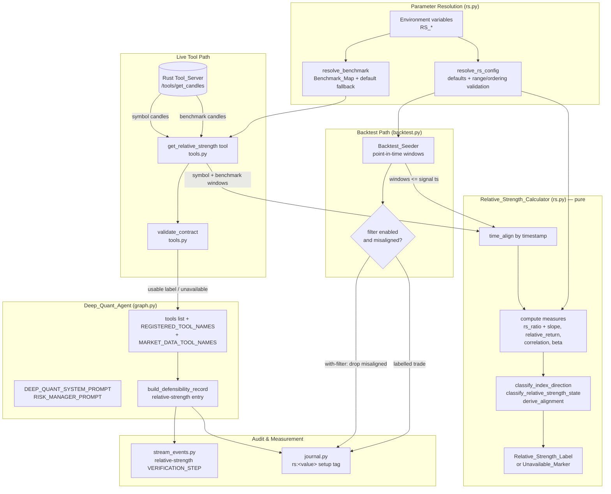

# Design Document

## Overview

The Relative Strength & Index Context feature gives the Deep Quant agent ("Alpha-Quant") the one piece of market awareness it currently lacks: a cheap, deterministic measurement of *what* to trade relative to the broader market. The agent already classifies each symbol's setup in isolation. A veteran trader's discipline is the opposite — trade the **strongest** stock **with** the market, never fight the index, and never buy a laggard in a falling market or short a leader in a rising one. The same multi-timeframe backtest that motivated the `regime-detection-gate` showed the rule set decaying toward break-even on fast intraday timeframes; a large share of those losing trades are directional bets taken against the prevailing index move or in names underperforming their benchmark.

This feature implements that discipline as a pure-math calculator that, from candle data the system already retrieves, measures the benchmark index's own direction, the symbol's relative strength versus that benchmark, and the symbol↔index correlation/beta, then labels a Relative_Strength_State and an Alignment of a proposed trade direction with that context. It surfaces as guidance — never as a hard block and never as a trade generator. Concretely, the design adds:

1. A pure-Python `Relative_Strength_Calculator` (new module `rs.py`) that maps a symbol candle sequence, a Benchmark_Index candle sequence, and a resolved configuration to a structured `Relative_Strength_Label` (Index_Direction, Relative_Strength_State, the named Relative_Strength_Measures, a derived Alignment, and the Benchmark_Index used), or to an honest `Unavailable_Marker`. No network, no clock, no hidden state.
2. A configurable `Benchmark_Map` (also in `rs.py`) resolving each symbol to its Benchmark_Index, with documented defaults and a documented fallback.
3. A new `get_relative_strength` Analysis_Tool in `tools.py` that fetches both the symbol candles and the benchmark candles from the authoritative Rust Tool_Server, classifies them with the calculator, and returns a contract-validated result. `validate_contract` gains a `get_relative_strength` branch.
4. Graph wiring in `graph.py`: the tool is bound to the model, registered in `REGISTERED_TOOL_NAMES` and `MARKET_DATA_TOOL_NAMES`, and the defensibility record gains a relative-strength entry.
5. Prompt integration: `DEEP_QUANT_SYSTEM_PROMPT` and `RISK_MANAGER_PROMPT` instruct the agent to consult relative strength, check Alignment before a directional trade, and bias toward lower conviction / wait / HOLD when `misaligned`.
6. A relative-strength `VERIFICATION_STEP` emitted by `stream_events.py`, ordered before the `DECISION`.
7. A new `rs:<value>` dimension on the Trade_Journal Setup_Fingerprint (`journal.py`).
8. Backtest integration: `backtest.py` classifies each generated signal with the **same** `Relative_Strength_Calculator` functions and supports a with-filter / without-filter comparison so the journal can prove, with numbers, whether requiring index/relative-strength alignment improves expectancy.
9. Environment-variable-driven, validated parameters resolved identically on both the tool path and the backtest path.

This feature deliberately reuses the architecture established by `regime-detection-gate` (pure-Python deterministic classifier + configurable thresholds + tool + contract + graph/prompt/defensibility/stream/journal/backtest integration) so the two compose cleanly: the **regime says *when* to trade, relative strength says *what* to trade.**

The design's central constraint is **scope discipline** (Requirement 13): relative strength is a filter / context aid. It produces only a label or an unavailable marker; it never emits BUY/SELL/HOLD, never overrides a committed decision, and never blocks a trade the agent chooses to take.

### Key Design Decisions

- **AD-1: Computation lives in Python, candle retrieval is delegated to Rust.** The `Relative_Strength_Calculator` is pure Python so it is unit- and property-testable in isolation with no infrastructure (Requirements 1, 3). The `get_relative_strength` tool retrieves *both* the symbol candles and the benchmark candles from the same `/tools/get_candles` Rust endpoint every other tool uses, so relative strength is computed from the system's authoritative price source. The tool re-validates its own result on receipt (consumer-side, AD-3) like every other tool.
- **AD-2: A single source of truth for the relative-strength math.** Both the live tool path (`get_relative_strength`) and the `Backtest_Seeder` call the **same** `Relative_Strength_Calculator` functions (Requirements 11.1, 11.5). The backtest never reimplements the math; it only feeds different candle windows (point-in-time, no look-ahead).
- **AD-3: Contract failures are data, not exceptions.** Mirroring the existing `validate_contract` philosophy, a malformed relative-strength result becomes a structured `{"error", "contract_violation"}` dict, and an unavailable result is an honest pass-through marker. Nothing in the relative-strength path raises into the agent loop (Requirements 4.9, 5.5).
- **AD-4: Unavailable means "missing optional input," never "fabricate."** When relative strength cannot be computed (missing benchmark, insufficient aligned candles, retrieval failure), the result omits Index_Direction / Relative_Strength_State / Alignment entirely rather than defaulting them, and every downstream consumer (defensibility record, verification step, journal tag, backtest filter) treats absence as a benign, non-blocking gap (Requirements 5, 8.3, 9.5, 10.2, 11.6).
- **AD-5: Parameters are resolved once, deterministically, with documented defaults.** A single `resolve_rs_config()` reads each parameter from its own environment variable, falls back to a documented default on unset/unparseable/out-of-range values, and enforces the `laggard_cutoff < leader_cutoff` ordering — applied identically on both paths (Requirement 12).
- **AD-6: The relative-strength tag is low-cardinality by construction.** The journal's relative-strength dimension draws from a fixed enumeration of at most 8 values (including `unknown`) so the relative-strength-extended `setup_key` stays groupable and individual setups can accumulate enough scored trades to clear the low-sample threshold (Requirement 10.3).
- **AD-7: Time-alignment precedes every cross-series measure.** Correlation, beta, and relative return are computed only from candles whose timestamps are common to *both* the symbol and benchmark sequences, so mismatched-length or mismatched-timestamp inputs cannot corrupt the measures (Requirement 3.7). The aligned-candle count is the quantity gated against the minimum (Requirements 3.1, 5.2).

## Architecture

The relative-strength feature threads a single new computation (`Relative_Strength_Calculator`) through the agent's existing layers. The calculator is the only place the relative-strength math exists; everything else consumes its output.



### Request flow (live FIND-mode analysis)

1. The agent, following `DEEP_QUANT_SYSTEM_PROMPT`, calls `get_relative_strength(symbol, timeframe)` (optionally with an explicit `benchmark`) during analysis.
2. The tool validates its arguments, resolves the Benchmark_Index via the Benchmark_Map, fetches both the symbol candles and the benchmark candles from the Rust Tool_Server, and resolves parameters via `resolve_rs_config()`.
3. The tool calls `classify_relative_strength(symbol_candles, benchmark_candles, config, ...)`, receiving either a `Relative_Strength_Label` or an `Unavailable_Marker`.
4. The tool re-validates the result with `validate_contract("get_relative_strength", result)` and returns it to the ReAct loop.
5. A usable label sets `market_data_seen`; an error/unavailable result does not.
6. When the agent commits a decision, `build_defensibility_record` reads the most recent `get_relative_strength` result from message history and writes a relative-strength entry.
7. `stream_events.py` emits a relative-strength `VERIFICATION_STEP` (ordered before `DECISION`) derived from that entry.
8. `journal.derive_setup_tags` appends an `rs:<value>` tag at a fixed position so per-relative-strength stats are measurable.

### Backtest flow (comparison mode)

1. The seeder walks history; for each generated signal it classifies relative strength using only candles **at or before** the signal's candle timestamp (no look-ahead), via the same `classify_relative_strength`, passing the signal's direction as the proposed trade direction.
2. In the with-filter run, a signal whose Alignment is `misaligned` for its direction is excluded; an `Unavailable_Marker` signal is **retained** (not excluded on the basis of relative strength).
3. The without-filter run keeps all signals. Both runs use identical candle history and identical setup rules.
4. Each seeded trade is labelled with its Relative_Strength_Label; the seeder reports win-rate and expectancy per run, reporting `not-applicable` when a run produced zero closed trades.

## Components and Interfaces

### 1. `rs.py` (new module) — the Relative_Strength_Calculator

A new pure-Python module in `agents/deep-quant-loop/`. No imports of `httpx`, no file/clock access. It exposes the calculator, the configuration resolver, the Benchmark_Map, and the measure functions. It mirrors the structure of `regime.py` exactly.

#### Configuration resolution

```python
# Default parameters (documented; applied on unset / unparseable / out-of-range).
DEFAULT_RS_LOOKBACK = 20            # bars over which RS ratio slope & relative return are measured
DEFAULT_RS_CORR_WINDOW = 30         # bars over which correlation & beta are measured
DEFAULT_RS_LEADER_CUTOFF = 0.02     # relative-return >= this => leader (outperforming)
DEFAULT_RS_LAGGARD_CUTOFF = -0.02   # relative-return <= this => laggard (underperforming)
DEFAULT_RS_INDEX_FLAT_BAND = 0.005  # |index return| <= this over lookback => flat
DEFAULT_RS_MIN_CANDLES = 30         # minimum aligned candles required to classify

@dataclass(frozen=True)
class RSConfig:
    lookback: int
    corr_window: int
    leader_cutoff: float
    laggard_cutoff: float
    index_flat_band: float
    min_candles: int

    @property
    def largest_lookback(self) -> int:
        """Max aligned candles any single measure requires (drives the gate)."""
        return max(self.lookback, self.corr_window) + 1

def resolve_rs_config() -> RSConfig:
    """Resolve every parameter from its own env var with documented defaults.

    Per-parameter rules (R12):
      * unset / empty            -> documented default
      * unparseable as its type  -> documented default (never raises)
      * parses but out of range  -> documented default (never raises)
      * laggard_cutoff >= leader_cutoff -> BOTH cutoffs revert to their defaults
    Called on the tool path and the backtest path so resolved values are
    identical for identical env (R12.6). NEVER raises.
    """
```

Environment variables (each independently parsed):

| Parameter | Env var | Type | Valid range | Default |
|---|---|---|---|---|
| Relative-strength lookback | `RS_LOOKBACK` | int | ≥ 2 | 20 |
| Correlation/beta window | `RS_CORR_WINDOW` | int | ≥ 2 | 30 |
| Leader cutoff | `RS_LEADER_CUTOFF` | float | -1.0–1.0 | 0.02 |
| Laggard cutoff | `RS_LAGGARD_CUTOFF` | float | -1.0–1.0 | -0.02 |
| Index flat-band threshold | `RS_INDEX_FLAT_BAND` | float | 0.0–1.0 | 0.005 |
| Minimum aligned-candle count | `RS_MIN_CANDLES` | int | ≥ 2 | 30 |

The Benchmark_Map is also configurable:

| Setting | Env var | Format | Default |
|---|---|---|---|
| Default Benchmark_Index | `RS_DEFAULT_BENCHMARK` | string | `NIFTY 50` |
| Symbol→benchmark overrides | `RS_BENCHMARK_MAP` | `SYMBOL:BENCHMARK,SYMBOL:BENCHMARK,...` | documented defaults (e.g. bank names → `BANKNIFTY`) |

```python
# Documented default symbol -> benchmark entries (R2.1, R2.2). Extended via
# RS_BENCHMARK_MAP without code changes (R2.3). Only benchmarks whose candles are
# available in the data source are given defaults.
DEFAULT_BENCHMARK = "NIFTY 50"
DEFAULT_BENCHMARK_MAP = {
    "HDFCBANK": "BANKNIFTY",
    "ICICIBANK": "BANKNIFTY",
    "SBIN": "BANKNIFTY",
    "AXISBANK": "BANKNIFTY",
    "KOTAKBANK": "BANKNIFTY",
    # ... documented defaults
}

def resolve_benchmark(symbol: str, explicit: Optional[str] = None) -> str:
    """Resolve the Benchmark_Index for a symbol (R2).

    Precedence: an explicit non-empty ``benchmark`` argument wins; otherwise the
    configurable RS_BENCHMARK_MAP / DEFAULT_BENCHMARK_MAP entry for the symbol;
    otherwise the documented default Benchmark_Index (R2.2). NEVER raises.
    """
```

#### Measure functions (pure)

```python
def compute_rs_ratio_slope(symbol_rows, benchmark_rows, lookback) -> tuple[Optional[float], Optional[float]]:
    """Latest RS ratio (symbol close / benchmark close) and the slope of that
    ratio over `lookback` aligned bars (R1.3). Ratio is None on a zero benchmark
    price; slope is None when the ratio series is too short or degenerate."""

def compute_relative_return(symbol_rows, benchmark_rows, lookback) -> Optional[float]:
    """Symbol return minus benchmark return over `lookback` aligned bars (R1.4).
    None when a base price is zero or there are too few aligned bars."""

def compute_correlation(symbol_rows, benchmark_rows, window) -> Optional[float]:
    """Pearson correlation of per-bar returns over `window` aligned bars,
    clamped to [-1.0, 1.0] (R1.5, R3.4). None on zero variance (R3.5)."""

def compute_beta(symbol_rows, benchmark_rows, window) -> Optional[float]:
    """Beta = cov(symbol_ret, benchmark_ret) / var(benchmark_ret) over `window`
    aligned bars (R1.5). None on zero benchmark-return variance (R3.5)."""

def compute_index_return(benchmark_rows, lookback) -> Optional[float]:
    """Benchmark return over `lookback` aligned bars; drives Index_Direction.
    None when a base price is zero or there are too few bars."""
```

Each measure function ignores candles with non-finite/non-numeric OHLCV fields (Requirement 3.2), clamps bounded measures into range (Requirement 3.4), and returns `None` when its denominator is zero (Requirement 3.5).

#### Time-alignment (pure)

```python
def time_align(symbol_candles, benchmark_candles) -> tuple[list, list]:
    """Project both candle sequences to equal-length lists of valid rows whose
    timestamps are common to BOTH sequences, in ascending timestamp order (R3.7).
    Candles with non-finite/non-numeric OHLCV (including timestamp) are dropped
    (R3.2). Pure: never mutates either input."""
```

#### Classification functions (pure, total)

```python
def classify_index_direction(index_return, config) -> str:
    """Return exactly one of 'up' | 'down' | 'flat' (R1.6).
      index_return > +flat_band  -> 'up'
      index_return < -flat_band  -> 'down'
      otherwise (within band, or None) -> 'flat'."""

def classify_relative_strength_state(relative_return, rs_ratio_slope, config) -> str:
    """Return exactly one of 'leader' | 'inline' | 'laggard' (R1.7) by comparing
    the relative-return measure against the configured leader/laggard cutoffs
    (rs_ratio_slope corroborates). None relative_return -> 'inline'."""

def derive_alignment(index_direction, rs_state, proposed_direction) -> str:
    """Return exactly one of 'aligned' | 'misaligned' | 'neutral' (R1.8, R1.9).
    Total function: every (index_direction, rs_state, proposed_direction)
    combination — including a None/absent proposed_direction -> 'neutral' — maps
    to exactly one Alignment value."""

def classify_relative_strength(symbol_candles, benchmark_candles, config,
                               proposed_direction=None, symbol=None,
                               benchmark=None, timeframe=None) -> dict:
    """Top-level entry point. Returns either a Relative_Strength_Label dict or an
    Unavailable_Marker dict. Pure and deterministic (R1.2, R1.10); never mutates
    inputs (R1.10); never raises (R3); emits ONLY a label or marker (R13.1)."""
```

The Index_Direction / Relative_Strength_State / Alignment mapping tables are specified in the Data Models section so they are total and unambiguous.

### 2. `tools.py` — the `get_relative_strength` tool and contract

```python
INDEX_DIRECTIONS = {"up", "down", "flat"}
RELATIVE_STRENGTH_STATES = {"leader", "inline", "laggard"}
ALIGNMENT_VALUES = {"aligned", "misaligned", "neutral"}
_RS_MEASURE_FIELDS = (
    "rs_ratio", "rs_ratio_slope", "relative_return", "correlation", "beta",
)

@tool
def get_relative_strength(symbol: str, timeframe: str, benchmark: str = "",
                          proposed_direction: str = "") -> dict:
    """Measure the symbol's relative strength versus its benchmark index and the
    alignment of a proposed trade direction with the index/relative-strength
    context. Returns index_direction, relative_strength_state, alignment, the
    named measures, and the resolved benchmark, or an Unavailable_Marker.
    Never raises (R3, R4, R5)."""
    # 1. Validate args: empty/whitespace symbol or unsupported timeframe -> error (R4.3).
    # 2. Resolve benchmark via resolve_benchmark(symbol, benchmark) (R4.2).
    # 3. Resolve config via rs.resolve_rs_config().
    # 4. Fetch symbol candles AND benchmark candles from RUST_SERVER_URL/tools/get_candles
    #    (R4.4). On retrieval failure/timeout -> Unavailable_Marker citing the cause (R5.1).
    #    Missing benchmark candles -> Unavailable_Marker identifying the missing benchmark (R2.4).
    # 5. result = rs.classify_relative_strength(sym_candles, bench_candles, config, ...)
    # 6. return validate_contract("get_relative_strength", result)
```

`validate_contract` gains a `get_relative_strength` branch:

- An `Unavailable_Marker` (`{"unavailable": true, ...}`) is already recognized by the existing `_has_honest_marker` and passes through unchanged (Requirement 4.8).
- A conforming label: `index_direction ∈ {up,down,flat}`, `relative_strength_state ∈ {leader,inline,laggard}`, `alignment ∈ {aligned,misaligned,neutral}`, a `benchmark` string, and each measure field present and finite-number-or-null. Returned unchanged (Requirement 4.6).
- Otherwise → `_contract_error("...offending field...")` (Requirement 4.7).
- Wrapped in the existing `try/except` so validation never raises (Requirement 4.9).

A `_relative_strength_unavailable(symbol, timeframe, benchmark, reason)` helper mirrors `_regime_unavailable`: it carries context plus `{"unavailable": true, "reason": ...}` and **omits** index_direction / relative_strength_state / alignment (AD-4, Requirement 5.3).

### 3. `graph.py` — graph wiring and defensibility

- Add `get_relative_strength` to the `tools` list, `REGISTERED_TOOL_NAMES`, and `MARKET_DATA_TOOL_NAMES` (Requirements 6.1–6.3). Because it joins `MARKET_DATA_TOOL_NAMES`, the existing `market_data_seen` logic automatically treats a usable result as data and an error/unavailable result as not-data (Requirements 6.4–6.5) with no further change — the existing `_tool_result_is_error` / unavailable predicates already classify the `{"unavailable": true}` marker correctly.
- `build_defensibility_record` gains a relative-strength entry built by a new `_relative_strength_entry(results)` helper, modelled on `_regime_entry`:

```python
def _relative_strength_entry(results) -> dict:
    """Build the defensibility relative-strength entry from the latest
    get_relative_strength result (R8.1-R8.3). Returns {'available': False, ...}
    when absent/unavailable (R8.3); otherwise copies index_direction,
    relative_strength_state, alignment, the named measures, and the benchmark
    verbatim (R8.2 — no inference)."""
```

The record's relative-strength entry, plus a flag set when `alignment == "misaligned"` and `action ∈ {BUY, SELL}`, supplies the explicit "trade fights the index / trades a laggard against its benchmark" statement (Requirement 8.4).

### 4. `stream_events.py` — relative-strength verification step

A new check is appended in `_derive_find_mode_steps` (and surfaced in VERIFY mode via the same record entry), modelled on `_regime_step`:

```python
def _relative_strength_step(record) -> dict:
    """Map the defensibility relative-strength entry to a VERIFICATION_STEP (R9).
      aligned      -> 'pass'
      misaligned   -> 'fail'
      neutral      -> 'informational'
      unavailable  -> 'not-evaluable' (with an 'unavailable' indication)
    Stable check id 'relative-strength'. Never fabricates an alignment (R9.5)."""
```

`decision_events` already emits all `VERIFICATION_STEP`s before the `DECISION`, so ordering (Requirement 9.6) holds for free. The check id `relative-strength` is stable (Requirement 9.1). As with the regime step, exactly one relative-strength step is appended in both FIND and VERIFY mode (Requirement 9.1).

### 5. `journal.py` — relative-strength setup-fingerprint dimension

`derive_setup_tags` appends exactly one relative-strength tag at a **fixed position** (after the existing `regime:` tag) so `setup_key_from_tags` stays deterministic:

```python
RS_TAG_VALUES = {
    "leader-aligned", "leader-misaligned",
    "laggard-aligned", "laggard-misaligned",
    "inline-neutral", "aligned", "misaligned",
    "unknown",
}  # <= 8 values total, including 'unknown' (R10.3)

def _relative_strength_tag(decision) -> str:
    """Read relative strength from decision['defensibility']['relative_strength'];
    map (Relative_Strength_State x Alignment) to one of the fixed RS_TAG_VALUES.
    Missing/empty/unrecognized -> 'rs:unknown' (R10.2)."""
```

The relative-strength tag collapses the (Relative_Strength_State × Alignment) space into a small fixed set so per-relative-strength `setup_key` groups stay low-cardinality (Requirement 10.3). The existing `_aggregate` already computes win-rate (fraction of scored trades that are wins) and expectancy (mean R-multiple) per `setup_key`, and the existing `LOW_SAMPLE_THRESHOLD` flagging already satisfies Requirements 10.4–10.5 once the tag is in place.

### 6. `backtest.py` — with-filter / without-filter comparison

- `BacktestConfig` gains `rs_filter_enabled: bool` and reuses `rs.resolve_rs_config()` (Requirements 11.5, 12.6).
- `generate_and_score` classifies each signal's relative strength using only `candles[: i + 1]` for the symbol and the corresponding benchmark window — at/before the signal bar — via `rs.classify_relative_strength`, passing the signal's direction as `proposed_direction` (Requirement 11.1, no look-ahead). The benchmark candles are resolved once for the run via `resolve_benchmark` and sliced point-in-time the same way.
- A `_relative_strength_defensibility_entry(rs_result)` helper (mirroring `_regime_defensibility_entry`) writes the seeded trade's `decision['defensibility']['relative_strength']` so `journal._relative_strength_tag` labels it (Requirements 11.3).
- With-filter run: drop a signal when `alignment == "misaligned"` for its direction; **retain** a signal whose relative-strength result is an `Unavailable_Marker` (Requirements 11.2, 11.6).
- A `compare(...)` entry point (or extension of the existing regime `compare`) runs both filtered and unfiltered over identical history/rules and reports each run's win-rate (`wins / closed`) and expectancy (mean realized R), returning `"n/a"` when a run has zero closed trades (Requirements 11.4, 11.7).

### Frontend (consumption only)

No new Tauri/React work is mandated by the requirements. The relative-strength `VERIFICATION_STEP` and the relative-strength fields in the `DECISION`/defensibility payload flow through the existing SSE stream that the deep-quant panel/`AgentTerminal` already render, so the relative-strength check and label appear in the existing verification/plan views automatically.

## Data Models

### RSConfig

The resolved, validated parameter set (see `resolve_rs_config`). Frozen dataclass; identical for identical env on both paths.

### Relative_Strength_Label (successful classification)

```json
{
  "index_direction": "up | down | flat",
  "relative_strength_state": "leader | inline | laggard",
  "alignment": "aligned | misaligned | neutral",
  "measures": {
    "rs_ratio": 0.0142,
    "rs_ratio_slope": 0.00031,
    "relative_return": 0.035,
    "correlation": 0.72,
    "beta": 1.18
  },
  "benchmark": "NIFTY 50",
  "symbol": "RELIANCE",
  "timeframe": "15m",
  "aligned_candles": 64
}
```

Each `measures` value is a finite number or `null` (Requirements 3.3, 3.5). Bounded measures (`correlation ∈ [-1,1]`) are clamped into range (Requirement 3.4).

### Unavailable_Marker

```json
{
  "symbol": "RELIANCE",
  "timeframe": "1m",
  "benchmark": "NIFTY 50",
  "unavailable": true,
  "reason": "insufficient aligned data: 12 aligned candles available, 31 required"
}
```

Index_Direction / Relative_Strength_State / Alignment are **omitted** (not defaulted) when unavailable (Requirements 5.3, 3.6). The `reason` cites the cause and, for the insufficient-data case, includes the count of aligned candles available and the count required (Requirements 3.1, 5.2). A missing-benchmark marker names the missing benchmark (Requirement 2.4).

### Contract-violation result (from `validate_contract`)

```json
{
  "error": "Tool result failed contract validation: alignment 'sideways' not in {aligned, misaligned, neutral}",
  "contract_violation": "alignment 'sideways' not in {aligned, misaligned, neutral}"
}
```

### Index_Direction classification (total mapping)

Input: `index_return` over the configured lookback (or `None`), and the configured `index_flat_band`.

| Condition | Index_Direction |
|---|---|
| `index_return > +index_flat_band` | `up` |
| `index_return < -index_flat_band` | `down` |
| otherwise (within ±band, or `index_return` is `None`) | `flat` |

### Relative_Strength_State classification (total mapping)

Input: `relative_return` over the configured lookback (or `None`), corroborated by `rs_ratio_slope`. The leader/laggard cutoffs satisfy `laggard_cutoff < leader_cutoff` (enforced at resolution).

| Condition | Relative_Strength_State |
|---|---|
| `relative_return >= leader_cutoff` | `leader` |
| `relative_return <= laggard_cutoff` | `laggard` |
| otherwise (between cutoffs, or `relative_return` is `None`) | `inline` |

### Alignment derivation (total mapping over Index_Direction × Relative_Strength_State × proposed_direction)

Alignment expresses the veteran principle: trade the strongest names with the market. When no proposed trade direction is provided, Alignment is `neutral` (Requirement 1.9).

For a **BUY** proposed direction:

| Index_Direction \ Relative_Strength_State | leader | inline | laggard |
|---|---|---|---|
| `up` | `aligned` | `neutral` | `neutral` |
| `flat` | `neutral` | `neutral` | `neutral` |
| `down` | `neutral` | `neutral` | `misaligned` |

For a **SELL** proposed direction:

| Index_Direction \ Relative_Strength_State | leader | inline | laggard |
|---|---|---|---|
| `up` | `misaligned` | `neutral` | `neutral` |
| `flat` | `neutral` | `neutral` | `neutral` |
| `down` | `neutral` | `neutral` | `aligned` |

For **no proposed direction** (or HOLD): `neutral` for every (Index_Direction, Relative_Strength_State) combination.

Every combination of the three inputs maps to exactly one Alignment value, so `derive_alignment` is total (Requirement 1.8).

### Journal relative-strength tag (fixed enumeration)

The journal collapses (Relative_Strength_State, Alignment) into the fixed `rs:<value>` set: the directional pairings (`leader-aligned`, `leader-misaligned`, `laggard-aligned`, `laggard-misaligned`), the neutral `inline-neutral`, and the bare `aligned`/`misaligned` for the residual combinations; anything missing/unrecognized → `rs:unknown`. At most 8 distinct values including `unknown` (Requirement 10.3).

## Correctness Properties

*A property is a characteristic or behavior that should hold true across all valid executions of a system — essentially, a formal statement about what the system should do. Properties serve as the bridge between human-readable specifications and machine-verifiable correctness guarantees.*

The prework analysis classified each acceptance criterion and consolidated the redundant ones (the two purity criteria, the measure-presence criteria, the threshold-mapping criteria, the contract identity criteria, the failure-degradation criteria, the verification-step outcome criteria, the tag criteria, and the per-parameter fallback criteria were each merged). Purely structural/prompt-text criteria (the Benchmark_Map default entries, tool registration, prompt wording, the backtest's reuse of the calculator) are covered by example-based unit tests in the Testing Strategy rather than properties.

### Property 1: Classification is deterministic

*For any* symbol candle sequence, benchmark candle sequence, configuration, and optional proposed direction, invoking `classify_relative_strength` two or more times returns results (Relative_Strength_Label or Unavailable_Marker, including the Index_Direction, Relative_Strength_State, Alignment, and every measure) that are element-wise identical across all invocations.

**Validates: Requirements 1.2**

### Property 2: Calculator functions are pure (no input mutation)

*For any* symbol candle sequence, benchmark candle sequence, and configuration, every `Relative_Strength_Calculator` function (the measure functions, `time_align`, the classification functions, and `classify_relative_strength`) leaves the provided candle sequences and configuration deep-equal to their pre-call snapshots, producing no observable change to any input.

**Validates: Requirements 1.1, 1.10**

### Property 3: Computed measures are present, finite-or-null, and correct

*For any* symbol/benchmark candle sequences with at least the largest configured lookback of time-aligned valid candles, the resulting Relative_Strength_Label includes each named Relative_Strength_Measure (`rs_ratio`, `rs_ratio_slope`, `relative_return`, `correlation`, `beta`), each is either a finite number or `null`, and the `relative_return` equals the symbol's return minus the benchmark's return over the lookback computed from the time-aligned closes.

**Validates: Requirements 1.3, 1.4, 1.5, 3.3**

### Property 4: Bounded measures are clamped within their range

*For any* symbol/benchmark candle sequences, the `correlation` measure reported in the Relative_Strength_Label lies within `[-1.0, 1.0]`, even when the raw computed value would fall outside that range.

**Validates: Requirements 3.4**

### Property 5: Label states are well-formed and match the threshold mapping

*For any* Relative_Strength_Label produced from sufficient aligned candles, the Index_Direction is exactly one of `up`/`down`/`flat` and equals the value dictated by comparing the index return against `±index_flat_band`, and the Relative_Strength_State is exactly one of `leader`/`inline`/`laggard` and equals the value dictated by comparing the relative-return measure against the configured leader/laggard cutoffs, per the specified mapping tables.

**Validates: Requirements 1.6, 1.7**

### Property 6: Alignment is a total function of its three inputs

*For any* combination of an Index_Direction value, a Relative_Strength_State value, and a proposed trade direction (BUY, SELL, or absent), `derive_alignment` returns exactly one Alignment value drawn from `aligned`/`misaligned`/`neutral`, so that every combination maps to exactly one Alignment.

**Validates: Requirements 1.8**

### Property 7: Absent proposed direction yields a neutral alignment with the other fields present

*For any* symbol/benchmark candle sequences and configuration with no proposed trade direction provided, the result (when not unavailable) reports Alignment `neutral` while still populating the Index_Direction, the Relative_Strength_State, and the named Relative_Strength_Measures.

**Validates: Requirements 1.9**

### Property 8: Non-finite candles are excluded without affecting the result

*For any* valid symbol/benchmark candle sequences and any interleaving of candles carrying non-finite or non-numeric OHLCV fields, `classify_relative_strength` returns a result equal to the result of classifying only the valid candles, and never raises an exception.

**Validates: Requirements 3.2**

### Property 9: Time-alignment makes the result depend only on common-timestamp candles

*For any* symbol/benchmark candle sequences, adding, removing, or reordering candles whose timestamps are not common to both sequences does not change the Relative_Strength_Label, because correlation, beta, and relative return are computed only from the time-aligned, common-timestamp candles.

**Validates: Requirements 3.7**

### Property 10: Insufficient aligned candles yield an Unavailable_Marker with counts

*For any* symbol/benchmark candle sequences whose count of time-aligned valid candles is fewer than the configured minimum required for the longest lookback (whether short to begin with or short after excluding non-finite/non-common candles), `classify_relative_strength` (and the `get_relative_strength` tool path) returns an Unavailable_Marker whose reason identifies the insufficient-data condition and includes both the count of aligned candles available and the configured minimum required, leaving the inputs unmodified and never raising.

**Validates: Requirements 3.1, 5.2**

### Property 11: Zero-denominator measures are null, and all-null yields unavailable

*For any* aligned window in which a Relative_Strength_Measure's denominator is zero (for example a zero benchmark price or zero return variance over the window), that measure is represented as `null` in the Relative_Strength_Label and no exception is raised; and *for any* input in which every required Relative_Strength_Measure is `null`, `classify_relative_strength` returns an Unavailable_Marker rather than a Relative_Strength_Label.

**Validates: Requirements 3.5, 3.6**

### Property 12: An Unavailable_Marker never carries fabricated states

*For any* path that produces an Unavailable_Marker (insufficient data, all-null measures, missing benchmark, retrieval failure, or processing error), the marker omits the `index_direction`, `relative_strength_state`, and `alignment` keys entirely rather than populating them with default, placeholder, or otherwise fabricated values.

**Validates: Requirements 5.3**

### Property 13: The tool rejects invalid arguments without raising

*For any* whitespace-only or empty `symbol`, or any `timeframe` not in the supported timeframe set, `get_relative_strength` returns a structured error result and never raises an exception.

**Validates: Requirements 4.3**

### Property 14: A successful tool result is well-formed

*For any* candle data sufficient to classify (with retrieval mocked), the `get_relative_strength` result contains `index_direction` in its enum, `relative_strength_state` in its enum, `alignment` in its enum, the resolved `benchmark` as a string, and each named Relative_Strength_Measure present as a finite number or `null`.

**Validates: Requirements 4.5**

### Property 15: validate_contract is the identity on conforming results and markers

*For any* generated conforming `get_relative_strength` Relative_Strength_Label, and *for any* Unavailable_Marker, `validate_contract("get_relative_strength", result)` returns that result unchanged.

**Validates: Requirements 4.6, 4.8**

### Property 16: validate_contract rejects non-conforming results, naming the field

*For any* `get_relative_strength` result mutated to violate the contract (an out-of-enum state, a missing required field, a missing benchmark string, or a non-numeric/non-null measure), `validate_contract` returns a structured `{"error", "contract_violation"}` result whose violation message identifies the offending field.

**Validates: Requirements 4.7**

### Property 17: validate_contract never raises on a relative-strength result

*For any* arbitrary payload (a well-formed object, a malformed object, a list, a scalar, or `None`), `validate_contract("get_relative_strength", payload)` returns a dict and never raises an exception.

**Validates: Requirements 4.9**

### Property 18: The tool degrades to an Unavailable_Marker on missing benchmark or any retrieval/processing failure

*For any* simulated missing benchmark (benchmark candle fetch returns empty/error) the `get_relative_strength` tool returns an Unavailable_Marker whose reason identifies the missing benchmark; and *for any* simulated failure in candle retrieval (timeout, connection error, error payload) or in downstream processing, it returns an Unavailable_Marker whose reason identifies the cause and never propagates an exception into the agent loop.

**Validates: Requirements 2.4, 5.1, 5.5**

### Property 19: The market-data gate classifies relative-strength results correctly and stays monotone

*For any* message history, `get_relative_strength` contributes to `market_data_seen` only via a usable result (neither an error nor an Unavailable_Marker); a history whose only market-data result is an error or unavailable relative-strength result yields `market_data_seen == false`; and once a usable market-data result makes the flag true, appending any further messages leaves it true.

**Validates: Requirements 6.4, 6.5**

### Property 20: The defensibility relative-strength entry mirrors the tool result without fabrication

*For any* message history containing a usable `get_relative_strength` result, `build_defensibility_record` produces a relative-strength entry whose Index_Direction, Relative_Strength_State, Alignment, named Relative_Strength_Measures, and Benchmark_Index are exactly the values from the most recent such result, introducing no value not present in that result.

**Validates: Requirements 8.1, 8.2**

### Property 21: Absent relative strength is recorded as unavailable

*For any* message history containing no usable `get_relative_strength` result, the relative-strength entry of the Defensibility_Record is marked unavailable and contains no Index_Direction, Relative_Strength_State, Alignment, or measure substitute values.

**Validates: Requirements 8.3**

### Property 22: A misaligned directional trade records the opposition statement

*For any* decision whose most recent relative-strength Alignment is `misaligned` and whose committed action is BUY or SELL, the Defensibility_Record includes an explicit statement that the committed trade fights the index or trades a laggard against its benchmark; for HOLD actions or non-`misaligned` alignments, no such statement is added.

**Validates: Requirements 8.4**

### Property 23: Exactly one relative-strength verification step with the correct outcome mapping

*For any* decision, the built Verification_Steps contain exactly one relative-strength step carrying the stable check identifier `relative-strength`, whose outcome is `pass` when the recorded Alignment is `aligned`, `fail` when `misaligned`, `informational` when `neutral`, and `not-evaluable` (with an unavailable indication and no fabricated Alignment) when relative strength is unavailable.

**Validates: Requirements 9.1, 9.2, 9.3, 9.4, 9.5**

### Property 24: The relative-strength verification step precedes the DECISION event

*For any* decision, the event sequence emitted by `decision_events` places the relative-strength `VERIFICATION_STEP` before the `DECISION` event of that run.

**Validates: Requirements 9.6**

### Property 25: Exactly one low-cardinality relative-strength tag at a fixed position

*For any* decision, `derive_setup_tags` appends exactly one `rs:<value>` tag at a fixed position in the tag sequence, where `<value>` is drawn from the fixed enumeration of at most 8 values (including `unknown`); a decision lacking a valid recorded relative strength yields `rs:unknown`; and identical decisions yield an identical `setup_key`.

**Validates: Requirements 10.1, 10.2, 10.3**

### Property 26: Per-relative-strength aggregation reports correct win-rate and expectancy

*For any* set of recorded trades, grouping scored (win or loss) trades by the relative-strength-extended `setup_key` yields, for each group, a win-rate equal to the fraction of scored trades that are wins (within `[0.0, 1.0]`) and an expectancy equal to the mean R-multiple of the group's scored trades, with any group holding fewer scored trades than the low-sample threshold flagged as a weak prior.

**Validates: Requirements 10.4, 10.5**

### Property 27: Backtest relative-strength classification is look-ahead-free

*For any* candle history and any signal index, the Relative_Strength_Label the Backtest_Seeder assigns to that signal is computed only from symbol and benchmark candles at or before the signal's candle timestamp, so that altering or removing any later candles does not change the assigned Relative_Strength_Label.

**Validates: Requirements 11.1**

### Property 28: The enabled filter excludes misaligned signals and retains unavailable ones

*For any* set of generated signals with the relative-strength filter enabled, the with-filter seeded trade set contains no signal whose Alignment is `misaligned` for its direction, and retains every signal whose relative-strength result is an Unavailable_Marker (such signals are never excluded on the basis of relative strength).

**Validates: Requirements 11.2, 11.6**

### Property 29: Comparison-mode runs are consistent and metrics are well-defined

*For any* candle history processed in comparison mode over identical setup rules, the with-filter seeded trade set is a subset of the without-filter set, each seeded trade is labelled with the Relative_Strength_Label (Index_Direction, Relative_Strength_State, Alignment) used to classify it, each run's reported win-rate equals its winning-closed-trade count divided by its closed-trade count and its expectancy equals the mean realized R-multiple per closed trade, and a run with zero closed trades reports win-rate and expectancy as not-applicable rather than dividing by zero.

**Validates: Requirements 11.3, 11.4, 11.7**

### Property 30: Each parameter falls back to its documented default

*For any* environment in which a relative-strength parameter variable is unset, empty, unparseable as its expected type, or parseable but outside its valid range, `resolve_rs_config` applies that parameter's documented default value while reading every parameter from its own variable, and never raises.

**Validates: Requirements 12.1, 12.2, 12.3, 12.4**

### Property 31: Cutoff ordering is enforced

*For any* environment in which the resolved laggard cutoff is not strictly less than the resolved leader cutoff, `resolve_rs_config` applies the documented default values for both cutoffs without raising.

**Validates: Requirements 12.5**

### Property 32: Parameter resolution is deterministic and path-independent

*For any* environment, `resolve_rs_config` returns equal `RSConfig` values across repeated calls and across the Relative_Strength_Tool path and the Backtest_Seeder path, so identical environment values resolve to identical parameters on both paths.

**Validates: Requirements 12.6**

### Property 33: Unmapped symbols resolve to the default benchmark

*For any* symbol with no explicit Benchmark_Map entry and no explicit `benchmark` argument, `resolve_benchmark` returns the documented default Benchmark_Index.

**Validates: Requirements 2.2**

### Property 34: The calculator never emits a trade decision

*For any* symbol/benchmark candle sequences and configuration, the `classify_relative_strength` result is a Relative_Strength_Label or an Unavailable_Marker and contains no BUY, SELL, or HOLD action, no conviction score, and no decision field, so classification alone — even when Alignment is `aligned` — never commits, generates, or triggers a trade.

**Validates: Requirements 13.1, 13.3**

### Property 35: The relative-strength context never modifies or blocks a committed decision

*For any* committed decision — including one whose Alignment is `misaligned` or `neutral` — assembling the defensibility relative-strength entry and verification step leaves the decision's action and execution levels (entry, stop-loss, take-profit) unchanged, so the relative-strength context neither overrides nor blocks a trade the agent decides to commit.

**Validates: Requirements 13.4, 13.5**

## Error Handling

The relative-strength feature follows the codebase's established "errors are data, never exceptions into the loop" philosophy.

| Failure | Layer | Handling |
|---|---|---|
| Fewer time-aligned candles than the largest lookback | `classify_relative_strength` | Return `Unavailable_Marker` with reason citing aligned-available vs required counts (R3.1, R5.2). No raise. |
| Candle with non-finite/non-numeric OHLCV (or timestamp) | `time_align` / measure functions | Candle excluded from alignment and all measures (R3.2). No raise. |
| Zero-denominator measure (zero benchmark price / zero variance) | measure function | Measure reported as `null` (R3.5); if all measures null, calculator returns `Unavailable_Marker` (R3.6). |
| Parameter env var unset/empty/unparseable/out-of-range | `resolve_rs_config` | Apply documented default for that parameter (R12.2–R12.4). No raise. |
| `laggard_cutoff >= leader_cutoff` | `resolve_rs_config` | Revert BOTH cutoffs to defaults (R12.5). No raise. |
| Empty/whitespace symbol or unsupported timeframe | `get_relative_strength` | Return structured error result (R4.3). No raise. |
| Resolved benchmark has no candle data | `get_relative_strength` | Return `Unavailable_Marker` whose reason names the missing benchmark (R2.4). No raise. |
| Candle retrieval timeout / connection error / error payload | `get_relative_strength` | Return `Unavailable_Marker` citing the retrieval cause (R5.1). No raise. |
| Any unexpected exception during fetch/classify | `get_relative_strength` | Caught; return `Unavailable_Marker` (R5.5). Never propagates into the agent loop. |
| Malformed relative-strength result reaching the consumer | `validate_contract` | Return `{"error", "contract_violation"}` naming the offending field (R4.7); wrapped in try/except so validation never raises (R4.9). |
| No relative-strength result in history at commit time | `build_defensibility_record` | Record entry as unavailable; no substitute values (R8.3). |
| Zero closed trades in a comparison run | `backtest` comparison | Report win-rate/expectancy as `"n/a"` rather than dividing by zero (R11.7). |
| `journal.record_decision` / tagging failure | `journal.py` | Best-effort; logged and swallowed (existing pattern) so journaling never aborts a run. |

The defining invariant: a missing or unavailable relative-strength result is always a benign, non-blocking gap. It never fabricates Index_Direction/Relative_Strength_State/Alignment, never blocks a decision, and never aborts a run.

## Testing Strategy

Property-based testing **is** appropriate for the core of this feature: the `Relative_Strength_Calculator` is a set of pure, deterministic functions over candle data with universal properties (determinism, purity, totality, clamping invariants, time-alignment, look-ahead-freedom, contract identity/rejection), and the journal/backtest/defensibility consumers have universal input/output properties. The thin glue layers (prompt wording, tool registration, Benchmark_Map default entries) are covered by example-based unit tests.

### Property-based testing

- **Library:** `hypothesis` (already vendored in the repo — note the existing `agents/deep-quant-loop/.hypothesis` cache). Do not implement property testing from scratch.
- **Iterations:** each property test runs a minimum of 100 generated examples (Hypothesis default `max_examples` ≥ 100).
- **Tagging:** each property test carries a comment of the form `# Feature: relative-strength-context, Property {number}: {property_text}` referencing the design property it implements.
- **Coverage:** exactly one property-based test implements each of Properties 1–35.
- **Generators:**
  - *Paired candle generator:* produces a symbol candle sequence and a benchmark candle sequence sharing a configurable set of timestamps (with finite floats satisfying `low <= open,close <= high` and `volume >= 0`), parameterized by length to drive both sufficient and insufficient aligned-candle cases. Variants interleave non-finite/non-numeric/`None` OHLCV fields (Properties 8, 10, 11), inject non-common timestamps on one side (Property 9), and produce degenerate "flat" / zero-benchmark-price windows (Property 11).
  - *Config/env generator:* maps of `RS_*` env-var strings spanning valid numerics, out-of-range numerics, unparseable strings, empty strings, unset keys, and ordering-violating cutoff pairs (Properties 30–32).
  - *Label generator:* well-formed Relative_Strength_Labels (Properties 15, 20, 23, 25) and mutated/malformed labels (Property 16).
  - *Direction generator:* BUY / SELL / absent proposed directions across the full Index_Direction × Relative_Strength_State cross-product (Properties 6, 7).
  - *Trade-row generator:* journal trade dicts with assorted `rs:` tags and win/loss/expired statuses (Property 26).
  - *Signal-history generator:* paired candle histories long enough to produce multiple signals, used to assert look-ahead-freedom and filter behavior (Properties 27–29). The Rust candle fetch is mocked so the tool-boundary properties (14, 18, 19) run in-memory with no network.

### Example-based unit tests

These verify specific structural facts and prompt content that are not universal properties:

- `get_relative_strength` is an `@tool`-decorated function named `get_relative_strength` accepting `symbol`, an optional `benchmark`, and `timeframe` (R4.1, R4.2).
- `get_relative_strength` appears in the bound `tools` list, in `REGISTERED_TOOL_NAMES`, and in `MARKET_DATA_TOOL_NAMES` (R6.1, R6.2, R6.3).
- The Benchmark_Map resolves known mapped symbols (e.g. a bank symbol → `BANKNIFTY`) and respects an `RS_BENCHMARK_MAP` override added via configuration (R2.1, R2.3).
- The tool fetches both the symbol and the benchmark candles from the Rust Tool_Server (two `get_candles` calls, verified with mocks) (R4.4).
- `DEEP_QUANT_SYSTEM_PROMPT` instructs calling `get_relative_strength`, checking Index_Direction/Relative_Strength_State Alignment before a directional trade, the misaligned→(lower conviction | wait | HOLD) guidance, the setup-validation disclosure of Index_Direction/Relative_Strength_State/Alignment, and the unavailable-and-proceed guidance (R7.1–R7.4, R7.6).
- `RISK_MANAGER_PROMPT` instructs consulting `get_relative_strength`, the misaligned warning statement, and the unavailable-and-proceed guidance (R7.5, R7.6).
- `backtest.py` imports and calls `rs.classify_relative_strength` rather than reimplementing the math (R11.5).
- The tool derives its result exclusively from OHLCV candles and parameters — it calls only `get_candles`, consuming no options-chain or other non-candle source (R13.2).
- A representative end-to-end example: a FIND-mode run with a mocked `aligned` relative-strength result produces a defensibility relative-strength entry, a `pass` relative-strength verification step ordered before the DECISION, and an `rs:leader-aligned` journal tag.

### Integration / smoke tests (1–3 examples each)

- Graph-level: an unavailable relative-strength result alone does not satisfy the data gate nor force a decision (R5.4) — a small example with a single unavailable relative-strength ToolMessage.
- The relative-strength tool against a live/stubbed Rust candle endpoint returns a contract-valid label for a known symbol/benchmark/timeframe (smoke).
- A comparison-mode backtest over a fixed candle fixture produces with-filter and without-filter summaries with the expected subset relationship (smoke).

### Test balance

Property tests carry the bulk of input-coverage for the calculator, contract, defensibility, journal, and backtest logic. Unit tests stay focused on concrete structural/wording facts and a couple of representative end-to-end scenarios; they are kept few in number because the property tests already exercise wide input ranges.
