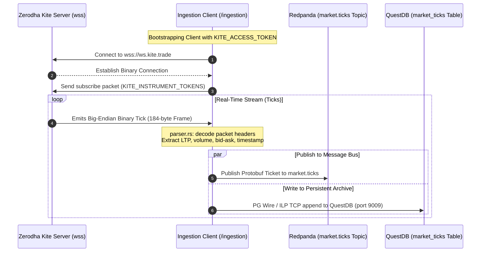
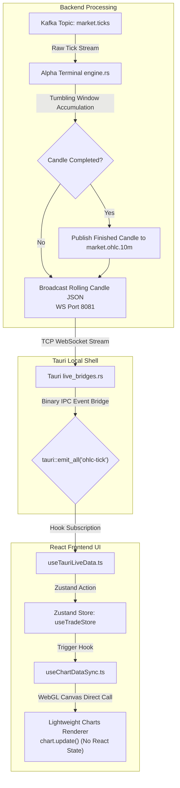
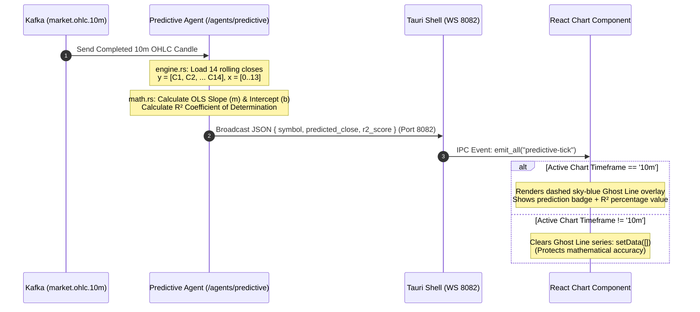
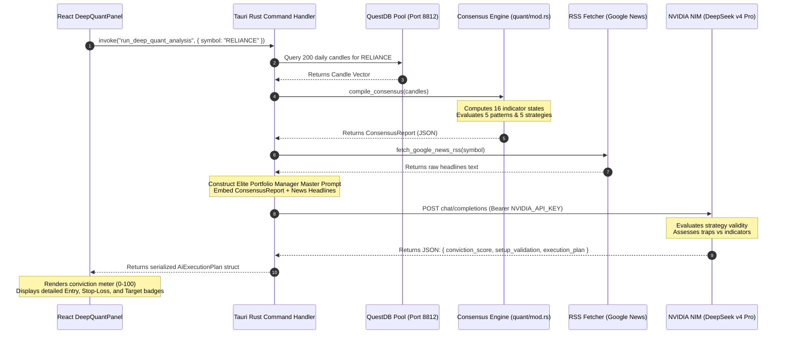
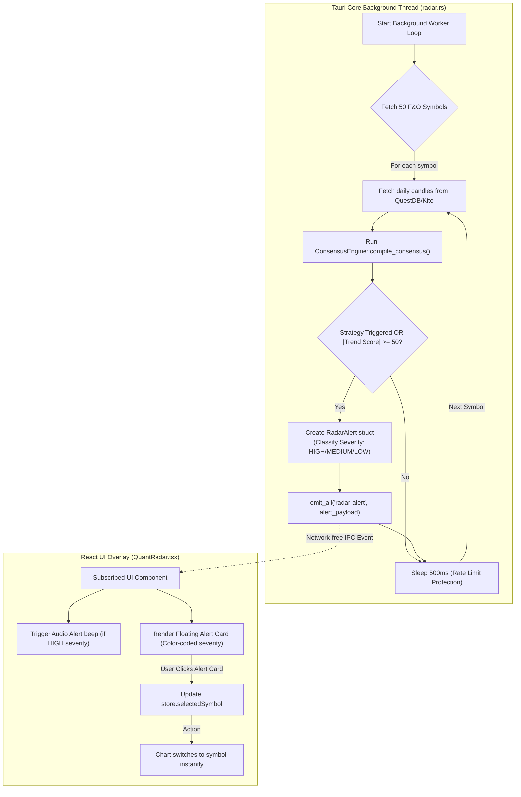
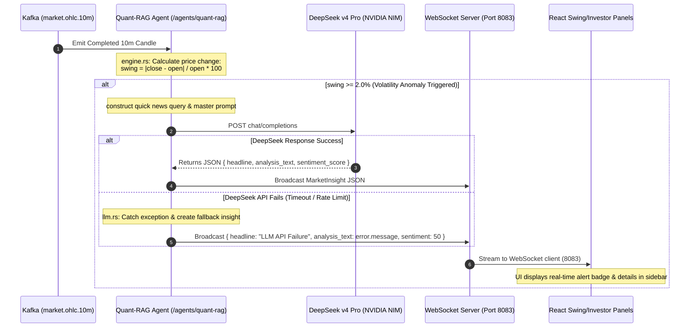
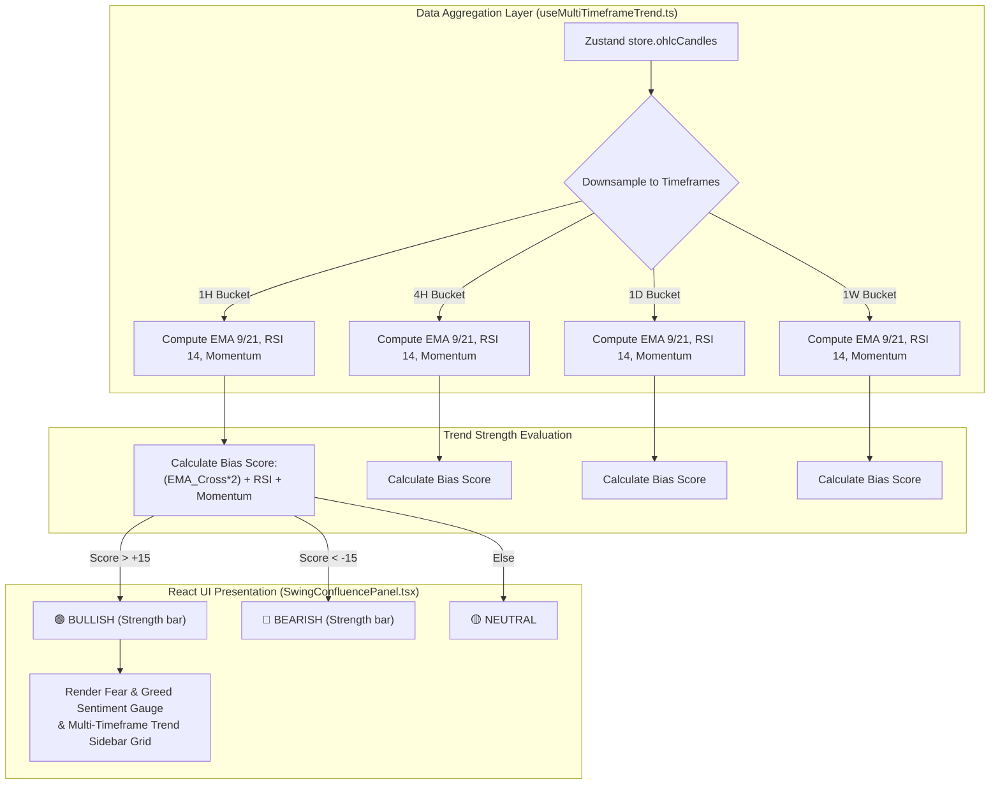

# Strat Ai — System Architecture & Feature-Wise Data Flows

This document provides a highly detailed, comprehensive, feature-by-feature architectural breakdown and data flow mapping for the **Strat Ai (Ai-Trader)** system. It maps the movement of data from real-time binary market feeds down to zero-latency canvas rendering loops, detailing the exact files, protocols, mathematical formulas, and UI states involved.

---

## 1. High-Level Architecture Overview

Strat Ai is structured as a **multi-agent, monorepo trading platform** written primarily in **Rust** (for low-latency ingestion, calculations, and local desk runtime) and **Next.js/TypeScript** (for the user terminal). 

```mermaid
graph TB
    subgraph "Data Source Layer"
        ZWS["Zerodha Kite WebSocket<br/>(Binary Protocol - 184-byte frames)"]
    end

    subgraph "Layer 1: Real-Time Ingestion"
        ING["📡 Ingestion Service<br/>(Rust · Tokio)<br/>/ingestion"]
        QDB[("QuestDB<br/>(Time-Series Archive)<br/>Port: 8812 / 9009")]
    end

    subgraph "Layer 2: Event Streaming Bus"
        REDPANDA{{"Redpanda (Kafka-compatible Broker)<br/>Port: 19092 / 29092"}}
    end

    subgraph "Layer 3: Analytical & AI Agents"
        AT["⚡ Alpha Terminal<br/>(OHLC Window Engine)<br/>/alpha-terminal<br/>WS Port: 8081"]
        PA["🔮 Predictive Agent<br/>(OLS ML Engine)<br/>/agents/predictive<br/>WS Port: 8082"]
        QRAG["🧠 Quant-RAG Agent<br/>(DeepSeek Anomaly Engine)<br/>/agents/quant-rag<br/>WS Port: 8083"]
        TA["📊 Technical Agent<br/>(Wilder's RSI / VWAP)<br/>/agents/technical"]
        SA["📰 Sentiment Agent<br/>(Google News LLM Scorer)<br/>/agents/sentiment"]
    end

    subgraph "Layer 4: Fusion & Orchestration"
        AGG["🔥 Aggregator Engine<br/>(Decision Consensus)<br/>/aggregator<br/>WS Port: 8080"]
    end

    subgraph "Layer 5: Local Desktop Desktop Shell"
        TAURI["🖥️ Tauri Native Core<br/>(Rust / SQLite / Stronghold)<br/>/frontend/src-tauri"]
    end

    subgraph "Layer 6: Reactive UI Terminal"
        FE["💎 Next.js Front-End Client<br/>(Lightweight Charts / Zustand)<br/>/frontend"]
    end

    %% High-level relationships
    ZWS -->|Raw Binary TCP| ING
    ING -->|QuestDB Client| QDB
    ING -->|Protobuf Ticks| REDPANDA
    REDPANDA -->|market.ticks| AT
    REDPANDA -->|market.ticks| TA
    REDPANDA -->|live_ticks| SA
    AT -->|market.ohlc.10m| REDPANDA
    REDPANDA -->|market.ohlc.10m| PA
    REDPANDA -->|market.ohlc.10m| QRAG
    TA -->|technical_signals| REDPANDA
    SA -->|sentiment_signals| REDPANDA
    REDPANDA -->|signals| AGG

    %% Live streaming to client
    AT -->|JSON Candle Stream (Port 8081)| TAURI
    PA -->|JSON Prediction (Port 8082)| TAURI
    QRAG -->|JSON Insight Stream (Port 8083)| TAURI
    AGG -->|JSON Decision Stream (Port 8080)| TAURI

    %% Tauri Native Bridge to frontend React UI
    TAURI -->|Tauri native IPC emit_all| FE
```

---

## 2. Feature-by-Feature Deep Dives & Data Flows

### Feature 1: Real-Time Market Tick Ingestion & Parse Pipeline
* **Purpose**: Establish a continuous, authenticated connection to the Zerodha Kite binary WebSocket stream, decode tick bytes into structures, and commit them immediately to our high-speed message bus and historical time-series database.
* **Core Components**:
  * `/ingestion/src/main.rs`: Authenticates using API Key + API Secret or falls back to an active `KITE_ACCESS_TOKEN`.
  * `/ingestion/src/kite_client.rs`: Opens connection to `wss://ws.kite.trade`.
  * [/ingestion/src/parser.rs](file:///d:/projects/Ai-trader/ingestion/src/parser.rs): Decodes Kite's big-endian binary frames into `ParsedTick` structs (containing Last Traded Price (LTP), OHLC, volume, exchange timestamps, and bid/ask depth).
  * `/ingestion/src/kafka_producer.rs`: Publishes parsed ticks as binary Protobuf objects to Kafka.
  * [/ingestion/src/questdb_sink.rs](file:///d:/projects/Ai-trader/ingestion/src/questdb_sink.rs): Appends parsed tick records to QuestDB for cold-storage and fast-query archival.



---

### Feature 2: Tumbling-Window OHLC Aggregator & Zero-Latency Chart Streaming
* **Purpose**: Consume raw transaction ticks from Kafka, bundle them into clean time-interval OHLC (Open, High, Low, Close, Volume) candlesticks, and stream them via WebSockets to the desktop wrapper for rendering.
* **Core Components**:
  * [/alpha-terminal/src/engine.rs](file:///d:/projects/Ai-trader/alpha-terminal/src/engine.rs): Implements a tumbling-window aggregation engine. Ticks are mapped to a 10-minute slot based on their timestamp.
  * `/alpha-terminal/src/consumer.rs`: Consumes tick events from the `market.ticks` topic.
  * `/alpha-terminal/src/kafka_producer.rs`: Publishes completed candles to the `market.ohlc.10m` topic.
  * `/alpha-terminal/src/ws_server.rs`: Exposes WebSocket server on **Port 8081** to broadcast completed and rolling candle events.
  * [/frontend/src-tauri/src/services/live_bridges.rs](file:///d:/projects/Ai-trader/frontend/src-tauri/src/services/live_bridges.rs): Listens to Port 8081 WebSocket and translates received frames directly into Tauri's `emit_all("ohlc-tick", ...)` native event system.
  * [/frontend/src/hooks/useTauriLiveData.ts](file:///d:/projects/Ai-trader/frontend/src/hooks/useTauriLiveData.ts): Registers listeners for `ohlc-tick` events and updates the Zustand global `ohlcCandles` array.
  * [/frontend/src/hooks/useChartDataSync.ts](file:///d:/projects/Ai-trader/frontend/src/hooks/useChartDataSync.ts): Reactively listens to store updates and calls the Lightweight Charts `update()` API directly, bypassing React DOM reconciliation.



---

### Feature 3: Predictive ML Engine (Ghost Line)
* **Purpose**: Project the price target of the *next* 10-minute trading candle using high-frequency linear regression models, expressing real-time mathematical conviction back to the trader's interface.
* **Core Components**:
  * [/agents/predictive/src/math.rs](file:///d:/projects/Ai-trader/agents/predictive/src/math.rs): Implements Ordinary Least-Squares (OLS) Linear Regression math.
  * `/agents/predictive/src/engine.rs`: Subscribes to the completed candles topic `market.ohlc.10m`. Maintains a rolling 14-period history window of 10-minute closes.
  * `/agents/predictive/src/ws_server.rs`: Broadcasts `PredictiveSignal` payloads (Predicted close + $R^2$ confidence value) on **Port 8082**.
  * **Visual Canvas Representation**:
    * Rendered inside [/frontend/src/components/AlphaPredictiveChart.tsx](file:///d:/projects/Ai-trader/frontend/src/components/AlphaPredictiveChart.tsx) as a dashed sky-blue line from the current closing candle to the predicted next point.
    * **Math Integrity Enforcement**: The system strictly hides this overlay (`setData([])`) on any active timeframe other than `'10m'` (such as 1m, 5m, 1H, 1D), as the linear regression window is calibrated exclusively to 10-minute intervals.

#### Mathematical Formulas
$$m = \frac{N\sum(xy) - \sum x \sum y}{N\sum(x^2) - (\sum x)^2}$$
$$b = \frac{\sum y - m\sum x}{N}$$
$$\text{Projected Next Close} = m \times 14 + b$$
$$R^2 = 1 - \frac{SS_{\text{res}}}{SS_{\text{tot}}} = 1 - \frac{\sum(y_i - \hat{y}_i)^2}{\sum(y_i - \bar{y})^2}$$
$$\text{Confidence Score} = \text{Clamp}(R^2 \times 100, \, [1, \, 100])$$



---

### Feature 4: Deep Quant AI (Consensus & LLM Trade Planner)
* **Purpose**: Enable the trader to trigger an on-demand, deep quantitative and natural language analysis of any asset, synthesizing raw technical stats with real-time news headlines.
* **Core Components**:
  * [/frontend/src/components/DeepQuantPanel.tsx](file:///d:/projects/Ai-trader/frontend/src/components/DeepQuantPanel.tsx): The "RUN DEEP QUANT ANALYSIS" interaction panel.
  * `/frontend/src-tauri/src/commands/deep_quant.rs`: Rust IPC command handler for `run_deep_quant_analysis`.
  * [/frontend/src-tauri/src/quant/mod.rs](file:///d:/projects/Ai-trader/frontend/src-tauri/src/quant/mod.rs): The **ConsensusEngine** which reads 200 candles from QuestDB and extracts the mathematical consensus report (Trend, Momentum, Volatility, Volume Flow).
  * [/frontend/src-tauri/src/quant/patterns.rs](file:///d:/projects/Ai-trader/frontend/src-tauri/src/quant/patterns.rs): Detects Doji, Hammer, Shooting Star, Bullish Engulfing, and Bearish Engulfing.
  * [/frontend/src-tauri/src/quant/strategies.rs](file:///d:/projects/Ai-trader/frontend/src-tauri/src/quant/strategies.rs): Evaluates Golden/Death Cross, VWAP Bounce, and Opening Range Breakouts.
  * `/frontend/src-tauri/src/services/llm.rs`: DeepSeek v4 Pro REST client communicating via NVIDIA NIM's OpenAI-compatible interface (`https://integrate.api.nvidia.com/v1/chat/completions`).



---

### Feature 5: Quant Radar (Continuous Background Scanner)
* **Purpose**: Automatically monitor the entire trading universe (50 active F&O stocks) in a low-priority background thread, sending audio-visual alerts when major technical breakouts trigger.
* **Core Components**:
  * [/frontend/src-tauri/src/quant/radar.rs](file:///d:/projects/Ai-trader/frontend/src-tauri/src/quant/radar.rs): Spawns a background Tokio task.
  * **Evaluation Loop**: Loops through the list of 50 F&O stocks. Fetches candles, runs the local `ConsensusEngine` on each, checks if any institutional strategy has triggered, and sleeps for 500ms between assets to prevent API rate limits.
  * [/frontend/src/components/QuantRadar.tsx](file:///d:/projects/Ai-trader/frontend/src/components/QuantRadar.tsx): Subscribes to Tauri IPC `radar-alert` events. Renders floating notification cards. On click, updates `selectedSymbol` in the Zustand store, causing the master chart to switch symbols.



---

### Feature 6: Quant-RAG Anomaly Insights
* **Purpose**: Continuously monitor the real-time aggregated OHLC stream for major price shocks (swings $\ge 2\%$) and automatically request DeepSeek AI commentary on what triggered the volatility.
* **Core Components**:
  * `/agents/quant-rag/src/engine.rs`: Connects to Kafka topic `market.ohlc.10m`.
  * `/agents/quant-rag/src/llm.rs`: Communicates with NVIDIA NIM DeepSeek v4 Pro.
  * **Error Hardening**: If the DeepSeek service returns an API error or timeout, the engine generates and broadcasts a fallback `MarketInsight` featuring `headline: "LLM API Failure"` and the exact technical error details inside `analysis_text` to prevent silent UI failures.



---

### Feature 7: Multi-Timeframe Trend & Sentiment Indicators
* **Purpose**: Provide the trader with an aggregated outlook of trend strength and underlying sentiment bias across multiple timeframes (1H, 4H, 1D, 1W) simultaneously.
* **Core Components**:
  * [/frontend/src/hooks/useMultiTimeframeTrend.ts](file:///d:/projects/Ai-trader/frontend/src/hooks/useMultiTimeframeTrend.ts): Takes active candles and downsamples them into hourly, 4-hour, daily, and weekly buckets.
  * **Calculations**:
    * Computes EMA 9 and EMA 21 crossovers, RSI 14 levels, and price momentum for each bucket.
    * Aggregates them using weighted ratios: $\text{EMA Crossover} \times 2 + \text{RSI} \times 1 + \text{Momentum} \times 1$.
  * **UI Badges**: Renders trend strength and bias indicators (Bullish/Neutral/Bearish) in the `SwingConfluencePanel`.



---

## 3. Core System Diagnostics & Error Isolation

To prevent silent failures in complex background processing loops, the system implements a unified status monitor:

* **Diagnostic Agent**: Exposed in the React interface through the `/frontend/src/components/SystemConsole.tsx` dashboard.
* **Status Flags**: Real-time health icons (🟢 / 🔴) reflect active connections to Redpanda (Kafka), Zerodha (Kite API), and the LLM endpoint (DeepSeek).
* **Latency Indicators**: The interface displays a continuous millisecond read of transaction latency, measuring the transit time from the raw binary timestamp at the broker to the WebGL drawing trigger.

---

## 4. Architecture Specifications Reference

### Port Allocations
* **8080**: Core Aggregator (Fuses signals, streams final trade decisions over WS)
* **8081**: Alpha Terminal (OHLC Engine, streams candle updates over WS)
* **8082**: Predictive Agent (Calculates OLS linear regressions, streams Ghost Line over WS)
* **8083**: Quant-RAG Agent (DeepSeek Volatility Anomaly scanner, streams Market Insights over WS)
* **8812**: QuestDB PostgreSQL Wire (Accepts standard SQL select queries)
* **9009**: QuestDB InfluxDB Line Protocol (Used by ingestion for high-speed concurrent tick writes)
* **19092 / 29092**: Redpanda/Kafka message broker streams

### Kafka Topic Layout
* `market.ticks`: Sourced by the Ingestion service (live Zerodha ticks).
* `market.ohlc.10m`: Sourced by the Alpha Terminal tumbling window engine.
* `live_ticks`: Consumed by technical and sentiment analysis engines.
* `technical_signals`: Emitted by the Technical Agent.
* `sentiment_signals`: Emitted by the Sentiment Agent.
* `signals.predictive`: Emitted by the Predictive Agent.
* `signals.insights`: Emitted by the Quant-RAG Agent.
* `aggregated_decisions`: Sourced by the Aggregator Decision engine.
