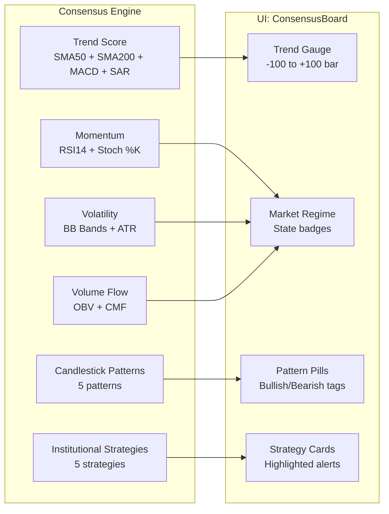

# Strat Ai — Technical Indicators, Patterns, Strategies & AI Pipeline

> Complete breakdown of every indicator, candlestick pattern, and strategy — where it's computed, how it flows, and which UI feature consumes it.

---

## 1. The Complete Indicator Inventory

Your system uses **16 distinct technical indicators** across 3 compute locations:

| # | Indicator | Compute Location | Used By |
|---|-----------|-----------------|---------|
| 1 | **RSI (14-period)** | Technical Agent + Consensus Engine + Frontend | Signal Engine, Momentum State, Multi-TF Trend |
| 2 | **VWAP** (Volume-Weighted Avg Price) | Technical Agent + Consensus Engine | Signal Engine, VWAP Bounce Strategy |
| 3 | **SMA 50** | Consensus Engine | Trend Score, Golden/Death Cross |
| 4 | **SMA 200** | Consensus Engine | Trend Score, Golden/Death Cross |
| 5 | **EMA 9** | Frontend Chart + Multi-TF Trend | Chart Ribbon Overlay, Trend Bias |
| 6 | **EMA 21** | Frontend Chart + Multi-TF Trend | Chart Ribbon Overlay, Trend Bias |
| 7 | **MACD Histogram** | Consensus Engine | Trend Score |
| 8 | **Parabolic SAR** | Consensus Engine | Trend Score |
| 9 | **Stochastic %K** | Consensus Engine | Momentum State |
| 10 | **Bollinger Bands** (Upper/Lower) | Consensus Engine | Volatility State |
| 11 | **ATR 20-period MA** | Consensus Engine | Volatility Squeeze Detection |
| 12 | **OBV** (On-Balance Volume) | Consensus Engine | Volume Flow State |
| 13 | **CMF** (Chaikin Money Flow) | Consensus Engine | Volume Flow State |
| 14 | **Average Volume** (20-period) | Consensus Engine | VWAP Bounce / ORB Volume Surge |
| 15 | **ORB High/Low** (Opening Range) | Consensus Engine | ORB Breakout/Breakdown |
| 16 | **Linear Regression** (14-period OLS) | Predictive Agent | Ghost Line / Price Prediction |

---

## 2. Where Each Indicator Lives (3 Compute Layers)

### Layer A: Technical Agent (`/agents/technical` · Rust · Real-time)

This runs as a **standalone Kafka consumer**, processing every raw tick as it arrives.

**Indicators computed:**
- **RSI 14** — Wilder's smoothing via the `ta` crate. Needs 14 prices to warm up.
- **VWAP** — Intraday cumulative `Σ(price × volume) / Σ(volume)`. Uses LTP approximation since Kite's tick feed doesn't include per-tick H/L.

**How they combine → `TechSignal`:**

```
RSI < 30  AND  price > VWAP  →  Score 85  (Strong Bullish)
RSI < 30  AND  price ≤ VWAP  →  Score 65  (Moderate Bullish)
RSI < 45  AND  price > VWAP  →  Score 62  (Mild Bullish)
RSI > 70  AND  price < VWAP  →  Score 15  (Strong Bearish)
RSI > 70  AND  price ≥ VWAP  →  Score 35  (Moderate Bearish)
RSI > 55  AND  price < VWAP  →  Score 38  (Mild Bearish)
Everything else              →  Score 50  (Neutral)
```

**Output:** `TechSignal` protobuf → Kafka `technical_signals` → Aggregator

---

### Layer B: Consensus Engine (`/frontend/src-tauri/src/quant/` · Rust · Tauri-local)

This is the **heavyweight analysis engine** that runs inside the desktop app. It takes an array of historical candles and computes everything needed for the ConsensusBoard and Deep Quant AI.

**The `IndicatorState` struct holds ALL 16 indicators:**

```rust
pub struct IndicatorState {
    pub sma_50: f64,         // Simple Moving Average (50)
    pub sma_200: f64,        // Simple Moving Average (200)
    pub prev_sma_50: f64,    // Previous SMA50 (for cross detection)
    pub prev_sma_200: f64,   // Previous SMA200 (for cross detection)
    pub macd_histogram: f64, // MACD histogram value
    pub parabolic_sar: f64,  // Parabolic SAR
    pub rsi_14: f64,         // RSI (14-period)
    pub stoch_k: f64,        // Stochastic %K
    pub bb_upper: f64,       // Bollinger Band upper
    pub bb_lower: f64,       // Bollinger Band lower
    pub atr_20_ma: f64,      // ATR 20-period moving average
    pub obv_current: f64,    // On-Balance Volume (current)
    pub obv_previous: f64,   // On-Balance Volume (previous)
    pub cmf: f64,            // Chaikin Money Flow
    pub vwap: f64,           // VWAP
    pub average_volume: f64, // 20-period average volume
    pub orb_high: f64,       // Opening Range Breakout high
    pub orb_low: f64,        // Opening Range Breakout low
}
```

**Currently auto-computed from candle data (`from_candles_basic`):**
- SMA 50, SMA 200 (last N closes averaged)
- RSI 14 (standard gain/loss ratio)
- Average Volume (20-period)

**Slots for future expansion (set to NaN until wired):**
- MACD, Parabolic SAR, Stochastic %K, Bollinger Bands, ATR, OBV, CMF, VWAP, ORB

---

### Layer C: Frontend (`/frontend/src/hooks/` · TypeScript · Client-side)

**EMA 9 & 21** — Computed client-side for the chart ribbon overlay:
```typescript
// SMA-seeded initialization, then exponential smoothing
const k = 2 / (period + 1);
ema = price * k + prev_ema * (1 - k);
```

**RSI 14** — Recomputed in `useMultiTimeframeTrend` for trend bias:
```typescript
// Standard Wilder's smoothing
avgGain = (avgGain * (period-1) + gain) / period;
avgLoss = (avgLoss * (period-1) + loss) / period;
RSI = 100 - (100 / (1 + avgGain/avgLoss));
```

**Price Momentum** — Close vs Open of aggregated window, scaled ×20, clamped ±100.

---

## 3. Candlestick Patterns (5 Patterns)

All detected by [`PatternEngine::analyze()`](file:///d:/projects/Ai-trader/frontend/src-tauri/src/quant/patterns.rs):

| Pattern | Type | Detection Logic |
|---------|------|-----------------|
| **Doji** | Single-candle | `body / range < 0.10` (body < 10% of total range) |
| **Hammer** | Single-candle | `lower_shadow ≥ body × 2` AND `upper_shadow ≤ range × 0.33` |
| **Shooting Star** | Single-candle | `upper_shadow ≥ body × 2` AND `lower_shadow ≤ range × 0.33` |
| **Bullish Engulfing** | Two-candle | Previous is bearish, current is bullish, current body fully engulfs previous body |
| **Bearish Engulfing** | Two-candle | Previous is bullish, current is bearish, current body fully engulfs previous body |

**Helper methods on `Candle`:**
```rust
body()         → |close - open|
range()        → high - low
body_top()     → max(open, close)
body_bottom()  → min(open, close)
upper_shadow() → high - body_top()
lower_shadow() → body_bottom() - low
```

---

## 4. Institutional Strategies (5 Strategies)

All detected by [`StrategyEngine::evaluate()`](file:///d:/projects/Ai-trader/frontend/src-tauri/src/quant/strategies.rs):

| Strategy | Detection Logic | Volume Requirement |
|----------|-----------------|-------------------|
| **Golden Cross** | `prev_sma_50 ≤ prev_sma_200` AND `sma_50 > sma_200` | None |
| **Death Cross** | `prev_sma_50 ≥ prev_sma_200` AND `sma_50 < sma_200` | None |
| **VWAP Bounce (Bullish)** | `low ≤ VWAP` AND `close > VWAP` AND `prev candle is bearish` | Volume > avg × 1.5 |
| **ORB Breakout (Bullish)** | `close > orb_high` | Volume > avg × 1.2 |
| **ORB Breakdown (Bearish)** | `close < orb_low` | Volume > avg × 1.2 |

---

## 5. The ConsensusEngine — How It Fuses Everything

The [`ConsensusEngine::compile_consensus()`](file:///d:/projects/Ai-trader/frontend/src-tauri/src/quant/mod.rs#L152-L171) produces a `ConsensusReport` with 6 fields:

### 5.1 Trend Score (-100 to +100)

4 signals, each contributing ±25 points:

```
close > SMA 50    →  +25     close < SMA 50    →  -25
close > SMA 200   →  +25     close < SMA 200   →  -25
MACD histogram > 0 → +25     MACD histogram < 0 → -25
Parabolic SAR < close → +25  Parabolic SAR > close → -25
```
Final score clamped to [-100, +100].

### 5.2 Momentum State

```
RSI > 70 OR Stoch %K > 80  →  "OVERBOUGHT"
RSI < 30 OR Stoch %K < 20  →  "OVERSOLD"
Otherwise                  →  "NEUTRAL"
```

### 5.3 Volatility State

```
Price breaks above BB Upper OR below BB Lower  →  "EXPANDING"
BB Width < ATR 20-period MA                    →  "SQUEEZING"
Otherwise                                     →  "NORMAL"
```

### 5.4 Volume Flow State

```
CMF > 0.05  AND  OBV rising  →  "ACCUMULATION"
CMF < -0.05 AND  OBV falling →  "DISTRIBUTION"
Otherwise                    →  "NEUTRAL"
```

### 5.5 Active Patterns → `Vec<String>`
From `PatternEngine::analyze()`

### 5.6 Active Strategies → `Vec<String>`
From `StrategyEngine::evaluate()`

---

## 6. Feature Map — Which UI Feature Uses What

### 6.1 ConsensusBoard (Left Panel)



**Data path:** `subscribe_ticker` IPC → Rust fetches candles → `ConsensusEngine::compile_consensus()` → emits `quant-consensus` event → React `useQuantStore` updates → `ConsensusBoard` renders.

---

### 6.2 Deep Quant Analysis (AI Panel)

This is the **5-step AI pipeline** triggered by the "RUN DEEP QUANT ANALYSIS" button:

```
Step 1: Load 200 candles from QuestDB
Step 2: Compute IndicatorState + ConsensusReport (all 16 indicators + 5 patterns + 5 strategies)
Step 3: Fetch news headlines (Google News RSS → fallback text)
Step 4: Build Master Prompt → Send to DeepSeek LLM
Step 5: Parse JSON response → Return AiExecutionPlan
```

**The LLM System Prompt:**
> "You are an Elite Quantitative Portfolio Manager. You will be provided with a mathematical consensus report and real-time news for a specific asset. You must evaluate if the 'Active Strategies' are valid or traps..."

**The User Prompt (what the LLM sees):**
```
Asset: RELIANCE
Mathematical Consensus:
- Trend Score: 75 (-100 to +100)
- Momentum: NEUTRAL
- Volatility: NORMAL
- Volume Flow: ACCUMULATION

Structural Data:
- Active Patterns: ["Bullish Engulfing", "Hammer"]
- Active Strategies: ["Golden Cross", "VWAP Bounce (Bullish)"]

Recent News Context:
Reliance Industries reports Q4 earnings beat...
```

**LLM Output (`AiExecutionPlan`):**
```json
{
  "conviction_score": 78,
  "setup_validation": "Golden Cross confirmed with rising OBV...",
  "execution_plan": "ENTRY: 2470 | STOP-LOSS: 2435 | TARGET 1: 2510..."
}
```

**LLM Provider:** Configurable via 3 env vars (`LLM_API_URL`, `LLM_API_KEY`, `LLM_MODEL`), so any
OpenAI-compatible endpoint works — OpenAI, Groq, a local Ollama, or a router. Each resolves runtime env →
compile-time `option_env!` → hardcoded default, so a released binary can carry values baked in at build
time. **The list above is what is supported, not what is deployed** — for the actual default and the
per-service inventory, see `docs/compliance/AI_MODEL_GOVERNANCE.md` §2, which is the only source of truth
for a model or provider name. Do not restate one from this file.

---

### 6.3 Quant Radar (Background Scanner)

The radar is a **continuous background worker** that scans 50 F&O symbols every 60 seconds:

```
For each of 50 NSE F&O symbols:
  1. Fetch 300 daily candles (Kite API → fallback QuestDB)
  2. Compute IndicatorState::from_candles_basic()
  3. Run ConsensusEngine::compile_consensus()
  4. IF any strategy fires OR |trend_score| ≥ 50:
       → Emit `radar-alert` IPC event to frontend
  5. Rate-limit: 500ms pause between symbols
```

**Alert Severity Classification:**
```
Golden Cross or ORB Breakout detected  →  "HIGH"    (🚨 + audio beep)
|trend_score| ≥ 75 OR any strategy     →  "MEDIUM"  (⚡)
Everything else that triggers          →  "LOW"     (📊)
```

**UI behavior:** Floating overlay panel in bottom-right. Clicking an alert **instantly switches the main chart** to that symbol.

---

### 6.4 Chart Overlays (AlphaPredictiveChart)

| Overlay | Indicator | Visual |
|---------|-----------|--------|
| **EMA 9 Ribbon** | EMA 9 (client-computed) | Cyan line (`#38bdf8`, 2px) |
| **EMA 21 Ribbon** | EMA 21 (client-computed) | Pink line (`#f472b6`, 2px) |
| **Volume Histogram** | Raw volume | Bottom 20%, green/red conditional coloring |
| **Ghost Line** | Linear Regression (14-period) | Dashed sky-blue projection (10m only) |
| **EMA Badge** | Latest EMA 9/21 values | Color-coded header badges |

---

### 6.5 Multi-Timeframe Trend (Swing Panel)

Aggregates live candles into 4 timeframe buckets and computes trend for each:

| Timeframe | Indicators Used | Weight |
|-----------|----------------|--------|
| **1H** | EMA 9/21 cross + RSI 14 + Price momentum | EMA ×2, RSI ×1, Momentum ×1 |
| **4H** | Same | Same |
| **1D** | Same | Same |
| **1W** | Same | Same |

**Bias classification:** Score > +15 = BULLISH, Score < -15 = BEARISH, else NEUTRAL.
**Strength:** Mapped to 0–100 (50 = neutral center).

---

### 6.6 Predictive Agent (Ghost Line)

The most mathematically rigorous component — runs as a standalone Rust service:

| Parameter | Value |
|-----------|-------|
| **Algorithm** | Ordinary Least Squares (OLS) Linear Regression |
| **Window** | 14 closing prices |
| **Input** | 10-minute OHLC candles from `market.ohlc.10m` |
| **Output** | Predicted close of candle #15 + R² confidence |
| **Confidence** | R² × 100, clamped to [1, 100] |
| **WebSocket** | Port 8082 |

**Math:**
```
m = (N·Σxy − Σx·Σy) / (N·Σx² − (Σx)²)
b = (Σy − m·Σx) / N
predicted_close = m × 14 + b
R² = 1 − (SS_res / SS_tot)
```

> [!IMPORTANT]
> The Ghost Line is **hidden on all non-10m timeframes** because the math is only valid for the 10-minute interval it was trained on.

---

## 7. Data Flow Summary

```mermaid
graph TB
    subgraph "Real-Time Path"
        TICK["Kite WS Tick"] --> TA_RSI["RSI 14"]
        TICK --> TA_VWAP["VWAP"]
        TA_RSI --> SIGNAL["TechSignal<br/>conviction 1-100"]
        TA_VWAP --> SIGNAL
        SIGNAL --> AGG["Aggregator<br/>BUY/SELL/HOLD"]
    end

    subgraph "OHLC Path"
        OHLC["10m Candle"] --> PRED["Predictive Agent<br/>LinReg 14-period"]
        PRED --> GHOST["Ghost Line<br/>WS:8082"]
        OHLC --> QRAG["Quant-RAG<br/>≥2% swing → DeepSeek"]
        QRAG --> INSIGHT["Market Insight<br/>WS:8083"]
    end

    subgraph "Consensus Path (On-Demand)"
        CANDLES["200 Historical Candles"] --> IND["IndicatorState<br/>16 indicators"]
        IND --> CE["ConsensusEngine"]
        CE --> PATTERNS["5 Candlestick Patterns"]
        CE --> STRATS["5 Institutional Strategies"]
        CE --> REPORT["ConsensusReport"]
        REPORT --> BOARD["ConsensusBoard UI"]
        REPORT --> LLM["DeepSeek LLM"]
        LLM --> PLAN["AiExecutionPlan"]
        PLAN --> DQP["DeepQuantPanel UI"]
    end

    subgraph "Radar Path (Background)"
        RADAR["50 F&O Symbols<br/>every 60s"] --> CE2["ConsensusEngine<br/>per symbol"]
        CE2 --> ALERT["RadarAlert<br/>IPC event"]
        ALERT --> OVERLAY["QuantRadar UI"]
    end
```



---

## 8. Quick Reference: What Feeds What

| Feature | Indicators | Patterns | Strategies | LLM | News |
|---------|-----------|----------|------------|-----|------|
| **TechSignal** (Kafka) | RSI, VWAP | ✗ | ✗ | ✗ | ✗ |
| **ConsensusBoard** | All 16 slots | All 5 | All 5 | ✗ | ✗ |
| **Deep Quant Panel** | All 16 slots | All 5 | All 5 | ✓ DeepSeek | ✓ Google RSS |
| **Quant Radar** | SMA50/200, RSI, AvgVol | All 5 | All 5 | ✗ | ✗ |
| **Ghost Line** | LinReg (14-period) | ✗ | ✗ | ✗ | ✗ |
| **Chart Ribbons** | EMA 9, EMA 21 | ✗ | ✗ | ✗ | ✗ |
| **Multi-TF Trend** | EMA 9/21, RSI 14, Momentum | ✗ | ✗ | ✗ | ✗ |
| **Aggregator Decision** | Via TechSignal score | ✗ | ✗ | ✗ | Via SentimentSignal |
